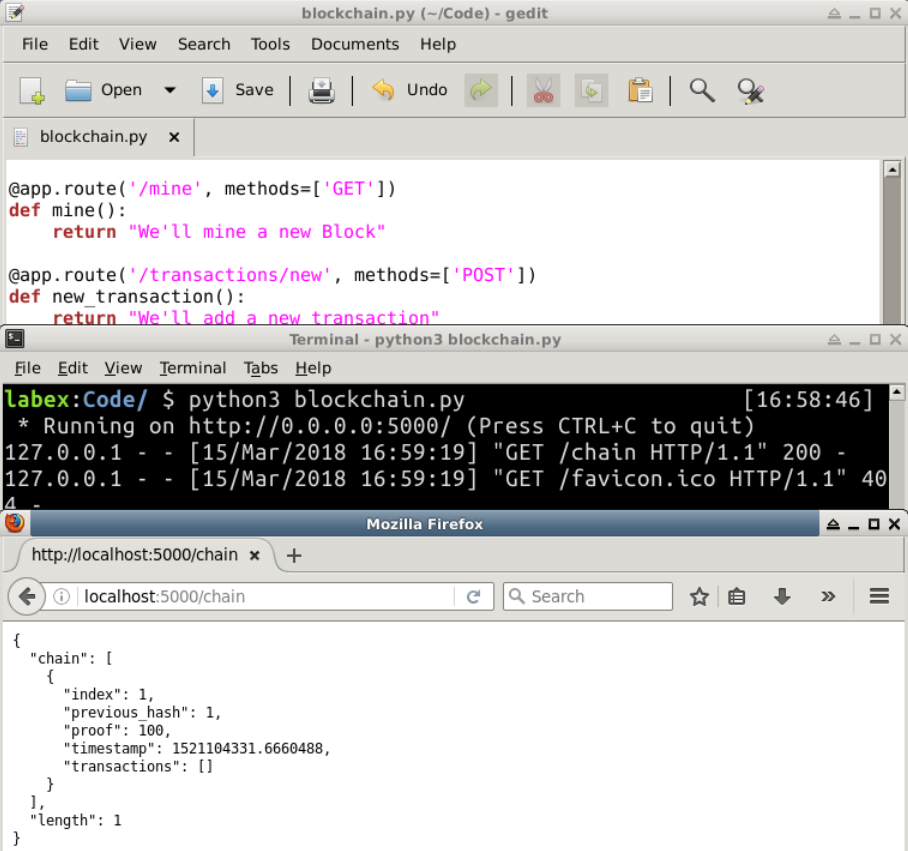
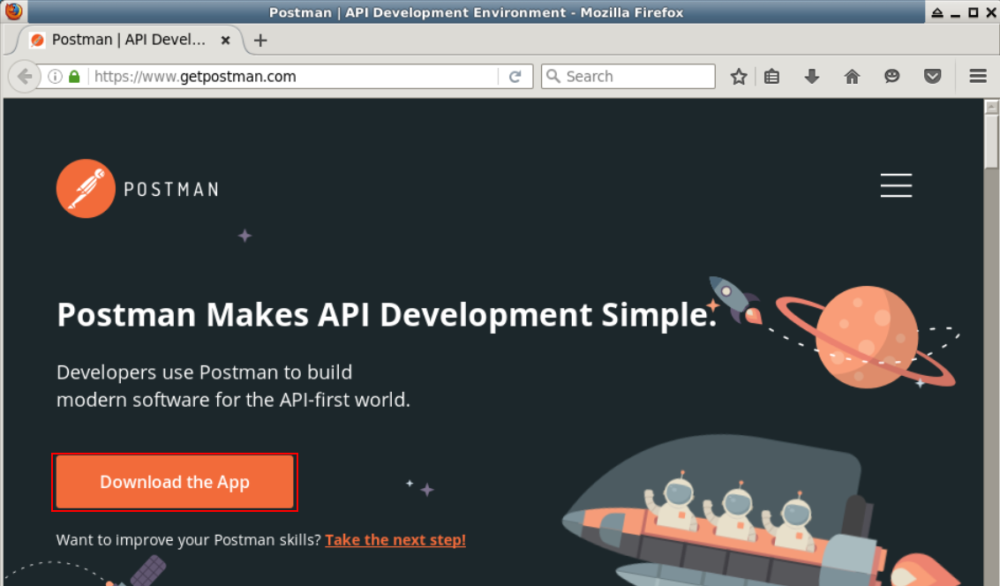
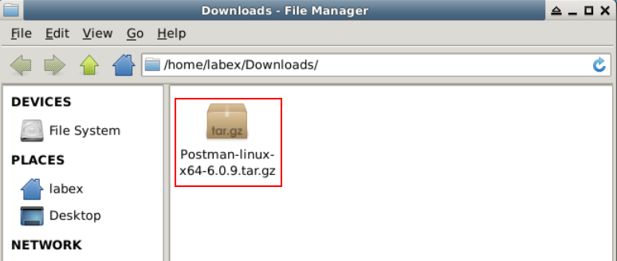
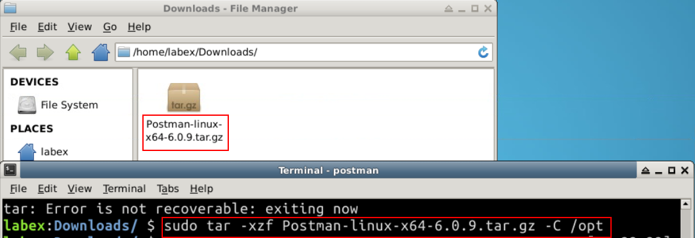
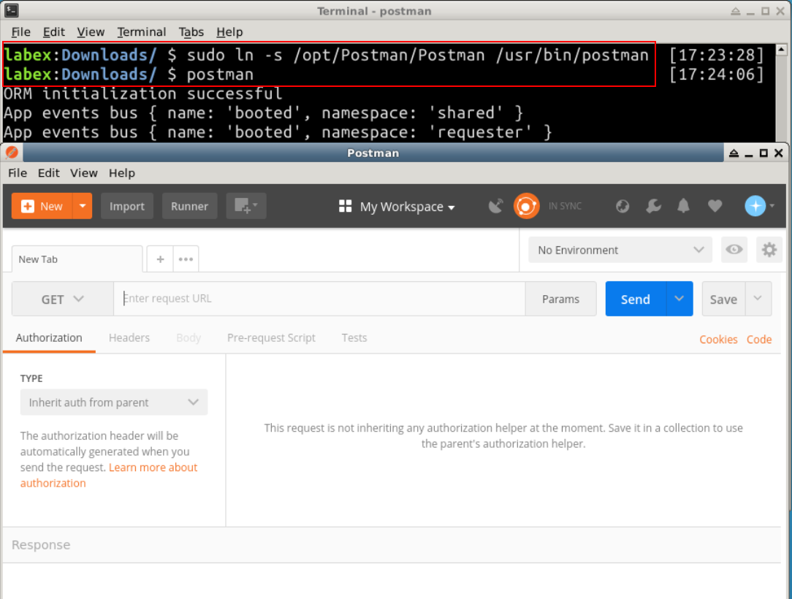
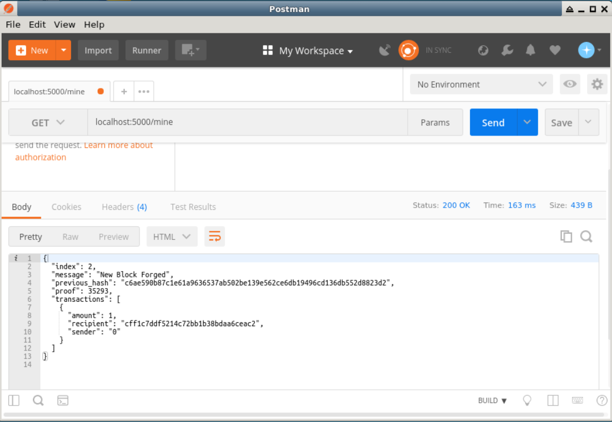
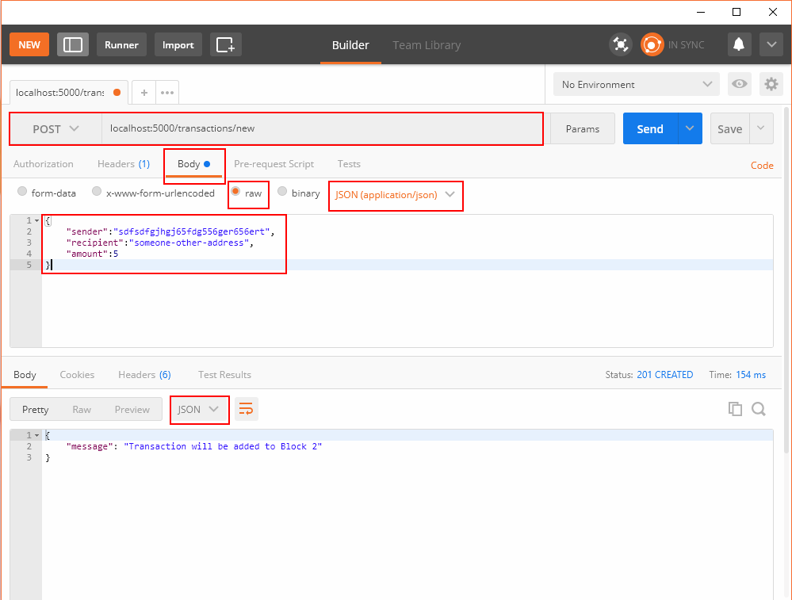

# Blockchain as an API

## 1. Introduction

We’re going to use the Python Flask Framework. It’s a micro-framework and it makes it easy to map endpoints to Python functions. This allows us talk to our blockchain over the web using HTTP requests. 

## 2. Content

We’ll create three methods:

- `/transactions/new` to create a new transaction to a block
- `/mine` to tell our server to mine a new block.
- `/chain` to return the full Blockchain.

### Setting up Flask

Our “server” will form a single node in our blockchain network. Let’s create some boilerplate code:

```
import hashlib
import json
from textwrap import dedent
from time import time
from uuid import uuid4

from flask import Flask,jsonify

class Blockchain(object):
    ...

# Instantiate our Node
app = Flask(__name__)

# Generate a globally unique address for this node
node_identifier = str(uuid4()).replace('-', '')

# Instantiate the Blockchain
blockchain = Blockchain()

@app.route('/mine', methods=['GET'])
def mine():
    return "We'll mine a new Block"
  
@app.route('/transactions/new', methods=['POST'])
def new_transaction():
    return "We'll add a new transaction"

@app.route('/chain', methods=['GET'])
def full_chain():
    response = {
        'chain': blockchain.chain,
        'length': len(blockchain.chain),
    }
    return jsonify(response), 200

if __name__ == '__main__':
    app.run(host='0.0.0.0', port=5000)
```



### The Transactions Endpoint

This is what the request for a transaction will look like. It’s what the user sends to the server:

```
{
 "sender": "my address",
 "recipient": "someone else's address",
 "amount": 5
}
```

Since we already have our class method for adding transactions to a block, the rest is easy. Let’s write the function for adding transactions:

```
import hashlib
import json
from textwrap import dedent
from time import time
from uuid import uuid4

from flask import Flask, jsonify, request

...

@app.route('/transactions/new', methods=['POST'])
def new_transaction():
    values = request.get_json()

    # Check that the required fields are in the POST'ed data
    required = ['sender', 'recipient', 'amount']
    if not all(k in values for k in required):
        return 'Missing values', 400

    # Create a new Transaction
    index = blockchain.new_transaction(values['sender'], values['recipient'], values['amount'])

    response = {'message': 'Transaction will be added to Block '+index}
    return jsonify(response), 201
```

### The Mining Endpoint

Our mining endpoint is where the magic happens, and it’s easy. It has to do three things:

1. Calculate the Proof of Work
2. Reward the miner (us) by adding a transaction granting us 1 coin
3. Forge the new Block by adding it to the chain

```
import hashlib
import json

from time import time
from uuid import uuid4

from flask import Flask, jsonify, request

...

@app.route('/mine', methods=['GET'])
def mine():
    # We run the proof of work algorithm to get the next proof...
    last_block = blockchain.last_block
    last_proof = last_block['proof']
    proof = blockchain.proof_of_work(last_proof)

    # We must receive a reward for finding the proof.
    # The sender is "0" to signify that this node has mined a new coin.
    blockchain.new_transaction(
        sender="0",
        recipient=node_identifier,
        amount=1,
    )

    # Forge the new Block by adding it to the chain
    previous_hash = blockchain.hash(last_block)
    block = blockchain.new_block(proof, previous_hash)

    response = {
        'message': "New Block Forged",
        'index': block['index'],
        'transactions': block['transactions'],
        'proof': block['proof'],
        'previous_hash': block['previous_hash'],
    }
    return jsonify(response), 200
```

Note that the recipient of the mined block is the address of our node. And most of what we’ve done here is just interact with the methods on our Blockchain class. At this point, we’re done, and can start interacting with our blockchain.

### Interacting with our Blockchain

Here we show you how to install Postman in our environment step by step.

1. Go to  [Postman official website](https://www.getpostman.com), and click Download the App.



2. Then choose x64 bit edition for linux, after downloading, open the folder where the file is.
3. By default, the customer downloaded file is in this folder as below.
4. Open the terminal, and type the command.
5. When finished install, type the two command, then you can easily open the postman using `postman`.
6. Keep the terminal above alive, if you want to use the postman. You can open another terminal to do other operations independently.

You can use plain old cURL or Postman to interact with our API over a network. Fire up the server:

```
$ python blockchain.py

* Running on http://127.0.0.1:5000/ (Press CTRL+C to quit)
```

Let’s try mining a block by making a `GET` request to `http://localhost:5000/mine` :



Let’s create a new transaction by making a `POST` request to`http://localhost:5000/transactions/new` with a body containing our transaction structure:




If you aren’t using Postman, then you can make the equivalent request using cURL:

```
$ curl -X POST -H "Content-Type: application/json" -d '{
 "sender": "d4ee26eee15148ee92c6cd394edd974e",
 "recipient": "someone-other-address",
 "amount": 5
}' "http://localhost:5000/transactions/new"
```

I restarted my server, and mined two blocks, to give 3 in total. Let’s inspect the full chain by requesting [http://localhost:5000/chain](http://localhost:5000/chain:) :

```
{
  "chain": [
    {
      "index": 1,
      "previous_hash": 1,
      "proof": 100,
      "timestamp": 1506280650.770839,
      "transactions": []
    },
    {
      "index": 2,
      "previous_hash": "c099bc...bfb7",
      "proof": 35293,
      "timestamp": 1506280664.717925,
      "transactions": [
        {
          "amount": 1,
          "recipient": "8bbcb347e0634905b0cac7955bae152b",
          "sender": "0"
        }
      ]
    },
    {
      "index": 3,
      "previous_hash": "eff91a...10f2",
      "proof": 35089,
      "timestamp": 1506280666.1086972,
      "transactions": [
        {
          "amount": 1,
          "recipient": "8bbcb347e0634905b0cac7955bae152b",
          "sender": "0"
        }
      ]
    }
  ],
  "length": 3
}
```

## 3. Summary

The postman is a very powerful tool, you can use it to test something for website. By this example, you have learned something about the flask framework and how to test the blockchain API, it's just easy.