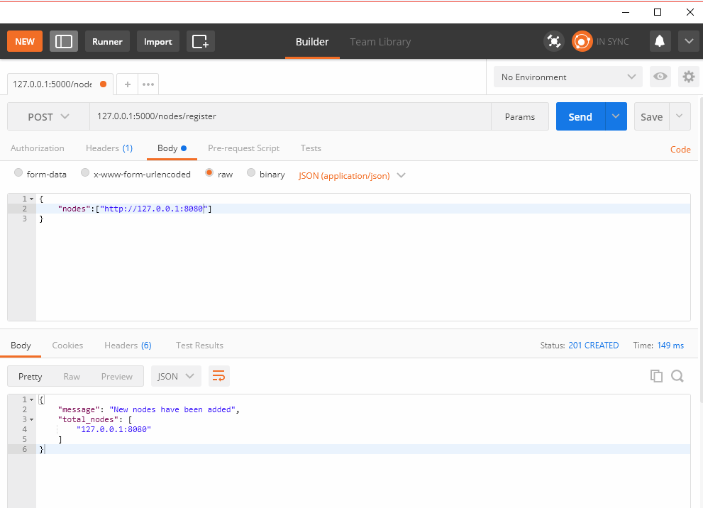
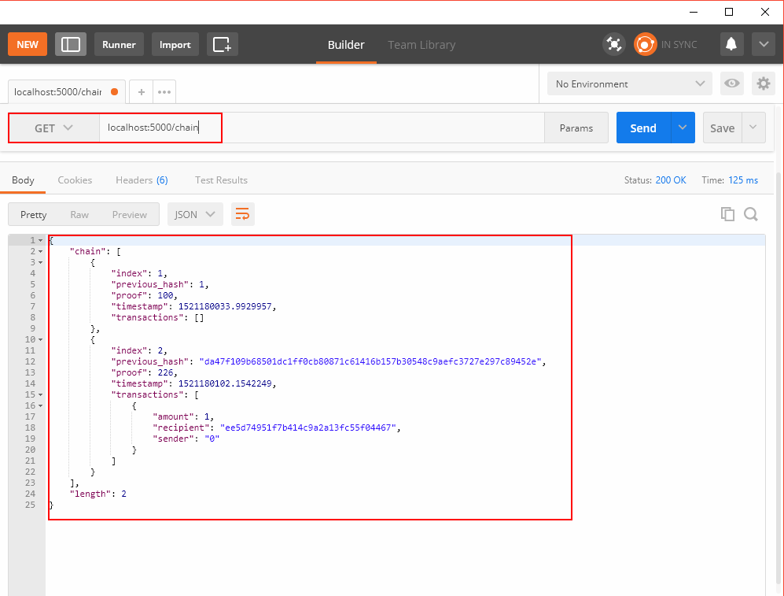
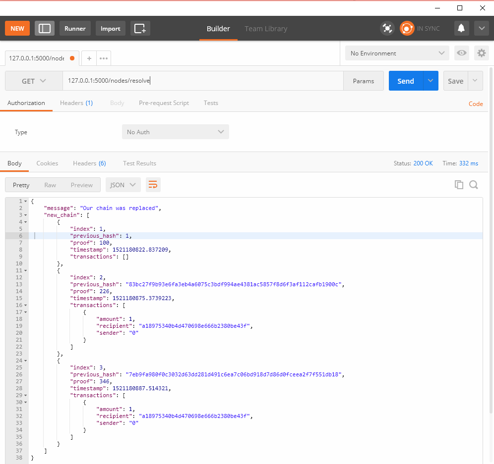

# Consensus

##1. Introduction

This is very cool. We’ve got a basic Blockchain that accepts transactions and allows us to mine new Blocks. But the whole point of Blockchains is that they should be *decentralized*. And if they’re decentralized, how on earth do we ensure that they all reflect the same chain? This is called the problem of *Consensus*, and we’ll have to implement a Consensus Algorithm if we want more than one node in our network.

##2. Content

### Registering new Nodes

Before we can implement a Consensus Algorithm, we need a way to let a node know about neighbouring nodes on the network. Each node on our network should keep a registry of other nodes on the network. Thus, we’ll need some more endpoints:

1. `/nodes/register` to accept a list of new nodes in the form of URLs.
2. `/nodes/resolve` to implement our Consensus Algorithm, which resolves any conflicts—to ensure a node has the correct chain.

We’ll need to modify our Blockchain’s constructor and provide a method for registering nodes:

```
...
from urllib.parse import urlparse
...

class Blockchain(object):
    def __init__(self):
        ...
        self.nodes = set()
        ...

    def register_node(self, address):
        """
        Add a new node to the list of nodes
        :param address: <str> Address of node. Eg. 'http://192.168.0.5:5000'
        :return: None
        """

        parsed_url = urlparse(address)
        self.nodes.add(parsed_url.netloc)
```

Note that we’ve used a `set()` to hold the list of nodes. This is a cheap way of ensuring that the 
addition of new nodes is idempotent—meaning that no matter how many times we add a specific node, it appears exactly once.

### Implementing the Consensus Algorithm

As mentioned, a conflict is when one node has a different chain to another node. To resolve this, we’ll make the rule that *the longest valid chain is authoritative.* In other words, the longest chain on the network is the *de-facto* one. Using this algorithm, we reach *Consensus* amongst the nodes in our network.

```
...
import requests

class Blockchain(object)
    ...
    
    def valid_chain(self, chain):
        """
        Determine if a given blockchain is valid
        :param chain: <list> A blockchain
        :return: <bool> True if valid, False if not
        """

        last_block = chain[0]
        current_index = 1

        while current_index < len(chain):
            block = chain[current_index]
            print(last_block)
            print(block)
            print("\n-----------\n")
            # Check that the hash of the block is correct
            if block['previous_hash'] != self.hash(last_block):
                return False

            # Check that the Proof of Work is correct
            if not self.valid_proof(last_block['proof'], block['proof']):
                return False

            last_block = block
            current_index += 1

        return True

    def resolve_conflicts(self):
        """
        This is our Consensus Algorithm, it resolves conflicts
        by replacing our chain with the longest one in the network.
        :return: <bool> True if our chain was replaced, False if not
        """

        neighbours = self.nodes
        new_chain = None

        # We're only looking for chains longer than ours
        max_length = len(self.chain)

        # Grab and verify the chains from all the nodes in our network
        for node in neighbours:
            response = requests.get('http://%s/chain'%node)

            if response.status_code == 200:
                length = response.json()['length']
                chain = response.json()['chain']

                # Check if the length is longer and the chain is valid
                if length > max_length and self.valid_chain(chain):
                    max_length = length
                    new_chain = chain

        # Replace our chain if we discovered a new, valid chain longer than ours
        if new_chain:
            self.chain = new_chain
            return True

        return False
```

The first method `valid_chain()` is responsible for checking if a chain is valid by looping through each block and verifying both the hash and the proof.

`resolve_conflicts()` is a method which loops through all our neighbouring nodes, *downloads* their chains and verifies them using the above method. **If a valid chain is found, whose length is greater than ours, we replace ours.**

Let’s register the two endpoints to our API, one for adding neighbouring nodes and the another for resolving conflicts:

```
@app.route('/nodes/register', methods=['POST'])
def register_nodes():
    values = request.get_json()

    nodes = values.get('nodes')
    if nodes is None:
        return "Error: Please supply a valid list of nodes", 400

    for node in nodes:
        blockchain.register_node(node)

    response = {
        'message': 'New nodes have been added',
        'total_nodes': list(blockchain.nodes),
    }
    return jsonify(response), 201


@app.route('/nodes/resolve', methods=['GET'])
def consensus():
    replaced = blockchain.resolve_conflicts()

    if replaced:
        response = {
            'message': 'Our chain was replaced',
            'new_chain': blockchain.chain
        }
    else:
        response = {
            'message': 'Our chain is authoritative',
            'chain': blockchain.chain
        }

    return jsonify(response), 200
```

At this point you can grab a different machine if you like, and spin up different nodes on your network. Or spin up processes using different ports on the same machine. I spun up another node on my machine, on a 
different port, and registered it with my current node. Thus, I have two nodes: `http://localhost:5000` and `http://localhost:8080` . In node http://localhost:5000 , there are 2 blocks,  and 3 blocks in node http://localhost:8080 . To run the program on two nodes, you just need to copy the source file, and set `app.run(host='127.0.0.1', port=8080)` , then open another terminal and run the copied file.





I then mined some new Blocks on node 2, to ensure the chain was longer. 


Afterward, I called `GET /nodes/resolve` on node 1, where the chain was replaced by the Consensus Algorithm:



And that’s a wrap... Go get some friends together to help test out your Blockchain.

## 3. Summary

We hope that this has inspired you to create something new. We are ecstatic about Cryptocurrencies because we believe that Blockchains will rapidly change the way we think about economies, governments and record-keeping.