#Create a personal blog website using Spring MVC + Spring + Mybatis

##1. Introduction

In this experiment, we'll show you how to use Spring MVC + Spring + Mybatis (SSM framework) and some front-end knowledge to build a personal blog website. You can write blogs / diarys, read blogs / diarys and manage all the content on the website.

###Learning Objective

- Spring MVC
- Spring
- Mybatis
- CSS/JS
- jquery

###Environment requirment

- Eclipse
- MySQL
- SSM Framework
- Markdown editor -- EditorMd
- Tomcat server
- Xfce terminal

##2. Project Structure

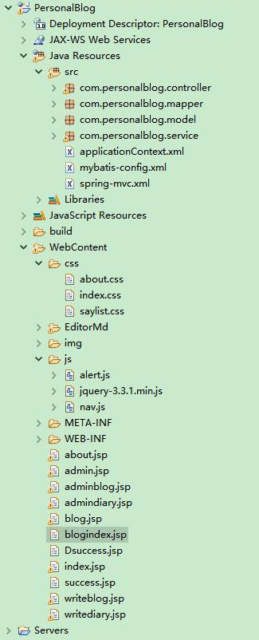

##3. Implementation

### 3.1 Create a project

Firstly, open eclipse in the environment to create a project. Click New-->Dynamic Web Project, and input the project name -- PersonalBlog, click next, choose auto generate web.xml, then click finish, now the project is created.

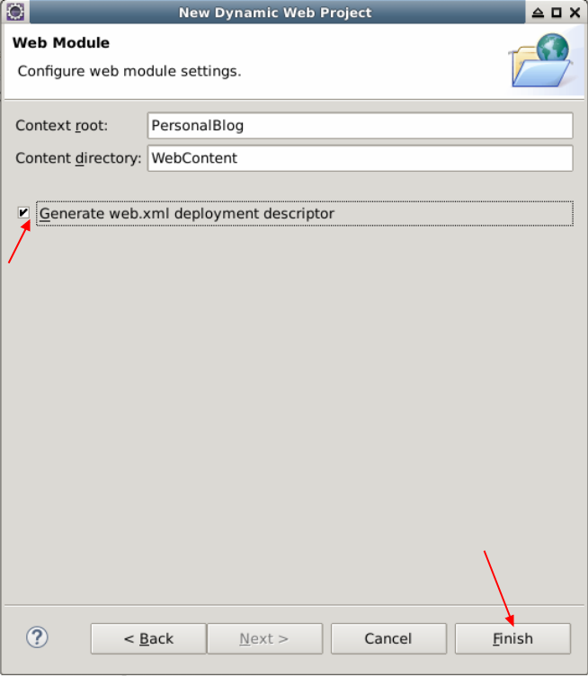

### 3.2 Import Jar packages and other resource

Download SSM framework dependencies packages to the local environment. In this project, we use markdown editor to edit blogs. Download an open source markdown editor -- Editor.md. Download two pictures, one for logo and the other for home page. We prepare all files for you. Use this cmd to get the resource.

```
git clone https://github.com/LabExCoding/Blog_SSM
```

Then unzip img,zip and EditorMd.zip

```
unzip img.zip
unzip EditorMd.zip
```

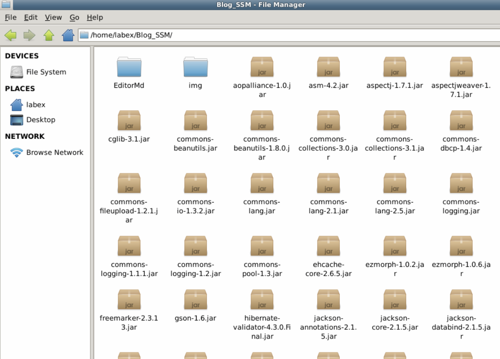

Copy these two folder to PersonalBlog/WebContent folder.

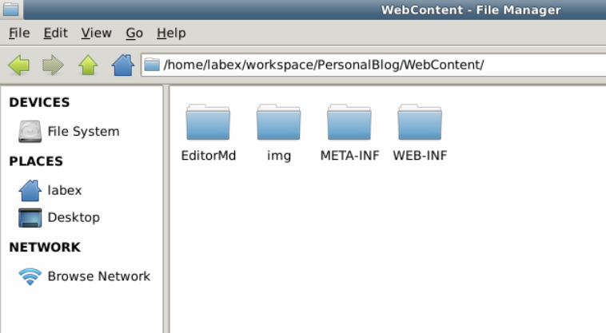

Copy all the Jar files to PersonalBlog/WebContent/WEB-INF/lib folder.

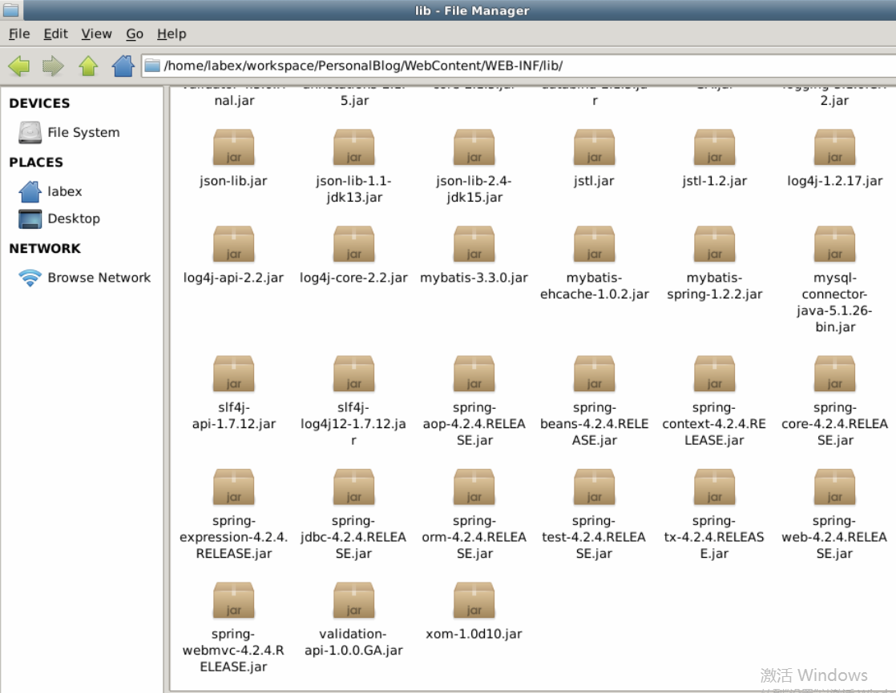

Add these jar files to build path. Right click project name-->Build Path-->Configure Build Path. First, in Libraries Tab -->Add JARs and choose all the copied jar files. In the Order and Export Tab, select all.

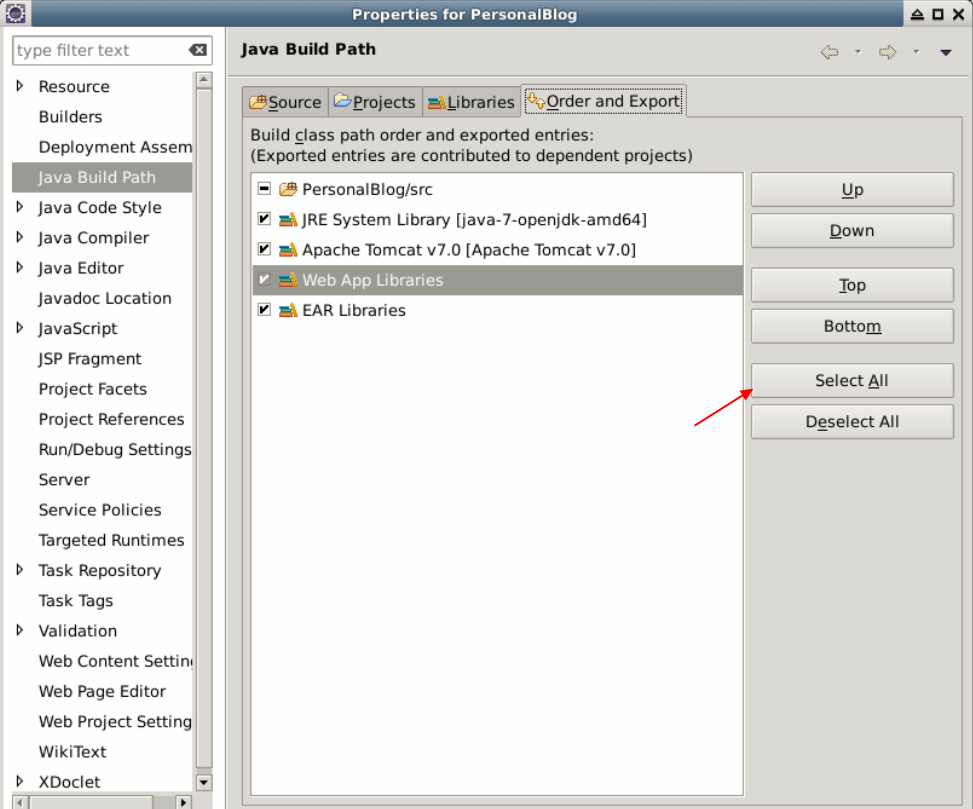

###3.3 Create database and tables

Open the terminal, and type the command:

```
sudo service mysql start
```

This is a cmd used to start mysql service. Then you need to input account and password for mysql. By default, the root user is in no need for password. You can do like this:

```
mysql -u root
```

Create a database for the project, use personalblog as database name:

```
create database personalblog;
```

*Don't omit the semicolon for each statement.* Then choose the database, 

```
use personalblog;
```
And create a table.
```
CREATE TABLE `blog` (
  `blogid` int(20) NOT NULL AUTO_INCREMENT,
  `blogtitle` varchar(50) DEFAULT NULL,
  `article` varchar(10000) DEFAULT NULL,
  `time` varchar(50) DEFAULT NULL,
  PRIMARY KEY (`blogid`)
) ENGINE=InnoDB AUTO_INCREMENT=19 DEFAULT CHARSET=utf8;
```

You can try to insert a piece of data into the table.

```
insert into blog(blogtitle,article,time) values("The first article","This is the first article to be used for testing",2018-04-10);
```

Then let's create another table for diary:

```
CREATE TABLE `diary` (
  `diaryid` int(20) NOT NULL AUTO_INCREMENT,
  `diary` varchar(10000) DEFAULT NULL,
  `time` varchar(20) DEFAULT NULL,
  PRIMARY KEY (`diaryid`)
) ENGINE=InnoDB AUTO_INCREMENT=3 DEFAULT CHARSET=utf8;
```

### 3.4 Create entity models

Each entity class corresponds to a table in database. All entity classes are part of package com.personal.model, the entity classes are as follows:

The blog entity:

```
package com.personalblog.model;

public class Blog {
    private int blogid;
    private String blogtitle;
    private String article;
    private String time;
    public int getBlogid() {
        return blogid;
    }
    public void setBlogid(int blogid) {
        this.blogid = blogid;
    }
    public String getBlogtitle() {
        return blogtitle;
    }
    public void setBlogtitle(String blogtitle) {
        this.blogtitle = blogtitle;
    }

    public String getArticle() {
        return article;
    }
    public void setArticle(String article) {
        this.article = article;
    }
    public String getTime() {
        return time;
    }
    public void setTime(String time) {
        this.time = time;
    }
}
```

The diary entity:

```
package com.personalblog.model;

public class Diary {
    private int diaryid;
    private String diary;
    private String time;
    public int getDiaryid() {
        return diaryid;
    }
    public void setDiaryid(int diaryid) {
        this.diaryid = diaryid;
    }
    public String getDiary() {
        return diary;
    }
    public void setDiary(String diary) {
        this.diary = diary;
    }
    public String getTime() {
        return time;
    }
    public void setTime(String time) {
        this.time = time;
    }
}
```

Now, the preparation has been done, you can start to work with other part of the project.

### 3.5 Front-end development

####3.5.1 CSS style and JS script

In our project, the front-end pages are jsp files including some css style and js code. All css files locate in /WebContent/CSS folder, there are three css files, they are index.css, about.css, saylist.css .

1. The content of index.css file as follows:

```
/* index.css */
* { margin: 0; padding: 0 }
body { font: 12px , Arial, Helvetica, sans-serif; color: #756F71 }
img { border: 0; display: block }
ul { list-style: none; }
a:link, a:visited {text-decoration: none; color: #333;}
.left { float: left; }
.right { float: right; }
.blank { height: 5px; overflow: hidden; width: 100%; margin: auto; clear: both }
.box{ width:1000px; margin:auto; overflow:hidden}
header { width: 1000px; margin: auto; height: 80px; position: relative; overflow: hidden }
#logo a { width:310px; height: 60px; margin: 10px 0 0 0; position: absolute; background: url(../img/logo.jpg) no-repeat; display: block }
nav { float: right; width: 100%; margin: 40px 0 0 0; text-align: right }
nav a { position: relative; display: inline-block; font-size: 18px; font-family: "", Arial, Helvetica, sans-serif; }
nav a:hover { text-decoration: none }
.topnav a { margin: 0 5px; padding: 0 8px; }
.topnav a span:first-child { z-index: 2; display: block; }
.topnav a span:last-child { z-index: 1; display: block; color: #999; font: 12px Georgia, serif; opacity: 0; -webkit-transition: -webkit-transform 0.3s, opacity 0.3s; -moz-transition: -moz-transform 0.3s, opacity 0.3s; transition: transform 0.3s, opacity 0.3s; -webkit-transform: translateY(-100%); -moz-transform: translateY(-100%); transform: translateY(-100%); text-align: center }
.topnav a:hover span:last-child, .topnav a:focus span:last-child { opacity: 1; -webkit-transform: translateY(0%); -moz-transform: translateY(0%); transform: translateY(0%); }
#topnav_current { color: #e15782; }
.en { color: #999; font-size: 12px; z-index: 1; display: block; }/* ie */
article { width: 1000px; margin: 20px auto; overflow: hidden }
aside { width: 250px; }
footer { text-align: center; line-height: 40px; border-top: #E8E8E8 1px solid ; width:1000px; margin:0 auto;}
footer p span{padding-left:10px;color:#292627;}
footer p span a{color:#292627;}
.clear{clear:both;}
.banner { background: url(../img/b2.jpg) no-repeat;width:1000px;height:345px;margin:0 auto;overflow: hidden;border-radius:5px;position:relative;}
h2.title{color: crimson; }
/*wz*/
.bloglist { width: 1000px; overflow: hidden; background: url(../images/r_line.jpg) repeat-y right; }
.bloglist .wz{width:1000px;bodrder:1px solid red;}
.wz h1 { margin: 8px 0px 4px 2px; color:#D6533A;font-size: 20px}
.wz ul { float: left; width: 1000px; margin: 10px 0px 0 2px; line-height: 20px; font-size:20px}
.dateview { width: 695px; overflow: hidden; clear: both; margin: 10px 0 0 0; display: inline-block; background: #f6f6f6 url(../images/time.jpg) 1px center no-repeat; line-height: 26px; height: 26px; color: #838383; padding-left:8px }
.dateview span { margin: 0 10px; }
.dateview span a { color: #099B43; }
a.readmore { background: #fd8a61; color: #fff; padding: 5px 10px; float: right; margin: 20px 0 0 0;border-radius:3px; }
.gut(width:1000px)
.admin{dispaly: inline-block;text-align: center;}

.blogtitle{font-family: "Arial, Helvetica, sans-serif";font-size:18px;float: left;}
/*end*/
/*markdown*/
#text {letter-spacing:2px;line-height:50px}
```

The index.css file is used to set navigation bar style,control content style and show the logo.

2. The about.css file is used to set user's personal page style.

```
/* about.css */
@charset "utf-8";
/*about*/
.aboutcon{ color:#696969; }
h1.t_nav {  font-size: 15px; font-weight: normal; line-height: 40px; height: 40px; }
h1.t_nav span{float:right; color:#DC143C}
.about{width: 740px;overflow: hidden; line-height:22px;float: left;}
.about h2{font-family:"comic sans ms";font-size: 30px;color:blue;}
.about #me_text{width: 1000px; font-family: "Microsoft YaHei";font-size: 17px;overflow: hidden;}
#me_text p{width:700px;padding:6px 20px;text-indent:2em;font-size:16px;}
.about_c,.about{margin:4px 0}
.about ul{ width:710px}
.about_c{ padding:10px 0 0 10px; color:#242222; line-height:26px; }
```

3. The saylist.css file is used to set diary style, including diary border, and datetime style:

```
/* saylist.css */
.moodlist { margin: auto; width: 100%; overflow: hidden }
h1.t_nav span{ float:right; color:red}
h1.t_nav { border-bottom: #F1F1F1 1px solid; font-size: 20px; font-weight: normal; line-height: 40px; height: 40px;margin:20px auto;width:1000px }
h1.t_nav a { width: 100px; display: block; text-align: center; color: #fff; float: left }
.bloglist { width: 1000px; margin: 0 auto;repeat-y 764px 0;overflow: hidden; }
.arrow_box { background: #f8f8f8; box-shadow: 0px 1px 0px, inset 0px 1px 1px rgba(214, 214, 214, 0.7); width: 730px;  position: relative; padding: 20px 0; margin: 20px 0; }
.arrow_box img { width: 150px; float: left; margin: 0 20px 0 20px; }
.arrow_box p { line-height: 24px; padding: 0 20px 20px }
.arrow_box:hover { background: #f4f2f2; color: #333; text-shadow: #f7f7f7 1px 1px 1px }
.dateview { position: absolute; left: 788px; top: 20px; width: 125px; line-height: 30px; background: #5EA51B; border-radius: 0px 40px; text-align: center; color: #fff }
```

The js files located in /WebContent/js folder. There are three js files, nav.js is used to control navigation bar, alert.js is used to identity administrator and jquery-3.3.1.min.js is a framework js lib.

4. Content of nav.js :

```
/* nav.js */
var obj=null;
var As=document.getElementById('topnav').getElementsByTagName('a');
obj = As[0];
for(i=1;i<As.length;i++){if(window.location.href.indexOf(As[i].href)>=0)
obj=As[i];}
obj.id='topnav_current'
```

5. Content of alert.js :

```
/* alert.js */
function fun1(){
        var result = confirm("Need for administrator to login");
    if(result){//true
        var password=prompt("Please input password：");
        if (password=="000000"){
        window.location.href="selectAllBlog2"
      }
    } else { //false
        window.history.back(-1)
    }
}
```

The jquery lib, you can copy it from the downloaded git repository to WebContent/js folder.

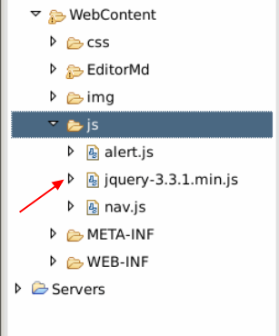

####3.5.2 JSP files

1. blogindex.jsp page is a welcome page, when accessing this page, it autoload js script, and get  blogs data from database and then redirect to index.jsp, it serves as a mediation. Using this page, we can avoid recursively jumping to home page.

```
<!-- blogindex.jsp -->
<%@ page language="java" contentType="text/html; charset=utf-8"
    pageEncoding="utf-8"%>
<!DOCTYPE html PUBLIC "-//W3C//DTD HTML 4.01 Transitional//EN" "http://www.w3.org/TR/html4/loose.dtd">
<html>
<head>
<meta http-equiv="Content-Type" content="text/html; charset=utf-8">
<script type="text/javascript" src="js/jquery-3.3.1.min.js"></script>
<title>Insert title here</title>
<script>
    $(function(){
          window.location.href='selectAllBlog';
    })
</script>
</head>
<body>

</body>

</html>
```

2. index.jsp page is the home page of the website, it shows all the blogs and provides a link to access the detail.

```
<%@ page language="java" contentType="text/html; charset=utf-8"
    pageEncoding="utf-8"%><%@ taglib prefix="c" uri="http://java.sun.com/jsp/jstl/core"%>
<!DOCTYPE html PUBLIC "-//W3C//DTD HTML 4.01 Transitional//EN" "http://www.w3.org/TR/html4/loose.dtd">
<html>
<head>
<meta http-equiv="Content-Type" content="text/html; charset=utf-8">
<title>index</title>
<link rel="stylesheet" type="text/css" href="css/index.css" />
<script type="text/javascript" src="js/jquery-3.3.1.min.js"></script>
</head>
<body>
<header>
  <div id="logo"><a href="/"></a></div>
  <nav class="topnav" id="topnav">
      <a href="selectAllBlog"><span>Home</span><span class="en">Home</span></a>
      <a href="about.jsp"><span>About</span><span class="en">About me</span></a>
     <a href="selectAllDiary"><span>Diary</span><span class="en">Diary</span></a>
      <a href="#" onclick="fun1()"><span>Admin</span><span class="en">Admin</span></a>
  </nav>
</header>
<div class="box">
    <div class="banner"></div><br>
        <h2 class="title">Content List</h2>
        <div class="bloglist">
            <div class="wz">
            <!-- blog list -->
            <c:forEach items="${blogs}" var="blogs">
                <h3><c:out value="${blogs.blogtitle}"/></h3>

    <ul>
      <a title="Read all"  href="selectBlogById?blogid=<c:out value="${blogs.blogid}"/>" class="readmore">Read all>></a>
    </ul>
    </c:forEach>
    
    <div class="clear"></div>
    </div>
            </div>
    <!-- diary list -->
    <div class="bloglist">
    	<c:forEach items="${diarys}" var="diarys">
                <p><c:out value="${diarys.diary}"/><br>
                <span style="readmore"> [<c:out value="${diarys.time}"/>]</span>
               </p>
               <br>
    </c:forEach>
    </div>
            </div>
    </body>
    <script type="text/javascript" src="js/alert.js" ></script>
</html>
```

3. blog.jsp page shows the detail of a blog. It aims at converting markdown file to html file and applying some simple css style to the output.

```
<!-- blog.jsp -->
<%@ page language="java" contentType="text/html; charset=utf-8"
    pageEncoding="utf-8"%><%@ taglib prefix="c" uri="http://java.sun.com/jsp/jstl/core"%>
<!DOCTYPE html PUBLIC "-//W3C//DTD HTML 4.01 Transitional//EN" "http://www.w3.org/TR/html4/loose.dtd">
<html>
<head>
<meta http-equiv="Content-Type" content="text/html; charset=utf-8">
<title>blog</title>
<link rel="stylesheet" type="text/css" href="css/index.css" />
<script type="text/javascript" src="js/jquery-3.3.1.min.js"></script>
<script src="https://cdn.bootcss.com/showdown/1.3.0/showdown.min.js"></script>  
</head>
<body>
<header>
  <div id="logo"><a href="/"></a></div>
  <nav class="topnav" id="topnav">
      <a href="selectAllBlog"><span>Home</span><span class="en">Home</span></a>
      <a href="about.jsp"><span>About</span><span class="en">About me</span></a>
     <a href="selectAllDiary"><span>Diary</span><span class="en">Diary</span></a>
      <a href="#" onclick="fun1()"><span>Admin</span><span class="en">Admin</span></a>
  </nav>
</header>
<div class="box">
    <div class="banner"></div><br>
        <h2 class="title"><c:out value="${blog.blogtitle}"></c:out></h2>
        <input type="hidden"  id="blogarticle"  value="${blog.article}"> 
        <div class="bloglist">
            <div class="wz">
                     <script type="text/javascript">  
        $(function() {  
             var converter = new showdown.Converter();  
            var x=document.getElementById('blogarticle').value;
            var html      = converter.makeHtml(x); 
            document.getElementById('text').innerHTML=html;
        });  
    </script> 
        <div id="text"></div>
    <div class="clear"></div>
    </div>
            </div>
            </div>
    </body>
    <script type="text/javascript" src="js/alert.js" ></script>
</html>
```

Here, we use showdown.js to convert markdown format to html format.

4. about.jsp is a page without interaction to back-end. It's a static page showing blogger's personal information.

```
<!-- about.jsp -->
<%@ page language="java" contentType="text/html; charset=utf-8"
    pageEncoding="utf-8"%><%@ taglib prefix="c" uri="http://java.sun.com/jsp/jstl/core"%>
<!DOCTYPE html PUBLIC "-//W3C//DTD HTML 4.01 Transitional//EN" "http://www.w3.org/TR/html4/loose.dtd">
<html>
<head>
<meta http-equiv="Content-Type" content="text/html; charset=utf-8">
<title>Insert title here</title>
        <link a href="css/index.css" rel="stylesheet"/>
        <link a href="css/about.css" rel="stylesheet"/>
        <script type="text/javascript" src="js/alert.js" ></script>
</head>
<body>
<header>
  <div id="logo"><a href="/"></a></div>
  <nav class="topnav" id="topnav">
      <a href="selectAllBlog"><span>Home</span><span class="en">Home page</span></a>
      <a href="about.jsp"><span>About</span><span class="en">About me</span></a>
     <a href="selectAllDiary"><span>Diary</span><span class="en">Diary</span></a>
      <a href="#" onclick="fun1()"><span>Admin</span><span class="en">Admin</span></a>
  </nav>
</header>
<article class="aboutcon">
<h1 class="t_nav"><span>Faith and goal drive me foraward.</span></h1><br />
<div class="about">
  <h2>About me</h2><br />
  <div id="me_text">
   <p>Thanks for those who have helped me, I cann't become excellent without what you give me.
   ----By:xxx</p>
  </div>

</div>
<aside class="right">  
    <div class="about_c">
        <br />
    <p>Nick: uncommon</p>
    <p>Name:<a href="#" target="_blank"> xxx</a></p>
    <p>Location: xx-xx</p>
    <p>Blog:<a href="#" target="_blank"> xx.blog</a></p>
    <p>Favorite: books, songs...</p>
</div>     
</aside>
</article>
<footer>
 <p><span>Design By:<a href=#" target="_blank"> xxx</a></span><span>Website</span><span><a href="#">Analysis</a></span></p>
</footer>
<script src="js/nav.js"></script>
</body>
<script type="text/javascript" src="js/alert.js" ></script>
</html>
```

5. admin.jsp page is management  page. Administrator login to this page and manage his blogs and diarys. It seems like the index.jsp page only the navigation bar showing management functionalities.

```
<!-- admin.jsp -->
<%@ page language="java" contentType="text/html; charset=utf-8"
    pageEncoding="utf-8"%><%@ taglib prefix="c" uri="http://java.sun.com/jsp/jstl/core"%>
<!DOCTYPE html PUBLIC "-//W3C//DTD HTML 4.01 Transitional//EN" "http://www.w3.org/TR/html4/loose.dtd">
<html>
<head>
<meta http-equiv="Content-Type" content="text/html; charset=utf-8">
        <title>Admin</title>
<link href="css/index.css" rel="stylesheet">
</head>
<body>
<header>
  <div id="logo"><a href="/"></a></div>
   <nav class="topnav" id="topnav">
            <a href="selectAllBlog"><span>Home</span><span class="en">Home</span></a>
      <a href="adminblog"><span>Admin Blog</span><span class="en">Admin Blog</span></a>
     <a href="admindiary"><span>Admin Diary</span><span class="en">Admin Diary</span></a>
      <a href="writeblog.jsp"><span>Write Blog</span><span class="en">Write Blog</span></a>
       <a href="writediary.jsp"><span>Write Diary</span><span class="en">Write Diary</span></a>
  </nav>
</header>
<div class="box">
    <div class="banner"></div><br>
        <h2 class="title">Blog list</h2>
        <div class="bloglist">
            <div class="wz">
            <c:forEach items="${blogs}" var="blogs">
                <h3><c:out value="${blogs.blogtitle}"/></h3>

    <ul>

      <a title="Read all"  href="selectBlogById?blogid=<c:out value="${blogs.blogid}"/>" class="readmore">Read all>></a>
    </ul>
    </c:forEach>
    <div class="clear"></div>
    </div>
            </div>
            </div>
    </body>
    <script type="text/javascript" src="js/alert.js" ></script>
</html>
```

6. writeblog.jsp page, in this page one can write blogs. It provides a plug-in tool -- EditorMd to create markdown style blogs.

```
<!-- writeblog.jsp -->
<%@ page language="java" contentType="text/html; charset=utf-8"
    pageEncoding="utf-8"%><%@ taglib prefix="c" uri="http://java.sun.com/jsp/jstl/core"%>
<!DOCTYPE html PUBLIC "-//W3C//DTD HTML 4.01 Transitional//EN" "http://www.w3.org/TR/html4/loose.dtd">
<html>
<head>
<meta http-equiv="Content-Type" content="text/html; charset=utf-8">
<title>Write Blog</title>
<link rel="stylesheet" href="EditorMd/examples/css/style.css" />
        <link rel="stylesheet" href="EditorMd/css/editormd.css" />
        <link rel="shortcut icon" href="https://pandao.github.io/editor.md/favicon.ico" type="image/x-icon" />

        <link href="css/index.css" rel="stylesheet">
           <link href="css/about.css" rel="stylesheet"/>
</head>
<body>
        <div class="admin">
        <header>
  <div id="logo"><a href="/"></a></div>
  <nav class="topnav" id="topnav">
           <a href="selectAllBlog"><span>Home</span><span class="en">Home</span></a>
      <a href="adminblog"><span>Admin Blog</span><span class="en">Admin Blog</span></a>
     <a href="admindiary"><span>Admin Diary</span><span class="en">Admin Diary</span></a>
      <a href="writeblog.jsp"><span>Write Blog</span><span class="en">Write Blog</span></a>
       <a href="writediary.jsp"><span>Write Diary</span><span class="en">Write Diary</span></a>
  </nav>
</header> 
</div>
<div class="box">
 <form action="writeBlog" method="post">
    <div class="admin">
        <h1 class="t_nav"><span>Share makes you happy.</span></h1><br />
          <div id="layout">
            <header>

                <h1>Write a blog</h1>
            </header>
            <div class="blogtitle">
             &nbsp;&nbsp;&nbsp;&nbsp;&nbsp;&nbsp;&nbsp;&nbsp;&nbsp;&nbsp;
               Title ：<input type="text" name="blogtitle" style="width: 400px;height:25px;"/>
            </div>
            <br />
            <br />
            <br />
             <input type="submit" value="upload"  style="background-color:#0055AA;color: white;font-size: 15px;
                height:30px;width:80px;display:inline-block;float: left;margin-left: 55px;" />
            <br />
            <br />
            <br />
            <div id="test-editormd">
                <textarea style="display:none;" name="article">


</textarea>
            </div>
        </div>
        <script src="EditorMd/examples/js/jquery.min.js"></script>
        <script src="EditorMd/editormd.min.js"></script>
        <script type="text/javascript">
            var testEditor;

            $(function() {
                testEditor = editormd("test-editormd", {
                    width   : "90%",
                    height  : 800,
                    syncScrolling : "single",
                    path    : "EditorMd/lib/"
                });

                /*
                // or
                testEditor = editormd({
                    id      : "test-editormd",
                    width   : "90%",
                    height  : 640,
                    path    : "../lib/"
                });
                */
            });
        </script>    
    </div>
    </form>
    </div>
    </body>
</html>

</html>
```

7. writediary.jsp page is similar to writeblog.jsp .

```
<!-- writediary.jsp -->
<%@ page language="java" contentType="text/html; charset=utf-8"
    pageEncoding="utf-8"%><%@ taglib prefix="c" uri="http://java.sun.com/jsp/jstl/core"%>
<!DOCTYPE html PUBLIC "-//W3C//DTD HTML 4.01 Transitional//EN" "http://www.w3.org/TR/html4/loose.dtd">
<html>
<head>
<meta http-equiv="Content-Type" content="text/html; charset=utf-8">
<title>Wright Diary</title>
        <link rel="stylesheet" href="EditorMd/examples/css/style.css" />
        <link rel="stylesheet" href="EditorMd/css/editormd.css" />
        <link rel="shortcut icon" href="https://pandao.github.io/editor.md/favicon.ico" type="image/x-icon" />

        <link href="css/index.css" rel="stylesheet">
           <link href="css/about.css" rel="stylesheet"/>
    </head>
    <body>
        <div class="admin">
        <header>
  <div id="logo"><a href="/"></a></div>
  <nav class="topnav" id="topnav">
 <a href="selectAllBlog"><span>Home</span><span class="en">Home</span></a>
      <a href="adminblog"><span>Admin Blog</span><span class="en">Admin Blog</span></a>
     <a href="admindiary"><span>Admin Diary</span><span class="en">Admin Diary</span></a>
      <a href="writeblog.jsp"><span>Write Blog</span><span class="en">Write Blog</span></a>
       <a href="writediary.jsp"><span>Write Diary</span><span class="en">Write Diary</span></a>
  </nav>
</header>
  </div>
  <div class="box">
    <div class="admin">
    <form action="writediary">
        <h1 class="t_nav"><span>Tell your stroy.</span></h1><br />
          <div id="layout">
            <header>

                <h1>Write diary</h1>
            </header>
             <input type="submit" value="upload"  style="background-color:#0055AA;color: white;font-size: 15px;
                height:30px;width:80px;display:inline-block;float: left;margin-left: 55px;" />
            <br />
            <br />
            <br />
            <div id="test-editormd">
                <textarea style="display:none;" name="diary">


</textarea>
            </div>
        </div>
        <script src="EditorMd/examples/js/jquery.min.js"></script>
        <script src="EditorMd/editormd.min.js"></script>
        <script type="text/javascript">
            var testEditor;

            $(function() {
                testEditor = editormd("test-editormd", {
                    width   : "90%",
                    height  : 800,
                    syncScrolling : "single",
                    path    : "EditorMd/lib/"
                });

                /*
                // or
                testEditor = editormd({
                    id      : "test-editormd",
                    width   : "90%",
                    height  : 640,
                    path    : "../lib/"
                });
                */
            });
        </script>    
        </form>
        </div>
    </div>
    </body>
</html>
```

8. adminblog.jsp page is used to manage blogs. Admin can delete blogs.

```
<!-- adminblog.jsp -->
<%@ page language="java" contentType="text/html; charset=utf-8"
    pageEncoding="utf-8"%><%@ taglib prefix="c" uri="http://java.sun.com/jsp/jstl/core"%>
<!DOCTYPE html PUBLIC "-//W3C//DTD HTML 4.01 Transitional//EN" "http://www.w3.org/TR/html4/loose.dtd">
<html>
<head>
<meta http-equiv="Content-Type" content="text/html; charset=utf-8">
<title>AdminBlog</title>
<link href="css/index.css" rel="stylesheet">
</head>
<body>
<header>
  <div id="logo"><a href="/"></a></div>
   <nav class="topnav" id="topnav">
       <a href="selectAllBlog"><span>Home</span><span class="en">Home</span></a>
      <a href="adminblog"><span>Admin Blog</span><span class="en">Admin Blog</span></a>
     <a href="admindiary"><span>Admin Diary</span><span class="en">Admin Diary</span></a>
      <a href="writeblog.jsp"><span>Write Blog</span><span class="en">Write Blog</span></a>
       <a href="writediary.jsp"><span>Write Diary</span><span class="en">Write Diary</span></a>
  </nav>
</header>

    <article>
        <h2 class="title">Blog list</h2>
        <br>
        <br><br>

        <div class="bloglist">
            <div class="wz">
            <c:forEach items="${blogs}" var="blogs">
                <h3><c:out value="${blogs.blogtitle}"/></h3>

    <ul>

      <a title="Delete"  href="deleteBlogById?blogid=<c:out value="${blogs.blogid}"/>" class="readmore">Delete>></a>
    </ul>
    </c:forEach>
    <div class="clear"></div>
    </div>
            </div>
            </div>
    </body>
    <script type="text/javascript" src="js/alert.js" ></script>
</html>
```

9. admindiary.jsp page is used to manage diaries. It's similar to adminblog.jsp .

```
<!-- admindiary.jsp -->
<%@ page language="java" contentType="text/html; charset=utf-8"
    pageEncoding="utf-8"%><%@ taglib prefix="c" uri="http://java.sun.com/jsp/jstl/core"%>
<!DOCTYPE html PUBLIC "-//W3C//DTD HTML 4.01 Transitional//EN" "http://www.w3.org/TR/html4/loose.dtd">
<html>
<head>
<meta http-equiv="Content-Type" content="text/html; charset=utf-8">
<title>AdminDiary</title>
<link href="css/index.css" rel="stylesheet">
</head>
<body>
<header>
  <div id="logo"><a href="/"></a></div>
   <nav class="topnav" id="topnav">
      <a href="selectAllBlog"><span>Home</span><span class="en">Home</span></a>
      <a href="adminblog"><span>Admin Blog</span><span class="en">Admin Blog</span></a>
     <a href="admindiary"><span>Admin Diary</span><span class="en">Admin Diary</span></a>
      <a href="writeblog.jsp"><span>Write Blog</span><span class="en">Write Blog</span></a>
       <a href="writediary.jsp"><span>Write Diary</span><span class="en">Write Diary</span></a>
  </nav>
</header>
<article>
        <h2 class="title">Diaries list</h2>
        <br>
        <br>
        <br>
        <div class="bloglist">
            <div class="wz">
            <c:forEach items="${diarys}" var="diarys">
                <h3><c:out value="${diarys.diary}"/></h3>

    <ul>

      <a title="Delete"  href="deleteDiaryById?diaryid=<c:out value="${diarys.diaryid}"/>" class="readmore">Delete>></a>
    </ul>
    </c:forEach>
    <div class="clear"></div>
    </div>
        </div>
    </article>
    </body>
    <script type="text/javascript" src="js/alert.js" ></script>
</html>
```

10. success.jsp page will show a popup and then return to writeblog page when uploading a blog suceessfully.

```
<!-- success.jsp -->
<%@ page language="java" contentType="text/html; charset=utf-8"
    pageEncoding="utf-8"%><%@ taglib prefix="c" uri="http://java.sun.com/jsp/jstl/core"%>
<!DOCTYPE html PUBLIC "-//W3C//DTD HTML 4.01 Transitional//EN" "http://www.w3.org/TR/html4/loose.dtd">
<html>
<head>
<meta http-equiv="Content-Type" content="text/html; charset=utf-8">
<title>Insert title here</title>
</head>
<body>
<script>
window.onload = function(){ 
    var result = confirm("Upload done!");
if(result) 
window.location ="writeblog.jsp"
}
</script>
</body>

</html>
```

11. Dsuccess.jsp is similar to success.jsp, it's used for uploading a diary.

```
<!-- Dsuccess.jsp -->
<%@ page language="java" contentType="text/html; charset=utf-8"
    pageEncoding="utf-8"%><%@ taglib prefix="c" uri="http://java.sun.com/jsp/jstl/core"%>
<!DOCTYPE html PUBLIC "-//W3C//DTD HTML 4.01 Transitional//EN" "http://www.w3.org/TR/html4/loose.dtd">
<html>
<head>
<meta http-equiv="Content-Type" content="text/html; charset=utf-8">
<title>Insert title here</title>
</head>
<body>
<script>
window.onload = function(){ 
    var result = confirm("Upload done!");
if(result) 
window.location ="writediary.jsp"
}
</script>
</body>

</html>
```

So far, we have already finished all the front-end pages and CSS, JS files. Next, we'll begin to write business logic layer.

### 3.6 Back-end development

####3.6.1 Business logic layer for blog

The functions we'll implement include storing blog content, search for all blogs and search a blog by id, delete a blog.

1. The functions related to blog, we wrap them into BlogController, it's under package com.personalblog.controller.

```
/* BlogController.java */
package com.personalblog.controller;

import java.text.SimpleDateFormat;
import java.util.ArrayList;
import java.util.Date;
import java.util.HashMap;
import java.util.List;
import java.util.Map;

import javax.servlet.http.HttpServletRequest;
import javax.xml.crypto.Data;

import org.apache.commons.collections.map.HashedMap;
import org.springframework.beans.factory.annotation.Autowired;
import org.springframework.stereotype.Controller;
import org.springframework.web.bind.annotation.RequestMapping;
import org.springframework.web.bind.annotation.ResponseBody;

import com.personalblog.model.Blog;
import com.personalblog.service.BlogService;
//annotate a controller
@Controller
public class BlogController {

    @Autowired
    private BlogService blogservice;
    //write a blog
    @RequestMapping("writeBlog")
    public String writeBlog(Blog blog){
                //get current datetime
                Date currentTime = new Date();
                 //convert time to specific format
                SimpleDateFormat formatter = new SimpleDateFormat("yyyy-MM-dd");
                String dateString = formatter.format(currentTime);
                blog.setTime(dateString);
                this.blogservice.writeBlog(blog);
                return "success";
    }
    //search all blogs for home page
    @RequestMapping("selectAllBlog")
    public String selectAllBlog(HttpServletRequest request){

        try {
            List<Blog> blogs = new ArrayList<Blog>();
            blogs =  this.blogservice.selectAllBlog();
            // put the result into a list and return to the page
            request.setAttribute("blogs", blogs);
            return "index";
        } catch (Exception e) {
            System.out.println(e);
            return null;
        }
    }
    //same operation as selectAllBlog, but return to different page
    @RequestMapping("selectAllBlog2")
    public String selectAllBlog2(HttpServletRequest request){

        try {
            List<Blog> blogs = new ArrayList<Blog>();
            blogs =  this.blogservice.selectAllBlog();
            System.out.println("title:"+blogs.get(0).getBlogtitle());
            request.setAttribute("blogs", blogs);
            return "admin";
        } catch (Exception e) {
            System.out.println(e);
            return "admin";
        }
    }
    //search a blog by id
    @RequestMapping("selectBlogById")
    public String selectBlogById(HttpServletRequest request){
        try {
            //get blog id and parse to int
            String id = request.getParameter("blogid");
            int blogid = Integer.parseInt(id);
            List<Blog> blogs = new ArrayList<Blog>();
            blogs =  this.blogservice.selectBlogById(blogid);
            //get result and return
            request.setAttribute("blog", blogs.get(0));
            return "blog";
        } catch (Exception e) {
            System.out.println(e);
            return null;
        }
    }
    //search all blogs for admin
    @RequestMapping("adminblog")
    public String adminblog(HttpServletRequest request){
        try {
            List<Blog> blogs = new ArrayList<Blog>();
            blogs =  this.blogservice.selectAllBlog();
            request.setAttribute("blogs", blogs);
            return "adminblog";
        } catch (Exception e) {
            System.out.println(e);
            return null;
        }
    }
    //delete a blog
    @RequestMapping("deleteBlogById")
    public String deleteBlogById(HttpServletRequest request){
        try {
            String id = request.getParameter("blogid");
            int blogid = Integer.parseInt(id);
            //call delete method by id
            this.blogservice.deleteBlogById(blogid);
            return "redirect:adminblog";
        } catch (Exception e) {
            return null;    
        }
    }
}
```

2. The interfaces and their implementations related to blog are under package com.personalblog.service .

The interface of service define as follow:

```
/* BlogService.java */
package com.personalblog.service;

import java.util.List;

import com.personalblog.model.Blog;

public interface BlogService {

    void writeBlog(Blog blog);

    List<Blog> selectAllBlog();

    List<Blog> selectBlogById(int blogid);

    void deleteBlogById(int blogid);

}
```

The implementation of interface is:

```
/* BlogServiceImpl.java */
package com.personalblog.service;

import java.util.List;

import org.springframework.beans.factory.annotation.Autowired;
import org.springframework.stereotype.Service;

import com.personalblog.mapper.BlogMapper;
import com.personalblog.model.Blog;

@Service
public class BlogServiceImpl implements BlogService{

    @Autowired
    private  BlogMapper blogMapper;

    @Override
    public void writeBlog(Blog blog) {
        System.out.println(blog.getArticle());
        blogMapper.writeBlog(blog);
    }

    @Override
    public List<Blog> selectAllBlog() {
        List<Blog> blogs = this.blogMapper.selectAllBlog();
        return blogs;
    }

    @Override
    public List<Blog> selectBlogById(int blogid) {
        List<Blog> blogs = this.blogMapper.selectBlogById(blogid);
        return blogs;
    }

    @Override
    public void deleteBlogById(int blogid) {
        blogMapper.deleteBlogById(blogid);

    }

}
```

3. The blog related mapper layer contains BlogMapper interface and BlogMapper.xml configuration file, Mapper is under package com.personalblog.mapper.

```
/* BlogMapper.java */
package com.personalblog.mapper;

import java.util.List;

import com.personalblog.model.Blog;

public interface BlogMapper {

    void writeBlog(Blog blog);

    List<Blog> selectAllBlog();

    List<Blog> selectBlogById(int blogid);

    void deleteBlogById(int blogid);

}
```

The configuration file is BlogMapper.xml :

```
<?xml version="1.0" encoding="UTF-8"?>
<!DOCTYPE mapper PUBLIC "-//mybatis.org//DTD Mapper 3.0//EN" 
"http://mybatis.org/dtd/mybatis-3-mapper.dtd">
<mapper namespace="com.personalblog.mapper.BlogMapper">
    <!-- self-define result set -->
     <resultMap type="Blog" id="blogResultMap">
        <id property="blogid" column="blogid" />
        <result property="blogtitle" column="blogtitle" />
        <result property="article" column="article" />
        <result property="time" column="time" />
    </resultMap>
    <insert id="writeBlog" parameterType="Blog"  useGeneratedKeys="true" keyProperty="blogid" >
        insert into blog (article,blogtitle,time)
        values(#{article},#{blogtitle},#{time})
    </insert>
    <select id="selectAllBlog" parameterType="Blog" resultMap="blogResultMap">
        select *
        from blog
    </select>
    <select id="selectBlogById" parameterType="Blog" resultMap="blogResultMap">
        select *
        from blog where blogid=#{blogid}
    </select>
    <delete id="deleteBlogById">
        delete from blog where blogid=#{blogid}
    </delete>
</mapper>
```

####3.6.2 Business logic layer for diary

This part is very similar to the previous. Firstly, let's write DiaryController.

1. DiaryController is a controller related to diary.

```
/* DiaryControllrt.java */
package com.personalblog.controller;

import java.text.SimpleDateFormat;
import java.util.ArrayList;
import java.util.Date;
import java.util.List;

import javax.servlet.http.HttpServletRequest;

import org.springframework.beans.factory.annotation.Autowired;
import org.springframework.stereotype.Controller;
import org.springframework.web.bind.annotation.RequestMapping;

import com.personalblog.model.Blog;
import com.personalblog.model.Diary;
import com.personalblog.service.DiaryService;

@Controller
public class DiaryController {
    @Autowired
    private DiaryService diaryService;

    @RequestMapping("writediary")
    public String writediary(Diary diary){
        //get current datetime
        Date currentTime = new Date();
         //convert datetime format
        SimpleDateFormat formatter = new SimpleDateFormat("yyyy-MM-dd");
        String dateString = formatter.format(currentTime);
        diary.setTime(dateString);
        this.diaryService.writediary(diary);
        return "Dsuccess";
    }

    /*
     * search all diaries
     */
    @RequestMapping("selectAllDiary")
    public String selectAllDiary(HttpServletRequest request){
        try {
            List<Diary> diarys = new ArrayList<Diary>();
            diarys =  this.diaryService.selectAllDiary();
            request.setAttribute("diarys", diarys);
            return "index";
        } catch (Exception e) {
            System.out.println(e);
            return null;
        }

    }

    /*
     * search all diaries and return to admin page
     */
    @RequestMapping("admindiary")
    public String selectAllDiary2(HttpServletRequest request){
        try {
            List<Diary> diarys = new ArrayList<Diary>();
            diarys =  this.diaryService.selectAllDiary();
            request.setAttribute("diarys", diarys);
            return "admindiary";
        } catch (Exception e) {
            System.out.println(e);
            return null;
        }

    }
    /*
     * delete a diary
     */
    @RequestMapping("deleteDiaryById")
    public String deleteDiaryById(HttpServletRequest request){
        try {
            String id = request.getParameter("diaryid");
            int diaryid = Integer.parseInt(id);
            this.diaryService.deleteDiaryById(diaryid);
            return "redirect:admindiary";
        } catch (Exception e) {
            return null;    
        }
    }
}
```

2. Service interface and implementation class.

```
/* DiaryService.java */
package com.personalblog.service;

import java.util.List;

import com.personalblog.model.Blog;
import com.personalblog.model.Diary;

public interface DiaryService {

    void writediary(Diary diary);

    List<Diary> selectAllDiary();

    void deleteDiaryById(int diaryid);

}
```

Implementation of DiaryService interface.

```
/* DiaryServiceImpl.java */
package com.personalblog.service;

import java.util.List;

import org.springframework.beans.factory.annotation.Autowired;
import org.springframework.stereotype.Service;

import com.personalblog.mapper.DiaryMapper;
import com.personalblog.model.Blog;
import com.personalblog.model.Diary;

@Service
public class DiaryServiceImpl implements DiaryService {

    @Autowired
    private DiaryMapper diarymapper;

    @Override
    public void writediary(Diary diary) {
        diarymapper.writediary(diary);

    }

    @Override
    public List<Diary> selectAllDiary() {
        List<Diary> diarys =this.diarymapper.selectAllDiary();
        return diarys;
    }

    @Override
    public void deleteDiaryById(int diaryid) {
        diarymapper.deleteDiaryById(diaryid);

    }

}
```

3. Mapper layer include an interface and a configuration file. The interface is:

```
/* DiaryMapper.java */
package com.personalblog.mapper;

import java.util.List;

import com.personalblog.model.Diary;

public interface DiaryMapper {

    void writediary(Diary diary);

    List<Diary> selectAllDiary();

    void deleteDiaryById(int diaryid);

}
```

The configuration file is DiaryMapper.xml .

```
<?xml version="1.0" encoding="UTF-8"?>
<!DOCTYPE mapper PUBLIC "-//mybatis.org//DTD Mapper 3.0//EN" 
"http://mybatis.org/dtd/mybatis-3-mapper.dtd">
<mapper namespace="com.personalblog.mapper.DiaryMapper">
    <!-- self-defined result set -->
     <resultMap type="Diary" id="diaryResultMap">
        <id property="diaryid" column="diaryid" />
        <result property="diary" column="diary" />
        <result property="time" column="time" />
    </resultMap>
    <insert id="writediary" parameterType="Diary"  useGeneratedKeys="true" keyProperty="diartid" >
        insert into diary (diary,time)
        values(#{diary},#{time})
    </insert>
    <select id="selectAllDiary" parameterType="Diary" resultMap="diaryResultMap">
        select *
        from diary
    </select>
      <delete id="deleteDiaryById">
        delete from diary where diaryid=#{diaryid}
    </delete>
    </mapper>
```

All the processing progress is finished, next we need to modify the configuration file.

### 3.7 Config the project

In web.xml, we need to config some options of SSM framework, including listerner, loader, etc.

web.xml for the project:

```
<?xml version="1.0" encoding="UTF-8"?>
<web-app xmlns:xsi="http://www.w3.org/2001/XMLSchema-instance"
    xmlns="http://java.sun.com/xml/ns/javaee" xmlns:web="http://java.sun.com/xml/ns/javaee/web-app_2_5.xsd"
    xsi:schemaLocation="http://java.sun.com/xml/ns/javaee http://java.sun.com/xml/ns/javaee/web-app_3_0.xsd"
    id="WebApp_ID" version="3.0">
  <display-name>PersonalBlog</display-name>
   <!-- config Spring listerner -->
  <listener>
    <listener-class>org.springframework.web.context.ContextLoaderListener</listener-class>
  </listener>
  <!-- set Spring config file path -->
  <context-param>
    <param-name>contextConfigLocation</param-name>
    <param-value>classpath:applicationContext.xml</param-value>
  </context-param>
      <!-- define Spring MVC front-end controller -->
  <servlet>
    <servlet-name>springMVC</servlet-name>
    <servlet-class>org.springframework.web.servlet.DispatcherServlet</servlet-class>
    <init-param>
      <param-name>contextConfigLocation</param-name>
      <param-value>classpath:spring-mvc.xml</param-value>
    </init-param>
    <load-on-startup>1</load-on-startup>
  </servlet>
      <!-- mapping DispatcherServlet -->
  <servlet-mapping>
    <servlet-name>springMVC</servlet-name>
    <url-pattern>/</url-pattern>
  </servlet-mapping>
  <!-- parse static resource -->
  <servlet-mapping>
    <servlet-name>default</servlet-name>
    <url-pattern>*.html</url-pattern>
    <url-pattern>*.css</url-pattern>
    <url-pattern>*.js</url-pattern>
    <url-pattern>*.jpg</url-pattern>
  </servlet-mapping>
  <listener>
    <listener-class>org.springframework.web.util.IntrospectorCleanupListener</listener-class>
  </listener>
      <!-- encode filter -->
  <filter>
    <filter-name>encodingFilter</filter-name>
    <filter-class>org.springframework.web.filter.CharacterEncodingFilter</filter-class>
    <init-param>
      <param-name>encoding</param-name>
      <param-value>UTF-8</param-value>
    </init-param>
    <init-param>
      <param-name>forceEncoding</param-name>
      <param-value>true</param-value>
    </init-param>
  </filter>
  <filter-mapping>
    <filter-name>encodingFilter</filter-name>
    <url-pattern>/*</url-pattern>
  </filter-mapping>
  <welcome-file-list>
    <welcome-file>blogindex.jsp</welcome-file>
  </welcome-file-list>
</web-app>
```

applicationContext.xml is a configuration file for spring framework. It integrated Spring MVC and Mybatis, and config some options for data persistence.

```
<?xml version="1.0" encoding="UTF-8"?>
<beans xmlns="http://www.springframework.org/schema/beans"
    xmlns:xsi="http://www.w3.org/2001/XMLSchema-instance" xmlns:p="http://www.springframework.org/schema/p"
    xmlns:context="http://www.springframework.org/schema/context" xmlns:tx="http://www.springframework.org/schema/tx"
    xsi:schemaLocation="
          http://www.springframework.org/schema/beans
          http://www.springframework.org/schema/beans/spring-beans-4.2.xsd
          http://www.springframework.org/schema/context
          http://www.springframework.org/schema/context/spring-context-4.2.xsd
          http://www.springframework.org/schema/tx
          http://www.springframework.org/schema/tx/spring-tx-4.1.xsd">

    <!-- auto scan Spring related classes，register them as beans -->
    <context:component-scan base-package="com.personalblog" />
    <!-- config datasource -->
    <bean id="dataSource"
        class="org.springframework.jdbc.datasource.DriverManagerDataSource">
        <property name="driverClassName" value="com.mysql.jdbc.Driver" />
        <property name="url" value="jdbc:mysql://localhost:3306/personalblog?useUnicode=true&amp;characterEncoding=UTF-8" />
        <property name="username" value="root" />
        <property name="password" value="" />
    </bean>
    <!-- MyBatis SqlSession factory，refer to datasource， scan MyBatis config file-->
    <bean id="sqlSessionFactory" class="org.mybatis.spring.SqlSessionFactoryBean">
        <property name="dataSource" ref="dataSource"></property>
        <property name="configLocation" value="classpath:mybatis-config.xml" />
    </bean>

    <!-- MyBatis auto scan and load Sql config file/interface -->    
    <bean class="org.mybatis.spring.mapper.MapperScannerConfigurer">
        <property name="basePackage" value="com.personalblog.mapper"></property>
        <property name="sqlSessionFactory" ref="sqlSessionFactory"></property>
    </bean>
    <!-- JDBC transaction manager -->
    <bean id="txManager"
        class="org.springframework.jdbc.datasource.DataSourceTransactionManager">
        <property name="dataSource" ref="dataSource"></property>
    </bean>
    <!-- start support for annotation -->
    <tx:annotation-driven transaction-manager="txManager" />

</beans>
```

mybatis-config.xml load mapper interfaces.

```
<?xml version="1.0" encoding="UTF-8"?>
<!DOCTYPE configuration PUBLIC "-//mybatis.org//DTD Config 3.0//EN" 
"http://mybatis.org/dtd/mybatis-3-config.dtd">
<configuration>
    <!-- take an alias for JavaBean -->
    <typeAliases>
        <package name="com.personalblog.model" />
    </typeAliases> 
    <!-- load mapper file throuth mapper interface --> 
    <mappers>
        <package name="com/personalblog/mapper" />
    </mappers>
</configuration>
```

spring-mvc.xml  configs controller and viewResolver.

```
<?xml version="1.0" encoding="UTF-8"?>
<beans xmlns="http://www.springframework.org/schema/beans"
    xmlns:xsi="http://www.w3.org/2001/XMLSchema-instance" xmlns:context="http://www.springframework.org/schema/context"
    xmlns:mvc="http://www.springframework.org/schema/mvc"
    xsi:schemaLocation="http://www.springframework.org/schema/beans 
      http://www.springframework.org/schema/beans/spring-beans.xsd
      http://www.springframework.org/schema/context
      http://www.springframework.org/schema/context/spring-context-4.2.xsd
      http://www.springframework.org/schema/mvc
     http://www.springframework.org/schema/mvc/spring-mvc-4.2.xsd">

    <!-- auto scan package，Spring MVC willregister @Controller wrapped class as Spring controller -->
    <context:component-scan base-package="com.personalblog.controller" />
    <!-- set default config solution -->
    <mvc:annotation-driven />
       <!-- viewresolver -->
    <bean id="viewResolver"
        class="org.springframework.web.servlet.view.InternalResourceViewResolver">
        <!-- after each action, the return result will combinate with property bellow，and generate a redirect path -->
        <property name="prefix" value="" />
        <property name="suffix" value=".jsp" />
    </bean>
</beans>
```

## 4. Test the project

Before test, we need some preparation:

1. start mysql service with `sudo service mysql start`.
2. Double click Tomcat server, extend server start-timeout time to 200 s.
3. Start the server.


You should have patient with the server starting, it will take some time.

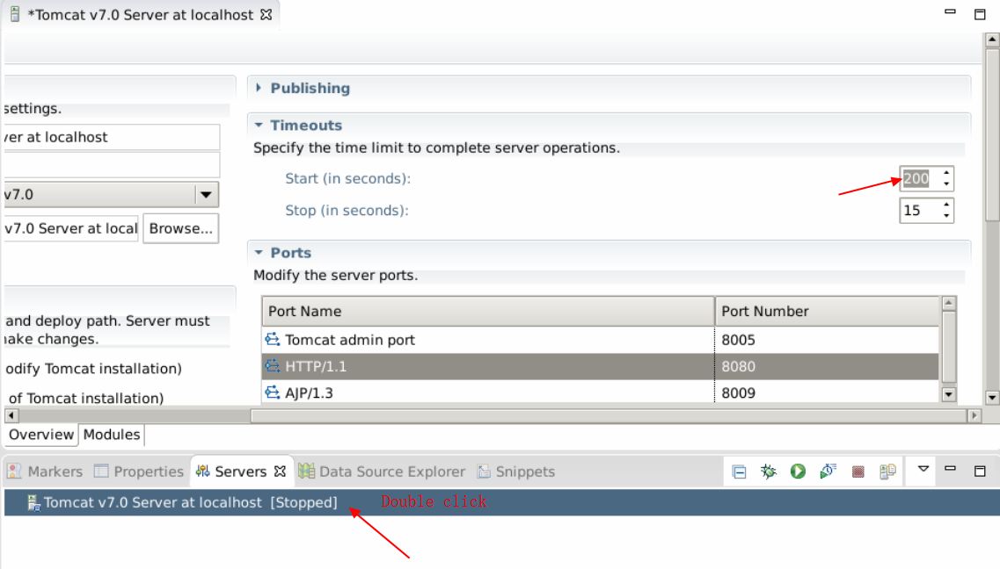

Open the browser, and type in the address : [localhost:8080/PersonalBlog/](localhost:8080/PersonalBlog/) , it will work.

This is the home page.

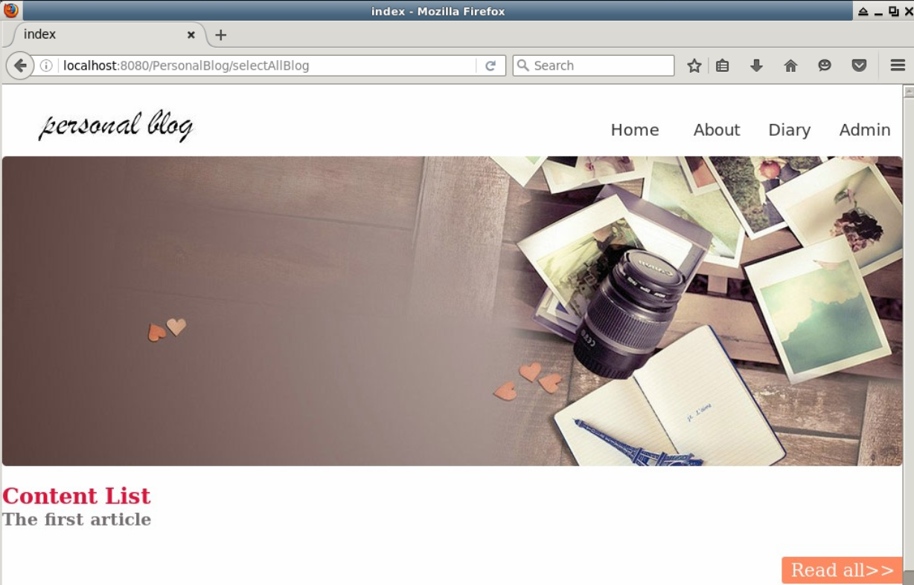

The read blog page.

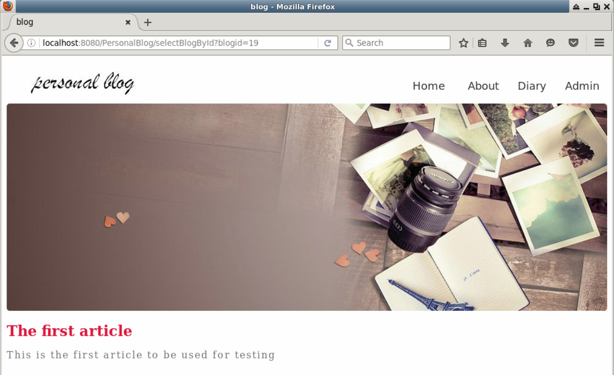

The about me page.

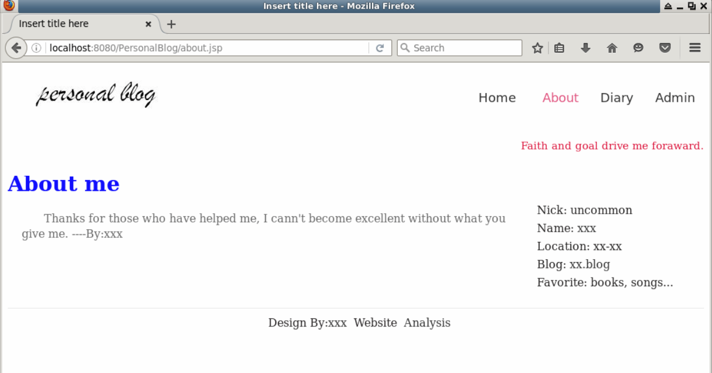

The diary page.

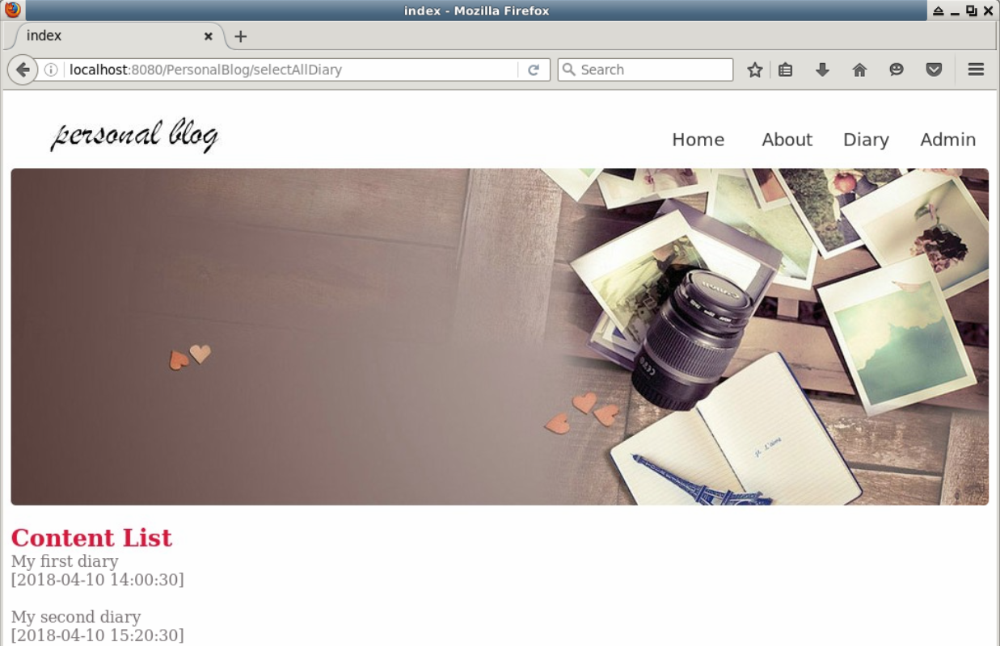

The admin page.

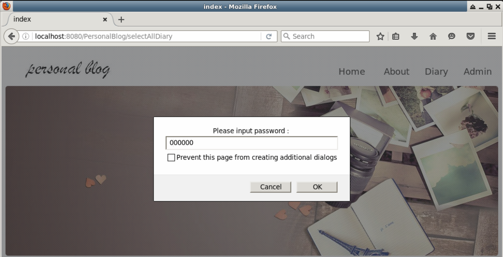

The admin blog page.

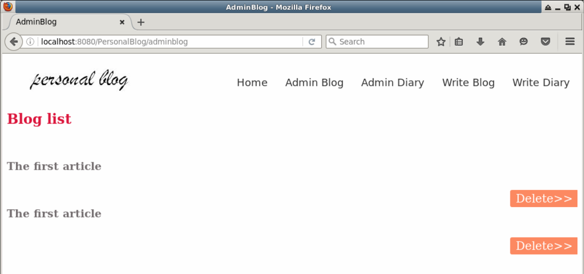

The admin diary page.

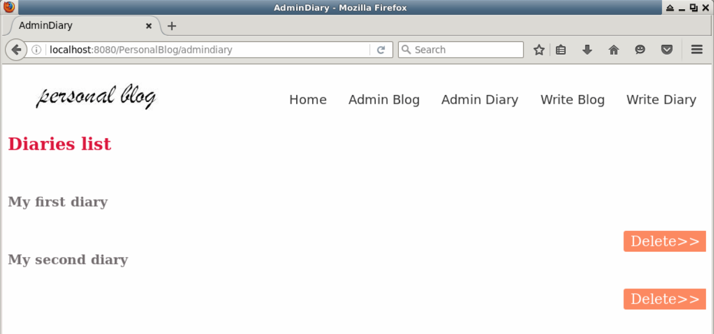

The write blog page.

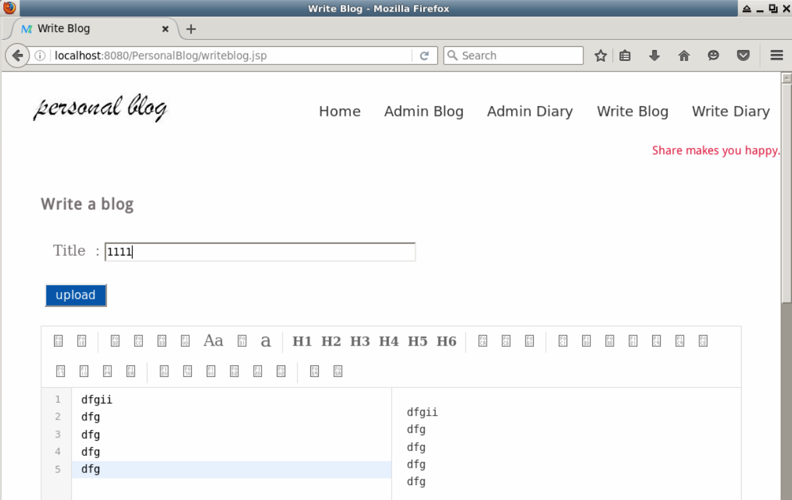

The write diary page.

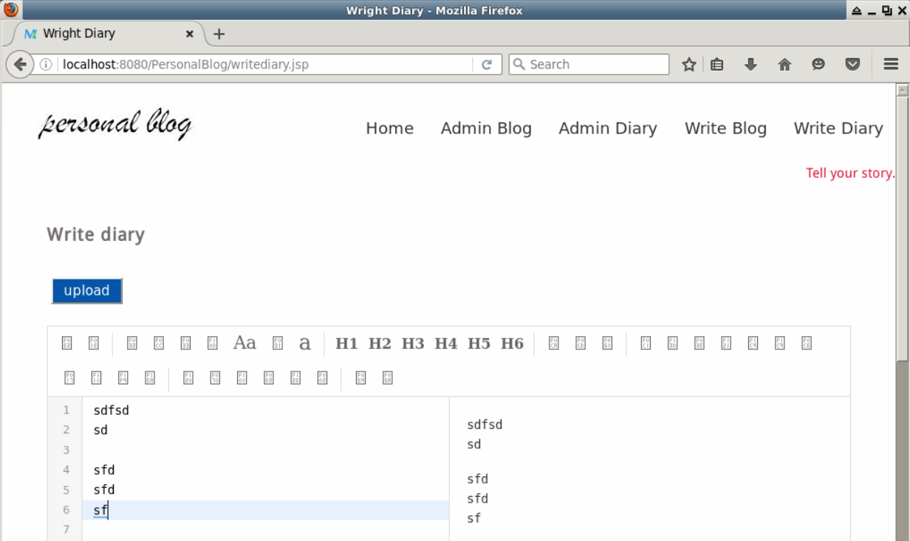


##5. Summary

In this project, you used some basic front-end skills to build some simple pages. The core of this project is to show you how to use SSM framework to create a dynamic web. You should be accustomed to creating web application with MVC architecture. It's a little complicated for novice, but you should try to grasp it.