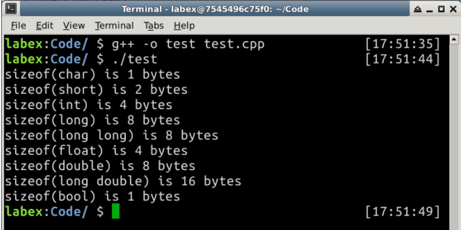
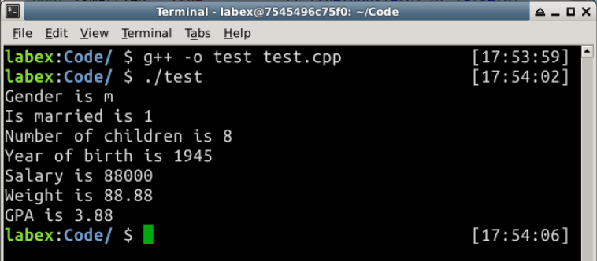

#Variables and Types

##1. Introduction

Computer programs manipulate (or process) data. A *variable* is used to *store a piece of data* for processing. It is called *variable* because you can change the value stored.

### Learning Objective

- variables
- identifiers
- variable declaration
- const
- expressions
- types
- values

## 2. Content

###2.1  Variables

A *variable* is a *named* storage location, that stores a *value* of a particular data *type*. In other words, a *variable* has a *name*, a *type* and stores a *value*.

- A variable has a *name* (or *identifier*), e.g., `radius`, `area`, `age`, `height`. The name is needed to uniquely identify each variable, so as to assign a value to the variable and retrieve the value stored.
- A variable has a type such as int double.
- A variable can store a *value* of that particular *type*. A variable is associated with a type, and can only store value of the particular type. 
- The type determines the size and layout of the data, the range of its values, and the set of operations that can be applied.

The following diagram illustrates two types of variables: `int` and `double`. An `int` variable stores an integer (whole number). A `double` variable stores a real number.


###2.2 Identifiers

An *identifier* is needed to *name* a variable (or any other entity such as a function or a class). C++ imposes the following *rules on identifiers*:

- An identifier is a sequence of characters, comprising uppercase and lowercase letters `(a-z, A-Z)`, digits `(0-9)`, and underscore `"_"`.
- White space (blank, tab, new-line) and other special characters (such as `+`, `-`, `*`, `/`, `@` , etc.) are not allowed.
- An identifier must begin with a letter or underscore. It cannot begin with a digit. Identifiers beginning with an underscore are typically reserved for system use.
- An identifier cannot be a reserved keyword or a reserved literal (e.g.,`int`, `double`, `if`, `else`, `for`).
- Identifiers are case-sensitive. A `rose` is NOT a `Rose`, and is NOT a `ROSE`.

**Variable Naming Convention**

A variable name is a noun, or a noun phrase made up of several words. The first word is in lowercase, while the remaining words are initial-capitalized, with no spaces between words. For example, `thefontSize`, `roomNumber`, `xMax` and `thisIsAVeryLongVariableName`, whick is known as *camel-case*.

**Recommendations**

1. It is important to choose a name that is *self-descriptive* and closely reflects the meaning of the variable, e.g., `numberOfStudents` or `numStudents`.
2. Do not use meaningless names like `a`, `b`, `c`, `d`, `i`, `j`, `k`, `i1`, `j99`. Avoid single-alphabet names, unless they are common names like `x`, `y`, `z` for coordinates, `i` for index.
4. It is perfectly okay to use long names of says 30 characters to make sure that the name accurately reflects its meaning.
4. Use singular and plural nouns prudently to differentiate between singular and plural variables.  For example, use the variable `row` to refer to a single row number and the `rows` to refer to many rows.


### 2.3 Variable Declaration

You need to first *declare* its *name* and *type* before using it, in one of the following syntaxes:

| Syntax             | Example                            |
| ---------------------------- | ------------------------ |
| Declare a variable of a specified type | int option; |
| Declare multiple variables of the same type, separated by commas | double sum, difference, product, quotient; |
| Declare a variable and assign an initial value of this type | int magicNumber = 88; |
| Declare multiple variables with initial values of this type | double sum = 0.0, product = 1.0; |

For example,

```
int mark1;           // Declare an int variable called mark1
mark1 = 76;          // Use mark1
int mark2;           // Declare int variable mark2
mark2 = mark1 + 10;  // Use mark2 and mark1
double average;      // Declare double variable average
average = (mark1 + mark2) / 2.0;   // Use average, mark1 and mark2
int mark1;           // Error: Declare twice
mark2 = "Hello";     // Error: Assign value of a different type
int number;             // Declared but not initialized
cout << number << endl; // Used before initialized, no warning/error, but unexpected result.
```

Note that:

- In C++, you need to declare the name of a variable before it can be used.
- C++ is a "strongly-type" language. A variable takes on a type. Once the *type* of a variable is declared, it can only store a value belonging to this particular type. 
- Each variable can only be declared once.
- In C++, you can declare a variable anywhere inside the program, as long as it is declared before used. 
- The type of a variable cannot be changed inside the program.
- A variable just declared but not initialized, it contains garbage. C/C++ does not issue any warning/error if you use a variable before initialize it - which will lead to some unexpected results. 

###2.4 Constants (const)

Constants are *non-modifiable* variables, declared with keyword `const`. Their values cannot be changed during program execution. Also, `const` must be initialized during declaration. For examples:

```
const double PI = 3.1415926;  // Need to initialize
```

Constant Naming Convention: Use uppercase words, joined with underscore. For example, `MIN_VALUE`.

###2.5 Expressions

An *expression* is a combination of *operators* (such as `'+'`, `'-'`, `'*'`, `'/'`) and *operands* (variables or literal values), that can be *evaluated to yield a single value of a certain type*. For example,

```
1 + 2 * 3           // give int 7

int sum, number;
sum + number        // evaluated to an int value
 
double principal, interestRate;
principal * (1 + interestRate)  // evaluated to a double value
```

###2.6 Assignment (=)

An *assignment statement*:

1. assigns a literal value (of the RHS) to a variable (of the LHS); or
2. evaluates an expression (of the RHS) and assign the resultant value to a variable (of the LHS).

The RHS shall be a value; and the LHS shall be a variable (or memory address).

The syntax for assignment statement is:

| Syntax                                                       | Example               |
| ------------------------------------------------------------ | --------------------- |
| Assign the literal value (of the RHS) to the variable (of the LHS) | ` number = 88; `      |
| Evaluate the expression (RHS) and assign the result to the variable (LHS) | `sum = sum + number;` |

The assignment statement should be interpreted this way: The *expression* on the right-hand-side (RHS) is first evaluated to produce a resultant value (called *rvalue* or right-value). The *rvalue* is then assigned to the variable on the left-hand-side (LHS) (or *lvalue*, which is a location that can hold a *rvalue*).

###2.7  Fundamental Types

The table below shows the *typical* size, minimum, maximum for the primitive types. Again, take note that the sizes are implementation dependent.

| Category        | Type                      | Description                                                  | Bytes(Typical) | Minimum(Typical) | Maximum(Typical)     |
| --------------- | ------------------------- | ------------------------------------------------------------ | -------------- | ---------------- | -------------------- |
| Integers        | int(or signed int)        | Signed integer (of at least 16 bits)                         | 4 (2)          | -2147483648      | 2147483647           |
| Integers        | unsigned int              | Unsigned integer (of at least 16 bits)                       | 4 (2)          | 0                | 4294967295           |
| Integers        | char                      | Character (can be either signed or unsigned depends on implementation) | 1              |                  |                      |
| Integers        | signed char               | Character or signed tiny integer (guarantee to be signed)    | 1              | -128             | 127                  |
| Integers        | unsigned char             | Character or unsigned tiny integer (guarantee to be unsigned) | 1              | 0                | 255                  |
| Integers        | signed short              | Short signed integer (of at least 16 bits)                   | 2              | -32768           | 32767                |
| Integers        | unsigned short            | Unsigned short integer (of at least 16 bits)                 | 2              | 0                | 65535                |
| Integers        | long                      | Long signed integer (of at least 32 bits)                    | 4 (8)          | -2147483648      | 2147483647           |
| Integers        | unsigned long             | Unsigned long integer (of at least 32 bits)                  | 4 (8)          | 0                | same as above        |
| Integers        | long long                 | Very long signed integer (of at least 64 bits)               | 8              | -2e^63           | 2e^63-1              |
| Integers        | unsigned long long        | Unsigned very long integer (of at least 64 bits)             | 8              | 0                | 2e^64-1              |
| Real Numbers    | float                     | Floating-point number, ≈7 digits                             | 4              | 3.4e^38          | 3.4e^(-38)           |
| Real Numbers    | double                    | Double precision floating-point number, ≈15 digits           | 8              | 1.7e^308         | 1.7e^(-308)          |
| Real Numbers    | long double               | Long double precision floating-point number, ≈19 digits      | 12 (8)         |                  |                      |
| BooleanNumbers  | bool                      | Boolean value of either `true` or `false`                    | 1              | false (0)        | true (1 or non-zero) |
| Wide Characters | wchar_tchar16_t ,char32_t | Wide (double-byte) character                                 | 2 (4)          |                  |                      |

**The sizeof Operator**

C/C++ provides an unary `sizeof` operator to get the size of the operand (in bytes). The following program uses `sizeof` operator to print the size of the fundamental types.

```
/*
 * Print Size of Fundamental Types.
 */
#include <iostream>
using namespace std;
 
int main() {
   cout << "sizeof(char) is " << sizeof(char) << " bytes " << endl;
   cout << "sizeof(short) is " << sizeof(short) << " bytes " << endl;
   cout << "sizeof(int) is " << sizeof(int) << " bytes " << endl;
   cout << "sizeof(long) is " << sizeof(long) << " bytes " << endl;
   cout << "sizeof(long long) is " << sizeof(long long) << " bytes " << endl;
   cout << "sizeof(float) is " << sizeof(float) << " bytes " << endl;
   cout << "sizeof(double) is " << sizeof(double) << " bytes " << endl;
   cout << "sizeof(long double) is " << sizeof(long double) << " bytes " << endl;
   cout << "sizeof(bool) is " << sizeof(bool) << " bytes " << endl;
   return 0;
}
```

Output:

```
sizeof(char) is 1 bytes
sizeof(short) is 2 bytes
sizeof(int) is 4 bytes
sizeof(long) is 4 bytes
sizeof(long long) is 8 bytes
sizeof(float) is 4 bytes
sizeof(double) is 8 bytes
sizeof(long double) is 12 bytes
sizeof(bool) is 1 bytes
```



**The typedef Statement**

Typing `unsigned int` many time can get annoying. The `typedef` statement can be used to create a new name for an existing type. For example, you can create a new type called "`uint`" for "`unsigned int`" as follow. You should place the `typedef` immediately after `#include`. Use `typedef` with care because it makes the program hard to read and understand.

```
typedef unsigned int uint;
```

Many C/C++ compilers define a type called `size_t`, which is a `typedef` of `unsigned int`.

```
typedef unsigned int size_t;
```

###2.8  Literals for Fundamental Types and String

**Integer Literals**

A whole number, such as `123` and `-456`, is treated as an `int`, by default. For example,

```
int number = -123;
int sum = 4567;
```
Besides the default base 10 integers, you can use a prefix `'0x'` for a value in hexadecimal, and prefix '`0b`' for binary value (in some compilers), e.g.,

```
int number1 = 1234;       // Decimal
int number2 = 01234;      // Octal 1234, Decimal 2322
int number3 = 0x1abc;     // hexadecimal 1ABC, decimal 15274
int number4 = 0b10001001; // binary (may not work in some compilers)
```

A `long` literal is identified by a suffix `'L'` or `'l'` (avoid lowercase, which can be confused with the number one). A `long long int` is identified by a suffix `'LL'`. You can also use suffix `'U'` for `unsigned int`, `'UL'` for `unsigned long`, and `'ULL'` for `unsigned long long int`. For example,

```
long number = 12345678L;     // Suffix 'L' for long
long sum = 123;              // int 123 auto-casts to long 123L
long long bigNumber = 987654321LL;  // Need suffix 'LL' for long long int
```

No suffix is needed for `short` literals. But you can only use integer values in the permitted range. For example,

```
short midSizeNumber = -12345;
```

**Floating-point Literals**

A number with a decimal point, such as `55.66` and `-33.44`, is treated as a `double`, by default. You can also express them in scientific notation, e.g., `1.2e3`, `-5.5E-6`, where `e` or `E` denotes the exponent in power of 10. You could precede the fractional part or exponent with a plus (`+`) or minus (`-`) sign. Exponent shall be an integer.

You MUST use a suffix of `'f'` or `'F'` for `float` literals, e.g., `-1.2345F`. For example,

```
float average = 55.66;      // Error! RHS is a double. Need suffix 'f' for float.
float average = 55.66f;
```

Use suffix `'L'` (or `'l'`) for `long double`.

**bool Literals**

There are only two `bool` literals, i.e., `true` and `false`. For example,

```
bool done = true;
bool gameOver = false;
int i;
if (i == 9) {   // returns either true or false
   ......
}
```
**Character Literals**

A printable `char` literal is written by enclosing the character with a pair of *single quotes*, e.g., `'z'`, `'$'`, and `'9'`. In C++, characters are represented using 8-bit ASCII code, and can be treated as a 8-bit *signed integer*s in arithmetic operations. In other words, `char` and 8-bit signed integer are interchangeable. You can also assign an integer in the range of `[-128, 127]` to a `char` variable; and `[0, 255]` to an `unsigned char`. For example,

```
char letter = 'a';             // Same as 97
char anotherLetter = 98;       // Same as the letter 'b'
cout << letter << endl;        // 'a' printed
cout << anotherLetter << endl; // 'b' printed instead of the number
anotherLetter += 2;            // 100 or 'd'
cout << anotherLetter << endl; // 'd' printed
cout << (int)anotherLetter << endl;  // 100 printed
```


**String Literals**

A `String` literal is composed of zero of more characters surrounded by a pair of *double quotes*, e.g., `"Hello, world!"`, `"The sum is "`, `""`. For example,

```
String directionMsg = "Turn Right";
String greetingMsg = "Hello";
String statusMsg = "";             // empty string
```
**Example (Literals)**

```
/* Testing Primitive Types */
#include <iostream>
using namespace std;
 
int main() {
   char gender = 'm';             // char is single-quoted
   bool isMarried = true;         // true(non-zero) or false(0)
   unsigned short numChildren = 8; // [0, 255]
   short yearOfBirth = 1945;      // [-32767, 32768]
   unsigned int salary = 88000;   // [0, 4294967295]
   double weight = 88.88;       // With fractional part
   float gpa = 3.88f;           // Need suffix 'f' for float
 
   // "cout <<" can be used to print value of any type
   cout << "Gender is " << gender << endl;
   cout << "Is married is " << isMarried << endl;
   cout << "Number of children is " << numChildren << endl;
   cout << "Year of birth is " << yearOfBirth << endl;
   cout << "Salary is " << salary << endl;
   cout << "Weight is " << weight << endl;
   cout << "GPA is " << gpa << endl;
   return 0;
}
```

Output:

```
Gender is m
Is married is 1    // true
Number of children is 8
Year of birth is 1945
Salary is 88000
Weight is 88.88
GPA is 3.88
```


## 3. Summary

In this part, we introduced several fundamental types. You should know how to represent a variable and how to operate on it. Keep in mind what is the size of each type in the memory and the range for each type.