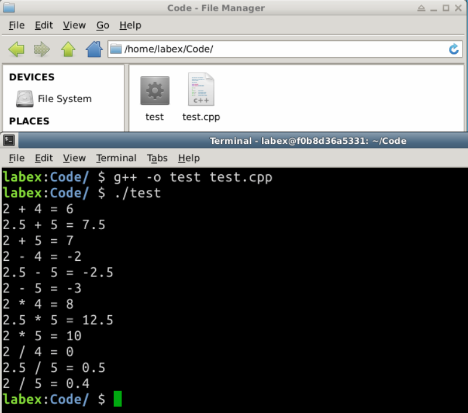

# Operations

##1. Introduction

For basic numeric and logical data, we use operators to operate with them. Like other languages, C++ provides thorough support for operators. Start learning them.

###Learning objective

- Arithmetic Operations
- Mixed-Type Operations
- Compound Assignment Operators
- Type-Casting
- Relational and Logical Operators

##2. Content

###2.1 Arithmetic Operations

C++ supports the following arithmetic operators for numbers: 

| Operator | Description         | Usage             | Examples                     |
| -------- | ------------------- | ----------------- | ---------------------------- |
| *        | Multiplication      | *expr1* * *expr2* | 2 * 3 → 6; 3.3 * 1.0 → 3.3   |
| /        | Division            | *expr1* / *expr2* | 1 / 2 → 0; 1.0 / 2.0 → 0.5   |
| %        | Remainder (Modulus) | *expr1* % *expr2* | 5 % 2 → 1; -5 % 2 → -1       |
| +        | Addition            | *expr1* + *expr2* | 1 + 2 → 3; 1.1 + 2.2 → 3.3   |
| -        | Subtraction         | *expr1* - *expr2* | 1 - 2 → -1; 1.1 - 2.2 → -1.1 |

All the above operators are *binary* operators, they take two operands. The multiplication, division and remainder take *precedence* over addition and subtraction.

It is important to take note that `int/int` produces an `int`, with the result *truncated*, 1/2 → 0 (not `0.5`).

###2.2 Mixed-Type Operations

If both the operands of an arithmetic operation belong to the *same type*, the operation is carried out in that type, and the result belongs to that type. However, if the two operands belong to *different types*, the compiler promotes the value of the *smaller* type to the *larger* type (known as *implicit type-casting*). The operation is then carried out in the *larger* type.

| Type   | Example   | Operation                                                 |
| ------ | --------- | --------------------------------------------------------- |
| int    | 2 + 3     | int 2 + int 3 → int 5                                     |
| double | 2.2 + 3.3 | double 2.2 + double 3.3 → double 5.5                      |
| mix    | 2 + 3.3   | int 2 + double 3.3 → double 2.0 + double 3.3 → double 5.3 |
| int    | 1 / 2     | int 1 / int 2 → int 0                                     |
| double | 1.0 / 2.0 | double 1.0 / double 2.0 → double 0.5                      |
| mix    | 1 / 2.0   | int 1 / double 2.0 → double 1.0 + double 2.0 → double 0.5 |

For example

```
/* Testing mix-type arithmetic operations */
#include <iostream>
#include <iomanip>   // needed for formatting floating-point numbers
using namespace std;
 
int main() {
   int i1 = 2, i2 = 4;
   double d1 = 2.5, d2 = 5.0;
   
   // floating-points in fixed format with 1 decimal place
   cout<<fixed<<setprecision(1);
   
   cout << i1 << " + " << i2 << " = " << i1+i2 << endl;  // 6
   cout << d1 << " + " << d2 << " = " << d1+d2 << endl;  // 7.5
   cout << i1 << " + " << d2 << " = " << i1+d2 << endl;  // 7.0  <==
 
   cout << i1 << " - " << i2 << " = " << i1-i2 << endl;  // -2
   cout << d1 << " - " << d2 << " = " << d1-d2 << endl;  // -2.5
   cout << i1 << " - " << d2 << " = " << i1-d2 << endl;  // -3.0 <==
 
   cout << i1 << " * " << i2 << " = " << i1*i2 << endl;  // 8
   cout << d1 << " * " << d2 << " = " << d1*d2 << endl;  // 12.5
   cout << i1 << " * " << d2 << " = " << i1*d2 << endl;  // 10.0 <==
 
   cout << i1 << " / " << i2 << " = " << i1/i2 << endl;  // 0    <==
   cout << d1 << " / " << d2 << " = " << d1/d2 << endl;  // 0.5
   cout << i1 << " / " << d2 << " = " << i1/d2 << endl;  // 0.4  <==
   return 0;
}
```
**Output:**
```
2 + 4 = 6
2.5 + 5.0 = 7.5
2 + 5.0 = 7.0
2 - 4 = -2
2.5 - 5.0 = -2.5
2 - 5.0 = -3.0
2 * 4 = 8
2.5 * 5.0 = 12.5
2 * 5.0 = 10.0
2 / 4 = 0
2.5 / 5.0 = 0.5
```



**Overflow / Underflow**

```
// Range of int is [-2147483648, 2147483647]
   int i1 = 2147483647;      // max int
   cout << i1 + 1 << endl;   // -2147483648 (overflow)
   cout << i1 * i1 << endl;  // 1
 
   int i2 = -2147483648;     // min int
   cout << i2 - 1 << endl;   // 2147483647 (underflow)
   cout << i2 * i2 << endl;  // 0
```

In arithmetic operations, the resultant value *wraps around* if it exceeds its range. C++ runtime does not issue an error/warning message but produces *incorrect* result. It is important to take note that *checking of overflow/underflow is the programmer's responsibility*.

###2.3 Compound Assignment Operators

 C++ also provides the so-called *compound assignment operator*s as listed:

| Operator | Usage           | Description                                            | Example                              |
| -------- | --------------- | ------------------------------------------------------ | ------------------------------------ |
| =        | *var* = *expr*  | Assign the value of the LHS to the variable at the RHS | x = 5;                               |
| +=       | *var* += *expr* | same as *var* = *var* + *expr*                         | x += 5; same as x = x + 5            |
| -=       | *var* -= *expr* | same as *var* = *var* - *expr*                         | x -= 5; same as x = x - 5            |
| *=       | *var* *= *expr* | same as *var* = *var* * *expr*                         | x *= 5; same as x = x * 5            |
| /=       | *var* /= *expr* | same as *var* = *var* / *expr*                         | x /= 5; same as x = x / 5            |
| %=       | *var* %= *expr* | same as *var* = *var* % *expr*                         | x %= 5; same as x = x % 5            |
| ++       | ++x             | Pre-Increment                                          | y=++x;same as x=x+1;y=x              |
| ++       | x++             | Post-Increment                                         | y=x++; same as oldX=x; x=x+1; y=oldX |
| --       | --x             | Pre-Decrement                                          | y=--x;same as x=x-1;y=x              |
| --       | x--             | Post-Decrement                                         | y=x--; same as oldX=x; x=x-1; y=oldX |

```
x = 5;
cout << x++ << endl;  // Save x (5); Increment x (=6); Print old x (5).
x = 5;
cout << ++x << endl;  // Increment x (=6); Print x (6).
```

###2.4 Implicit Type-Conversion vs. Explicit Type-Casting

When you assign a value of a fundamental (built-in) type to a variable of another fundamental type, C++ automatically converts the value to the receiving type, if the two types are compatible. For examples,

- If you assign an `int` value to a `double` variable, the compiler automatically casts the `int` value to a `double` double (e.g., from 1 to 1.0) and assigns it to the `double` variable.
- if you assign a `double` value to an `int` variable, the compiler automatically casts the `double` value to an `int` value (e.g., from 1.2 to 1) and assigns it to the `int` variable. The fractional part would be truncated and lost. Some compilers issue a warning/error "possible loss in precision"; others do not.

```
 int i;
 double d;
 
 i = 3;
 d = i;    // Assign an int value to double
 cout << "d = " << d << endl;  // 3.0
 
 d = 5.5;
 i = d;    // Assign a double value to int
 cout << "i = " << i << endl;  // 5 (truncated, no warning!)
```

You can explicitly perform type-casting via the so-called unary *type-casting operator* in the form of `(new-type) operand` or `new-type (operand)`. The type-casting operator takes one operand in the particular type, and returns an equivalent value in the new type. Take note that it is an operation that yields a resultant value, similar to an addition operation although addition involves two operands. For example,

```
cout << (double)5 << endl;  // int 5 → double 5.0
cout << (int)5.5 << endl;   // double 5.5 → int 5
 
double aDouble = 5.6;
int anInt = (int)aDouble; // return 5 and assign to anInt. aDouble does not change!
 
// C++ also supports function-style type cast.
cout << double(5) << endl;     // 5.0
cout << int(5.5) << endl;      // 5
cout << int(aDouble) << endl;  // 5
```

###2.5 Relational and Logical Operators

Very often, you need to compare two values before deciding on the action to be taken, C++ provides six *comparison operators* (or *relational operators*):

| Operator | Description              | Usage                | Example (x=5, y=8) |
| -------- | ------------------------ | -------------------- | ------------------ |
| ==       | Equal to                 | *expr1* == *expr2*   | (x == y) → false   |
| !=       | Not Equal to             | *expr1* != *expr2*   | (x != y) → true    |
| >        | Greater than             | *expr1* > *expr2*    | (x > y) → false    |
| >=       | Greater than or equal to | *expr1* >= *expr2*   | (x >= 5) → true    |
| <        | Less than                | *expr1* < *expr2*    | (y < 8) → false    |
| <=       | Less than or equal to    | *expr1* >= *expr2*   | (y <= 8) → true    |
| &&       | Logical AND              | *expr1* && *expr2*   | --------           |
| \|\|     | Logical OR               | *expr1* \|\| *expr2* | --------           |
| !        | Logical NOT              | !*expr*              | --------           |
| ^        | Logical XOR              | *expr1* ^ *expr2*    | --------           |

The truth tables are as follows:

| AND (&&) | true  | false |
| -------- | ----- | ----- |
| true     | true  | false |
| false    | false | false |

| OR (\|\|) | true | false |
| --------- | ---- | ----- |
| true      | true | true  |
| false     | true | false |

| NOT (!) | true  | false |
| ------- | ----- | ----- |
|         | false | true  |

| XOR (^) | true  | false |
| ------- | ----- | ----- |
| true    | false | true  |
| false   | true  | false |

```
// Return true if x is between 0 and 100 (inclusive)
(x >= 0) && (x <= 100)
// wrong to use 0 <= x <= 100
  
// Return true if x is outside 0 and 100 (inclusive)
(x < 0) || (x > 100)   //or
!((x >= 0) && (x <= 100))
 
// Return true if year is a leap year
// A year is a leap year if it is divisible by 4 but not by 100, or it is divisible by 400.
((year % 4 == 0) && (year % 100 != 0)) || (year % 400 == 0)
```

## 3. Summary

This part is relatively easy, you should relate them with previous section. No need to memorize them, to understand their logic in mind.