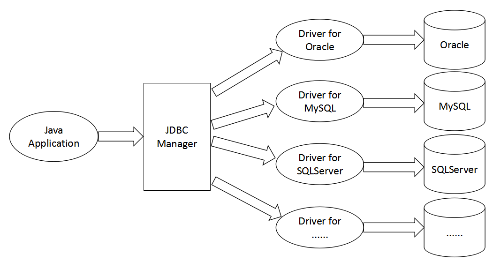
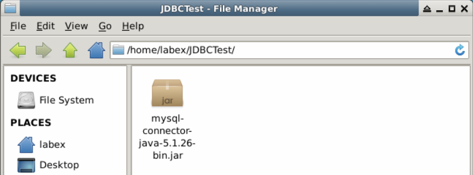
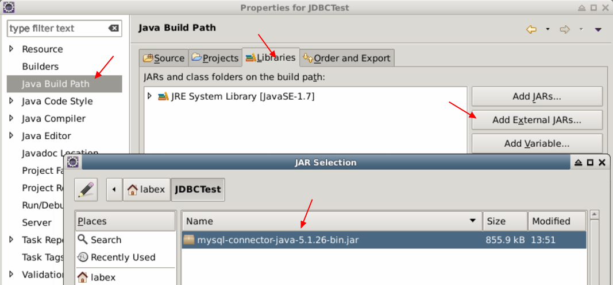
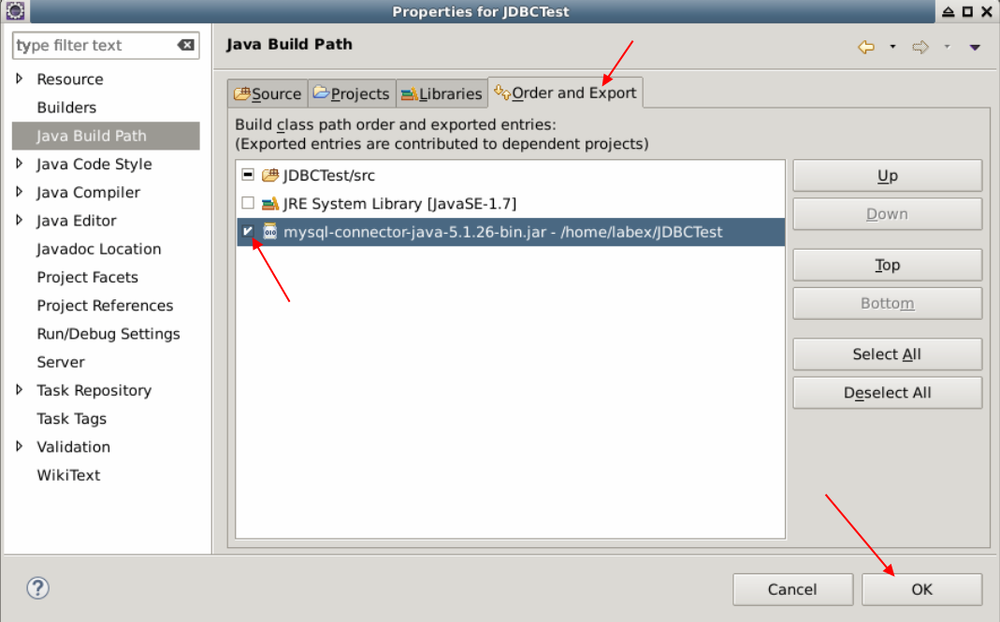
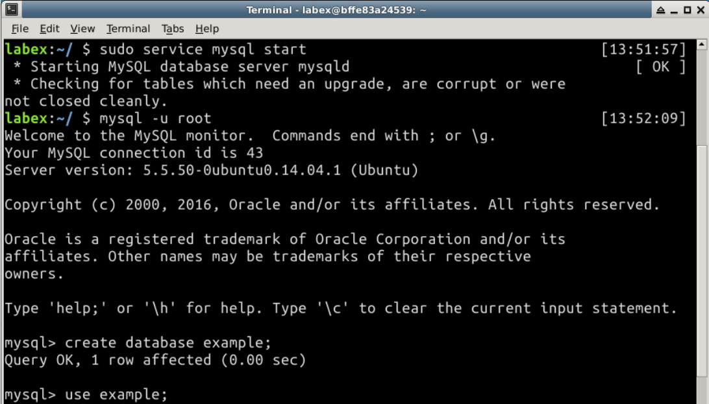
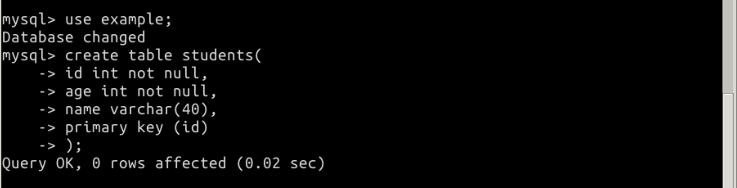
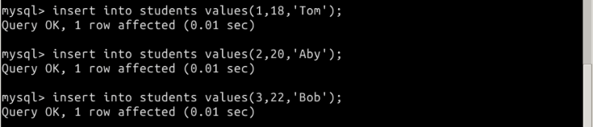
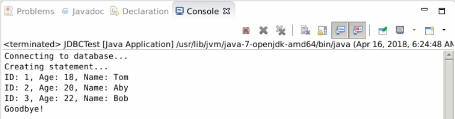

# Introduction to JDBC

## 1. Introduction

In this tutorial, we'll learn JDBC and some basic SQL syntax, then build the JDBC development environment.

###Learning Objective

- JDBC introduction
- SQL statements
- JDBC setttings
- A JDBC application

### Environment requirement

- JDK 1.7
- Eclipse
- MySQL 5.5+

## 2. Contetnt

###2.1 What's JDBC

JDBC is short for Java Database Connectivity, it contains a group of  APIs and database drivers which are used to manage database. 

If our applications want to operate database, commonly we use C/C++ database interfaces.


For different databases, their APIs are not all the same, this will affect our application cross-platform. 

Does there exist uniform database interfaces for applications? You should know about  the hierarchical structure of program architecture. Our application only needs to interact with the upper interface, the rest left for lower implementation.


ODBC is short for Open Database Connect. It's a middleware for application managing database provided by Microsoft. With it, our application does not need to konw what database we use, the application only interacts with ODBC.

In Java, the choose is JDBC. JDBC provides a group of standard interfaces for database management. Upon these interfaces, we can easily build our application for database operation.



### 2.2 JDBC Usage

We use SQL statements to operate database. Here we just review some basic SQL statements, if you do not know how to use database, you can refer to our [MySQL tutorial](https://labex.io/courses).

####2.2.1 Create Database

Use `CREATE BATADASE` to create a new database.

```sql
CREATE DATABASE example;
```

Here we created a database named `example`.

#### 2.2.2 Drop Database

Use `DROP DATABASE` to delete an existed database.

```sql
DROP DATABASE example;
```

> To do create and drop operation, one should have the authorization.Drop operation will delete all data in the database, you should be careful for this.

Here we just delete the database created before.

#### 2.2.3 Create Table

Use `CREATE TABLE` to create a new table.

```sql
CREATE TABLE students{
    id INT NOT NULL,
    age INT NOT NULL,
    name VARCHAR(40),
    major VARCHAR(40),
    PRIMARY KEY (id)
};
```

Here we created a table `studnents` with four data fields.

####2.2.4 Drop Table

Use `DROP TABLE` to delete an existed table.

```sql
DROP TABLE students;
```

Here we delete table `students` created before.

#### 2.2.5 Insert Data

Use `INSERT INTO tb_name VALUES(val1,val2,...);` to insert data.

```sql
INSERT INTO students VALUES(1,18,'Mumu','JAVA');
```

Here we insert a piece of data into table `students`.

####2.2.6 Select Data

Use `SELECT` to search for data in database.

```sql
SELECT name,age FROM students WHERE id = 1;
```

Here we select a record with its id =1.

Or you can search for data using `LIKE` for fuzzy search.

```sql
SELECT name, major FROM students WHERE name LIKE '%om%';
```

#### 2.2.7 Update Data

Use `UPDATE` to update data.

```sql
UPDATE students SET age=20 WHERE id=1;
```

Here we update a student age to 20 whose id is 1.

#### 2.2.8 Delete Data

Use `DELETE FROM` to delete data.

```sql
DELETE FROM students WHERE id = 1;
```

Here we delete a student data whose id is 1.

### 2.3 JDBC Settings

In this test, we use MySQL database. In our environment, we have installed MySQL for you, you don't need to install it again.

#### 2.3.1 Start MySQL Service

```shell
sudo service mysql start
```

#### 2.3.2 Login and Logout

Connect to database.

```shell
mysql -u root
```

Exit database.

```shell
mysql> exit
```

### 2.4 Build a JDBC Application

Next we start to build a real JDBC application.

#### 2.4.1 Import JDBC driver

You can download database driver from official website for your database. We provid a mysql driver.

```
git clone https://github.com/LabExCoding/JDBCTest
```



1. Open eclipse and import jar as follow.

​    a. New a java project `JDBCTest` and right click project name to choose  `Properties`.

​    b. Choose `Java Build Path` , in right tab choose `Libraries` --> `Add External JARs..`.

​    c. Import `/home/labex/JDBCTest/mysql-connector-java-5.1.26-bin.jar`.



​    d. Choose `Order and Export`,  select the mysql connector jar and click `OK` button.



2. Get connection: Use `DriverManager.getConnection()` method to create a `Connection` object which is a bridge between database and application.
3. Execute query: Commit a SQL statement to database.
4. Get result: Use `ResultSet.getXXX()` method to retrive data from result set.
5. Deal with result set: Do some operation with result.
6. Clean up: Close connection and release the resource.

###2.5 A Simple Demo

Create database.



Create table.



Insert sample data.



Java program for JDBC. 

Create a package `com.labex` in `Java Resources/src/`. Create a class in package `com.labex`.

```javascript
package com.labex;

import java.sql.*;

public class JdbcTest {
   // JDBC driver name
   static final String JDBC_DRIVER = "com.mysql.jdbc.Driver";  
   //database url
   static final String DB_URL = "jdbc:mysql://localhost/example";

   //  database user name
   static final String USER = "root";
   // database user password
   static final String PASS = "";

   public static void main(String[] args) {
       Connection conn = null;
       Statement stmt = null;
       try{
           // load driver class
           Class.forName("com.mysql.jdbc.Driver");

           // connect to database
           System.out.println("Connecting to database...");
           conn = DriverManager.getConnection(DB_URL,USER,PASS);

           // execute query
           System.out.println("Creating statement...");
           stmt = conn.createStatement();
           String sql;
           sql = "SELECT id, name, age FROM students";
           ResultSet rs = stmt.executeQuery(sql);

           // get result set
           while(rs.next()){
               // retrive data
               int id  = rs.getInt("id");
               int age = rs.getInt("age");
               String name = rs.getString("name");

               // print result
               System.out.print("ID: " + id);
               System.out.print(", Age: " + age);
               System.out.print(", Name: " + name);
               System.out.println();
           }
           // release resource
           rs.close();
           stmt.close();
           conn.close();
       }catch(SQLException se){
           // JDBC exception handle
           se.printStackTrace();
       }catch(Exception e){
           // Class.forName error
           e.printStackTrace();
       }finally{
           // close resource
           try{
               if(stmt!=null)
                   stmt.close();
           }catch(SQLException se2){
           }
           try{
               if(conn!=null)
                   conn.close();
           }catch(SQLException se){
               se.printStackTrace();
           }
       }
       System.out.println("Goodbye!");
   }
}
```

Run this project, and see output.



## 3. Summary

This demo showed you how to use JDBC, next we'll learn some basis of JDBC.