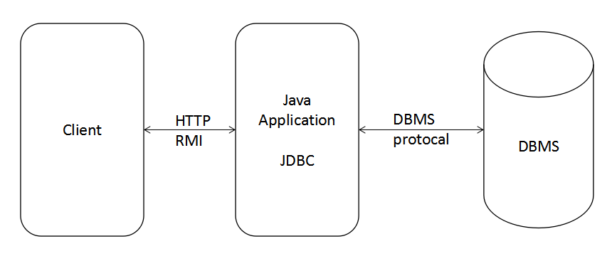

# JDBC Basic

## 1. Introduction

In this section, you will learn JDBC driven type and JDBC connection.

###Learning Objective

- JDBC structure
- JDBC driver type
- JDBC Connection

## 2. Content

### 2.1 JDBC structure

JDBC API consists of three parts:

- JDBC driver manager
- JDBC driver test toolkit
- JDBC-ODBC bridge

JDBC driver manager is used to connect java program to JDBC driver.

JDBC driver test toolkit is used  to provide reliability for JDBC driver.

JDBC-ODBC bridge is used to make use of ODBC driver as JDBC driver, commonly used to access some less used database management system.

Three layer access model.



### 2.2 JDBC driver type

JDBC driver implements JDBC API interface, can open connection with database and send SQL statements, collect result and interact with your Java program.

JDBC driver is different according to  the operation system and hardware platform you use. Them can be classified as following:

- JDBC-ODBC bridge: it converts JDBC to ODBC, and then uses ODBC to connect to databasse. It's not the suggested way to use JDBC.
- Local API using Java for database driver:  this driver converts client JDBC invoke to Oracle, Sybase, Informix,... invoke.
- JDBC network driver: it is the most flexible JDBC driver. It's a three-layer model. JDBC client uses standard net sockts to communicate with middleware server. The middleware server transfer to DBMS server.
- Local protocal driver: this driver will convert JDBC invoke to special network protocal. It's a practical way to use  internet access. It's a high performance driver, usually provided by database provider. It's the suggested way of using JDBC.

### 2.3 JDBC Connection

To establish a connection to database, you need to do the four steps:

1. Import JDBC driver: import a driver for registration.
2. Register a JDBC driver: the JVM will load all necessary driver classes into memory.
3. Set database URL:  refer to database you are going to connect to.
4. Create a connection object: use `getConnection()` method to get real connection.

**Register a driver:**

a. Class.forName()

Dynamic load a class for Java program.

```java
try {
   Class.forName("com.mysql.jdbc.Driver");
}
catch(ClassNotFoundException ex) {
   System.out.println("Error: unable to load driver class!");
   System.exit(1);
}
```

b. DriverManager.registerDriver()

```java
 Driver driver = new com.mysql.jdbc.Driver();
 DriverManager.registerDriver(driver);
```

**Set database URL and get connection:**

DriverManager.getConnection() method has three overload types:

```java
getConnection(String url)

getConnection(String url, Properties prop)

getConnection(String url, String user, String password)
```

Here we list the JDBC driver name and database URL.

| RDBMS | Driver name | URL |
|-|-|-|
| MySQL | com.mysql.jdbc.Driver | jdbc:mysql://hostname/dbName |
| Oracle | oracle.jdbc.OracleDriver | jdbc:oracle:thin:@hostname:port:dbName |
| DB2 | COM.ibm.db2.jdbc.net.DB2Driver | jdbc:db2:hostname:port/dbName |
| Sybase | com.sybase.jdbc.SybDriver | jdbc:sybase:Tds:hostname:port/dbName |

Use URL, user name and password to connect.

```java
String URL = "jdbc:mysql://localhost/EXAMPLE";
String USER = "username";
String PASS = "password"
Connection conn = DriverManager.getConnection(URL, USER, PASS);
```

Only use URL to connect.

```java
String URL = "jdbc:mysql://localhost/example?user=root&password=";
Connection conn = DriverManager.getConnection(URL);
```

Use URL and properties to connect.

```java
import java.util.*;

String URL = "jdbc:mysql://localhost/example";
Properties pro = new Properties( );

pro.put( "user", "root" );
pro.put( "password", "" );

Connection conn = DriverManager.getConnection(URL, pro);
```

Close JDBC connection.

```java
conn.close();
```

## 3. Summary

This section, we introduced  JDBC driver types and JDBC connection, next part we'll learn JDBC interface. 