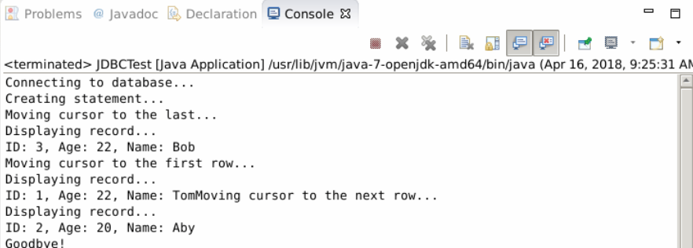

# JDBC ResultSet

## 1. Introduction

In this part, you will learn java.sql.ResultSet interface, that is something about result set.

### Learning Objective

- ResultSet interface

## 2. Content

### 2.1 ResultSet introduction

ResultSet is generated by  executing query statement, it represents the result of query. ResultSet has a cursor pointing to current data row. At the  beginning, the cursor points to the first row, calling next() method will move to next row. If no more rows in ResultSet, next() returns false. The ResultSet can be iterated once from first row to last row.

JDBC provide three methods to create ResultSet:

```java
createStatement(int RSType, int RSConcurrency);

prepareStatement(String SQL, int RSType, int RSConcurrency);

prepareCall(String sql, int RSType, int RSConcurrency);
```

RSType indicates ResultSet type, RSConcurrency is a ResultSet const, indicates the ResultSte is read-only or updatable.

Type of ResultSet:

|Type|Desc|
|-|-|
|ResultSet.TYPE_FORWARD_ONLY|cursor can only move forward|
|ResultSet.TYPE_SCROLL_INSENSITIVE|cursor can move forward and backward, not trace updating in database|
|ResultSet.TYPE_SCROLL_INSENSITIVE|cursor can move forward and backward, trace data updating in database|

If not specify any ResultSet concurrency, by default, it's CONCUR_RAED_ONLY.

|Concurrency|Desc|
|-|-|
|ResultSet.CONCUR_READ_ONLY|Result Set in read-only|
|ResultSet.CONCUR_UPDATABLE|Result Set is updatable|

Initialize a bidirectional, updatable Result Set.

```
try {
   Statement stmt = conn.createStatement(
                           ResultSet.TYPE_SCROLL_INSENSITIVE,
                           ResultSet.CONCUR_UPDATABLE);
}
catch(Exception ex) {
   ....
}
finally {
   ....
}
```

### 2.2 Navigation

The navigation method is used to move cursor. Let's see some methods related to cursor.

|Method|Desc|
|-|-|
|public void beforeFirst() throws SQLException|move cursor befor first row|
|public void afterLast() throws SQLException|move cursor after last row|
|public boolean first() throws SQLException|move cursor to first row|
|public boolean last() throws SQLException|move cursor to last row|
|public boolean absolute(int row) throws SQLException|move cursor to specific row|
|public boolean relative(int row) throws SQLException|move cursor back or forward from current row by some rows|
|public boolean previous(int row) throws SQLException|move to previous row, if closed ResultSet, return false|
|public boolean next() throws SQLException|move to next row, if no more return false|
|public int getRow() throws SQLException|get row number where the cursor points|
|public void moveToInsertRow() throws SQLException|move to a special row where new row can be inserted into ResultSet|
|public void moveToCurrentRow() throws SQLException|move to current row if insert some row, or nothing happen|

Just show you the code.

```java
package com.labex;
import java.sql.*;

public class JDBCTest {
   // JDBC driver name
   static final String JDBC_DRIVER = "com.mysql.jdbc.Driver";
   // database URL
   static final String DB_URL = "jdbc:mysql://localhost/example";

   // user name and password
   static final String USER = "root";
   static final String PASS = "";

   public static void main(String[] args) {
       Connection conn = null;
       Statement stmt = null;
       try{
           // register JDBC driver
           Class.forName("com.mysql.jdbc.Driver");

           // open connection
           System.out.println("Connecting to database...");
           conn = DriverManager.getConnection(DB_URL,USER,PASS);


           System.out.println("Creating statement...");
           // create ResultSet，bidirectional，read-only
           stmt = conn.createStatement(
                           ResultSet.TYPE_SCROLL_INSENSITIVE,
                           ResultSet.CONCUR_READ_ONLY);
           String sql;
           sql = "SELECT id, name, age FROM students";
           ResultSet rs = stmt.executeQuery(sql);

           // move cursor to last row
           System.out.println("Moving cursor to the last...");
           rs.last();

           // handle result set
           System.out.println("Displaying record...");
           int id  = rs.getInt("id");
           int age = rs.getInt("age");
           String name = rs.getString("name");


           // display data
           System.out.print("ID: " + id);
           System.out.print(", Age: " + age);
           System.out.print(", Name: " + name);
           System.out.println();

           // move cursor to first row
           System.out.println("Moving cursor to the first row...");
           rs.first();


           System.out.println("Displaying record...");
           id  = rs.getInt("id");
           age = rs.getInt("age");
           name = rs.getString("name");


           // display data
           System.out.print("ID: " + id);
           System.out.print(", Age: " + age);
           System.out.print(", Name: " + name);

           // move cursor to next row
           System.out.println("Moving cursor to the next row...");
           rs.next();


           System.out.println("Displaying record...");
           id  = rs.getInt("id");
           age = rs.getInt("age");
           name = rs.getString("name");

           // display data
           System.out.print("ID: " + id);
           System.out.print(", Age: " + age);
           System.out.print(", Name: " + name);

           rs.close();
           stmt.close();
           conn.close();
       }catch(SQLException se){
           se.printStackTrace();
       }catch(Exception e){
           e.printStackTrace();
       }finally{
           try{
               if(stmt!=null)
                   stmt.close();
           }catch(SQLException se2){
           }
           try{
               if(conn!=null)
                   conn.close();
           }catch(SQLException se){
               se.printStackTrace();
           }
       }
       System.out.println("\nGoodbye!");
   }
}
```



### 2.3 Get data in Result Set

In Result Set, use get method to return data.

|Method|Desc|
|-|-|
|public int getInt(String columnName) throws SQLException|get value of columnName in row|
|public int getInt(int columnIndex) throws SQLException|get value of index in row, index begins from 1.|

Besides, there are getString(), getDouble(), etc.

### 2.4 Update

The update methods are:

|Method|Desc|
|-|-|
|public void updateString(int columnIndex, String s) throws SQLException|set value of column index as s|
|public void updateString(String columnName, String s) throws SQLException|set value of column name as s|

Besides, there are updateInt(), updateDouble(), etc.

After update Result Set, we also can update database.

|Method|Desc|
|-|-|
|public void updateRow()|update row in database|
|public void deleteRow()|delete current row in database|
|public void refreshRow()|refresh row from database|
|public void cancelRowUpdates()|cancel change to current row|
|public void insertRow()|insert row into database|

A show demo:

```java
Statement stmt = conn.createStatement(
                           ResultSet.TYPE_SCROLL_INSENSITIVE,
                           ResultSet.CONCUR_UPDATABLE);

String sql = "SELECT id, name, age FROM students";
ResultSet rs = stmt.executeQuery(sql);

// update data in Result Set
rs.moveToInsertRow();
rs.updateInt("id",5);
rs.updateString("name","John");
rs.updateInt("age",21);
// insert row into database
rs.insertRow();
```

## 3. Summary

In this part, we introduced something  about Result Set. Next you'll learn JDBC data type and transaction.