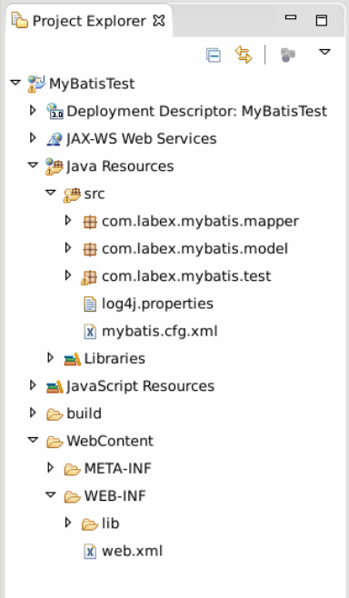
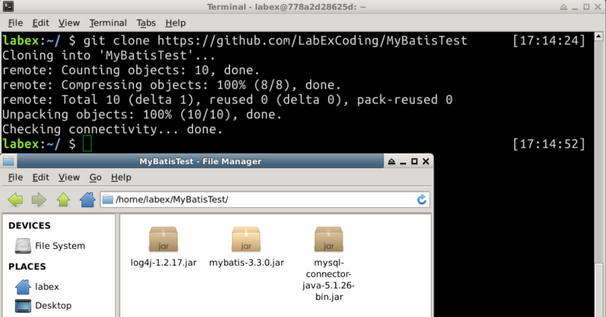
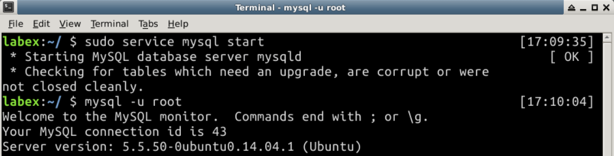
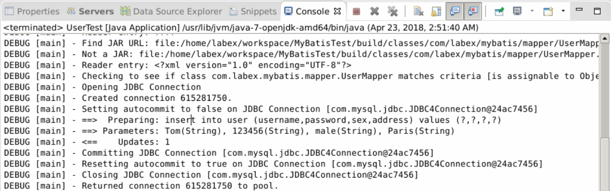
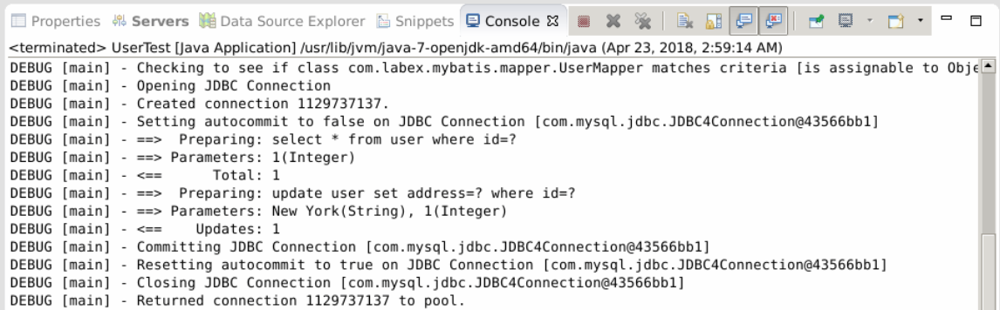
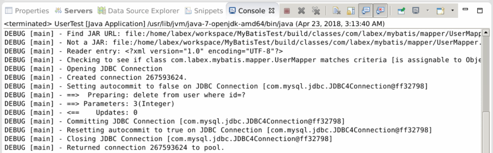
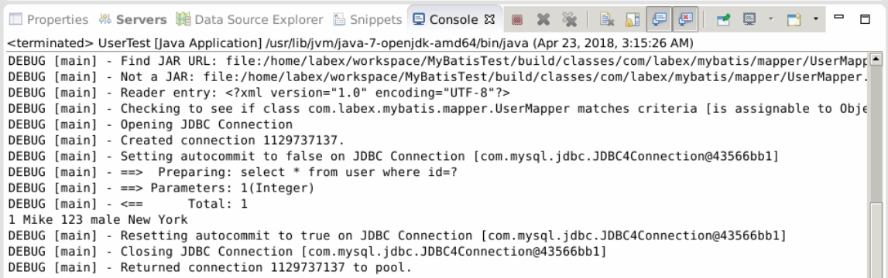
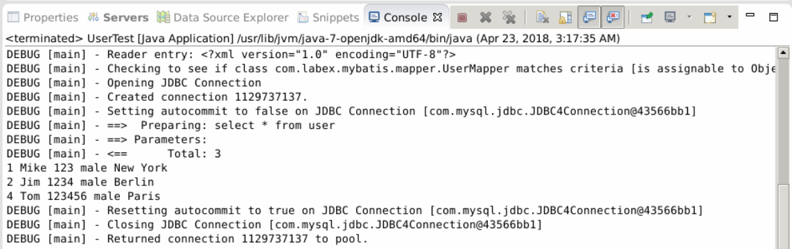

# A Demo for MyBatis

## 1. Introduction

In this part, we use a demo project to show you how to use MyBatis. Implement the CURD operation.

### Learning Objective

- MyBatis
- SQL
- MySQL
- Interface

### Environment Requirment

- JDK 1.7
- Eclipse
- MySQL 5.5+
- Xfce terminal

## 2. Content

###2.1 Preparation

(1) The project structure.



(2) Open Eclipse, create a Dynamic Web Project `MyBatisTest`. Click Next->Next-> generate web.xml...

(3) Download MyBatis jar files.

```shell
git clone https://github.com/LabExCoding/MyBatisTest
```



Copy the jar files to `/WebContent/WEB-INF/lib/` folder.

(4) Start MySQL server. In terminal, type the two cmd bellow.

```shell
$ sudo service mysql start
$ mysql -u root
```



Create a database `mybatis` for test.

```sql
mysql> create database mybatis;
mysql> use mybatis;
```

Create a table `user`, insert three users.

```sql
mysql> create table user(
    -> id int primary key auto_increment,
    -> username varchar(20),
    -> password varchar(20),
    -> sex varchar(10),
    -> address varchar(20));
 
mysql> insert into user(username,password,sex,address) values('Mike',123,'male','London');
mysql> insert into user(username,password,sex,address) values('Jim',1234,'male','Berlin');
mysql> insert into user(username,password,sex,address) values('Mary',12345,'female','Chicago');
```

###2.2 MyBatis Configuration File

Create configuration file for MyBatis `mybatis.cfg.xml` in `/Java Resources/src` folder. The content is:

```xml
<?xml version="1.0" encoding="UTF-8"?>
<!DOCTYPE configuration PUBLIC "-//mybatis.org//DTD Config 3.0//EN" "http://mybatis.org/dtd/mybatis-3-config.dtd">
<configuration>    
    <!-- set an alias for JavaBean-->
    <typeAliases>
        <!-- class name in package as an alias -->
        <package name="com.labex.mybatis.model" />
	</typeAliases> 
    
       <!-- config mybatis environment -->
    <environments default="development">
        <environment id="development">
           <!-- type="JDBC" indicates using JDBC commit and roll back -->
            <transactionManager type="JDBC" />

            <!-- POOLED support JDBC connection pool -->
            <!-- database connection pool, managed by Mybatis, db url, MySQL user and password -->
            <dataSource type="POOLED">
                <property name="driver" value="com.mysql.jdbc.Driver" />
                <property name="url" value="jdbc:mysql://localhost:3306/mybatis" />
                <property name="username" value="root" />
                <property name="password" value="" />
            </dataSource>
        </environment>
    </environments> 
    
    <mappers>
    <!-- load mapper file via mapper interface -->
    <package name="com/labex/mybatis/mapper" />
</mappers>
</configuration>
```

### 2.3 Class and Interface

#### 2.3.1 Entity class -- User

Create a package `com.labex.mybatis.model` in `/Java Resources/src`. Create a class `User` in `com.labex.mybatis,model` package.

```java
package com.labex.mybatis.model;

public class User {

    private Integer id;
    private String username;
    private String password;
    private String sex;
    private String address;

    public Integer getId() {
        return id;
    }

    public void setId(Integer id) {
        this.id = id;
    }

    public String getUsername() {
        return username;
    }

    public void setUsername(String username) {
        this.username = username;
    }

    public String getPassword() {
        return password;
    }

    public void setPassword(String password) {
        this.password = password;
    }

    public String getSex() {
        return sex;
    }

    public void setSex(String sex) {
        this.sex = sex;
    }

    public String getAddress() {
        return address;
    }

    public void setAddress(String address) {
        this.address = address;
    }

}
```

#### 2.3.2 Mapper interface-- UserMapper

Create a package `com.labex.mybatis.mapper` in `/Java Resources/src`. Create interface `UserMapper` in `com.labex.mybatis.mapper` package.

```java
package com.labex.mybatis.mapper;

import java.util.List;

import com.labex.mybatis.model.User;

public interface UserMapper {

    /*
     * add new user
     * @param user
     * @return
     * @throws Exception
     */
    public int insertUser(User user) throws Exception;

    /*
     * update user data
     * @param user
     * @param id
     * @return
     * @throws Exception
     */
    public int updateUser(User user) throws Exception;

    /*
     * delete user data by id
     * @param id
     * @return
     * @throws Exception
     */
    public int deleteUser(Integer id) throws Exception;

    /*
     * search user data by id
     * @param id
     * @return
     * @throws Exception
     */
    public User selectUserById(Integer id) throws Exception;

    /*
     * serarch all user data
     * @return
     * @throws Exception
     */
    public List<User> selectAllUser() throws Exception;
}
```

#### 2.3.3 Mapper Configuration File

Create a mapper configuration file `UserMapper.xml` in `com.labex.mybatis.mapper` package. It contains some SQL statements, parameters and return types.

```xml
<?xml version="1.0" encoding="UTF-8"?>
<!DOCTYPE mapper PUBLIC "-//mybatis.org/DTD Mapper 3.0" "http://mybatis.org/dtd/mybatis-3-mapper.dtd">
<mapper namespace="com.labex.mybatis.mapper.UserMapper">
    <!-- customized result set -->
    <resultMap id="userMap" type="User">
        <id property="id" column="id" javaType="int"></id>
        <result property="username" column="username" javaType="String"></result>
        <result property="password" column="password" javaType="String"></result>
        <result property="sex" column="sex" javaType="String"></result>
        <result property="address" column="address" javaType="String"></result>
    </resultMap>

    <!-- define SQL statement, id must be the same with method name in interface -->
    <!-- useGeneratedKeys：auto generate primary key -->
    <!-- keyProperty： unique attribute -->
    <!-- parameterType represents param type, resultType indicates return type -->
    <insert id="insertUser" useGeneratedKeys="true" keyProperty="id">
        insert into user (username,password,sex,address) values
        (#{username},#{password},#{sex},#{address})
    </insert>

    <update id="updateUser"  parameterType="User">
        update user set
        address=#{address} where
        id=#{id}
    </update>

    <delete id="deleteUser" parameterType="int">
        delete from user where
        id=#{id}
    </delete>

    <!-- if not set an alias for Java Bean, resultType="com.labex.mybatis.model.User" -->

    <!-- when using resultType, make sure class attributes name absolutely the same withdata fields name, or you can use resultMap -->
    <select id="selectUserById" parameterType="int" resultType="User">
        select * from user where id=#{id}
    </select>

    <select id="selectAllUser" resultMap="userMap">
        select * from user
    </select>

</mapper>
```

#### 2.3.4 Log File

Log file helps us check output SQL statements. Create a log file `log4j.properties` in `/Java Resources/src`.

```
# Global logging configuration
log4j.rootLogger=DEBUG, stdout
# Console output...
log4j.appender.stdout=org.apache.log4j.ConsoleAppender
log4j.appender.stdout.layout=org.apache.log4j.PatternLayout
log4j.appender.stdout.layout.ConversionPattern=%5p [%t] - %m%n
```

### 2.4 Test

Create a package `com.labex.mybatis.test` in  `/Java Resources/src`. Create a test class `UserTest` in `com.labex.mybatis.test` package.

```java
package com.labex.mybatis.test;

import java.io.IOException;
import java.io.InputStream;
import java.util.List;

import org.apache.ibatis.io.Resources;
import org.apache.ibatis.session.SqlSession;
import org.apache.ibatis.session.SqlSessionFactory;
import org.apache.ibatis.session.SqlSessionFactoryBuilder;

import com.labex.mybatis.mapper.UserMapper;
import com.labex.mybatis.model.User;

public class UserTest {
    private static SqlSessionFactory sqlSessionFactory;

    public static void main(String[] args) {
        // Mybatis config file
        String resource = "mybatis.cfg.xml";

        // get config filestream
        InputStream inputStream = null;
        try {
            inputStream = Resources.getResourceAsStream(resource);
        } catch (IOException e) {
            e.printStackTrace();
        }

        // create SqlSessionFactory, pass in MyBatis config file
        sqlSessionFactory = new SqlSessionFactoryBuilder().build(inputStream);

        // these method are for test
        // uncomment one when test it
        insertUser();
        // updateUser();
        // deleteUser();
        // selectUserById();
        // selectAllUser();

    }

    // add new user
    private static void insertUser() {
        // get SqlSession object
        SqlSession session = sqlSessionFactory.openSession();

        UserMapper mapper = session.getMapper(UserMapper.class);
        User user = new User();
        user.setUsername("Tom");
        user.setPassword("123456");
        user.setSex("male");
        user.setAddress("Paris");
        try {
            mapper.insertUser(user);

            session.commit();
        } catch (Exception e) {
            e.printStackTrace();
            session.rollback();
        }

        // release resource
        session.close();
    }

    // update user data
    private static void updateUser() {

        SqlSession session = sqlSessionFactory.openSession();

        UserMapper mapper = session.getMapper(UserMapper.class);
        User user = null;
        try {
            user = mapper.selectUserById(1);
        } catch (Exception e1) {
            e1.printStackTrace();
        }
        user.setAddress("New York");
        try {
            mapper.updateUser(user);
            session.commit();
        } catch (Exception e) {
            e.printStackTrace();
            session.rollback();
        }

        session.close();
    }

    // delete user data
    private static void deleteUser() {

        SqlSession session = sqlSessionFactory.openSession();

        UserMapper mapper = session.getMapper(UserMapper.class);
        try {
            mapper.deleteUser(3);
            session.commit();
        } catch (Exception e) {
            e.printStackTrace();
            session.rollback();
        }

        session.close();
    }

    // search user data by id
    private static void selectUserById() {

        SqlSession session = sqlSessionFactory.openSession();

        UserMapper mapper = session.getMapper(UserMapper.class);
        try {
            User user = mapper.selectUserById(1);
            session.commit();
            System.out.println(user.getId() + " " + user.getUsername() + " "
                    + user.getPassword() + " " + user.getSex() + " "
                    + user.getAddress());
        } catch (Exception e) {
            e.printStackTrace();
            session.rollback();
        }

        session.close();
    }

    // search all user data
    private static void selectAllUser() {

        SqlSession session = sqlSessionFactory.openSession();

        UserMapper mapper = session.getMapper(UserMapper.class);
        try {
            List<User> userList = mapper.selectAllUser();
            session.commit();
            for (User user : userList) {
                System.out.println(user.getId() + " " + user.getUsername() + " "
                        + user.getPassword() + " " + user.getSex() + " "
                        + user.getAddress());
            }
        } catch (Exception e) {
            e.printStackTrace();
            session.rollback();
        }

        session.close();
    }
}
```


**(1) Test insertUser()**



**(2) Test updateUser()**



**(3) deleteUser()**



**(4) selectUserById()**



**(5) selectAllUser()**



## 3. Summary

This is a simple demo, it implemented CURD operation. Hope it would help you underestanding MyBatis.