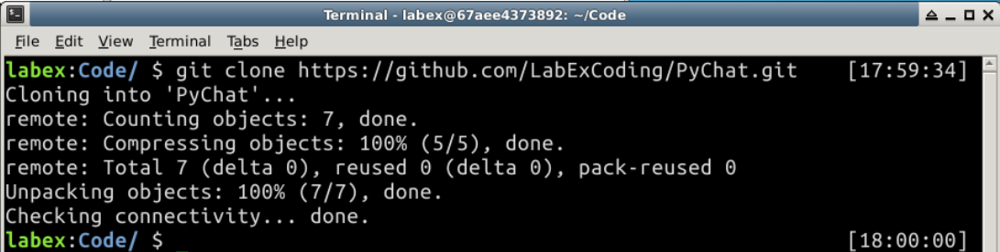
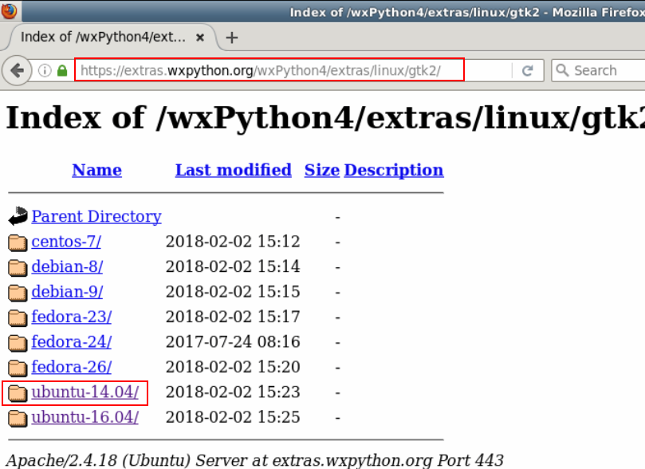
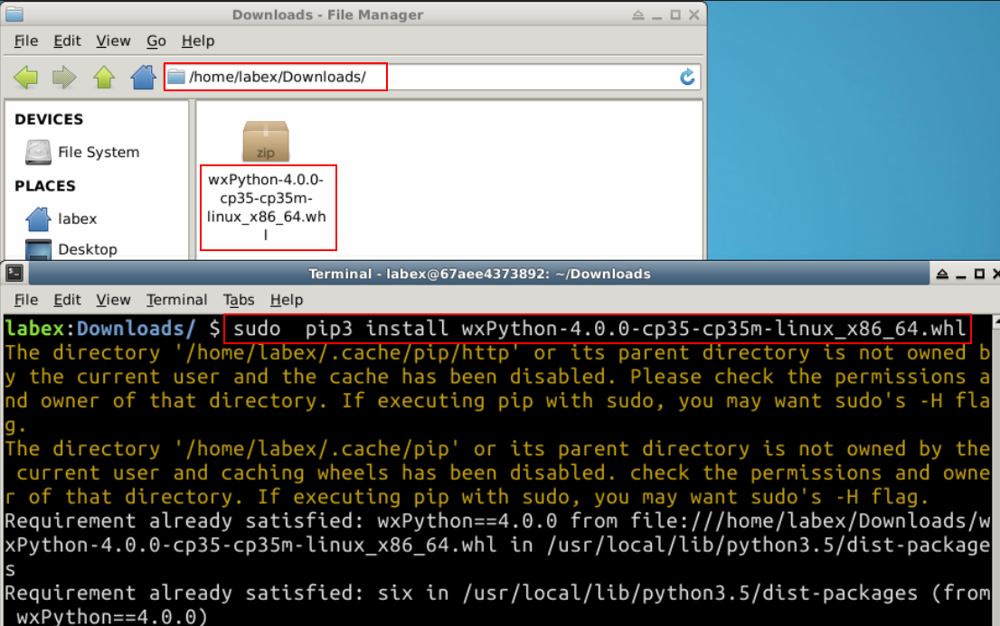

# Use Python to Build a Chat Room

## 1. Overview

### 1.1 Introduction

This tutorial uses modules such as wxPython, asynchat, _thread to develop a graphical interface chat room program.

### 1.2 Learning Objevtives

+ asyncore, asynchat modules
+ wxPython graphics development

### 1.3 Operating Environment

+ python 3.5
+ wxPython

### 1.4 Download Code

Here is the link for you to download the full code used：
```
# download
git clone https://github.com/LabExCoding/PyChat.git
```

You can download into your file and use to learn.



## 2. Principles

### 2.1 Description

In this tutorial, we will implement a simple graphical interface chat system. We can log in to the chat room via a graphical client and chat with other members.

### 2.2 Analysis

Since Python is a language with GIL, it is not a good choice to use multithreaded IO operations in Python. At the same time, the chat server will communicate with multiple sockets, so we can implement the chat server based on the asyncore module. The aysncore module is an asynchronous socket processor. Using this module will greatly simplify the asynchronous programming. The asynchat module is further encapsulated on the basis of the asyncore module, which simplifies the development of communication tasks based on text protocols.

Since you want to develop a chat program, it is necessary to design the protocol that is used when chatting. For the sake of simplicity, the chat server we are going to develop only supports the text protocol and invokes the related operations through the command message. For example, if the client sends the following text, it will perform the corresponding operation:

```
# log in
login\n
# send hello in chat room
say hello\n
# view online users in the chat room
look\n
# log out
logout\n
```

In the above protocol flow, `login`, `say`, `look`, `logout` is the relevant protocol code.

## 3. Preparation

This tutorial is based on the python3 environment whose installation package is already provided. You can go to [here](https://extras.wxpython.org/wxPython4/extras/linux/gtk2/ubuntu-14.04/) to download wxPython module. Do the operations step by step as we'll show you.

Open the browser, and  access the website.



Choose this file to download.


After finishing download, the file is in this folder. You open the folder and open a terminal here and use the command `sudo  pip3 install wxPython-4.0.0-cp35-cp35m-linux_x86_64.whl` to  install it.



## 4. Procedure

### 4.1 Serview type

Here we first need a chat server class, which is implemented by inheriting the asyncore dispatcher class. We write the `server.py` file:

```
import asynchat
import asyncore


# define the port
PORT = 6666

# define end exception class
class EndSession(Exception):
    pass


class ChatServer(asyncore.dispatcher):
    """
    Chat server
    """

    def __init__(self, port):
        asyncore.dispatcher.__init__(self)
        # create socket
        self.create_socket()
        # set socket into recyclable
        self.set_reuse_addr()
        # listen port
        self.bind(('', port))
        self.listen(5)
        self.users = {}
        self.main_room = ChatRoom(self)

    def handle_accept(self):
        conn, addr = self.accept()
        ChatSession(self, conn)
```

Note here that for `asyncore` and `asynchat` module, you will need to use `asyncio` module as replacement in python3.6

### 4.2 Chat class

Now we have a server class, and we also need to be able to maintain each user's connection session, which is inherited from asynchat's `async_chat` class. It is defined in the `server.py` file, and the code is as follows:

```
class ChatSession(asynchat.async_chat):
    """
    Responsible for communication with clients
    """

    def __init__(self, server, sock):
        asynchat.async_chat.__init__(self, sock)
        self.server = server
        self.set_terminator(b'\n')
        self.data = []
        self.name = None
        self.enter(LoginRoom(server))

    def enter(self, room):
        # Remove yourself from the current room and add it to the designated room
        try:
            cur = self.room
        except AttributeError:
            pass
        else:
            cur.remove(self)
        self.room = room
        room.add(self)

    def collect_incoming_data(self, data):
        # receive data from client
        self.data.append(data.decode("utf-8"))

    def found_terminator(self):
        # when a piece of data at the end of the client
        line = ''.join(self.data)
        self.data = []
        try:
            self.room.handle(self, line.encode("utf-8"))
        # when you exit the chat room
        except EndSession:
            self.handle_close()

    def handle_close(self):
        # when session is off，you'll enter LogoutRoom
        asynchat.async_chat.handle_close(self)
        self.enter(LogoutRoom(self.server))
```

### 4.3 Protocol command interpreter

In the previous analysis, we designed the protocol of the chat server, we need to implement the corresponding method of the protocol command, specifically to deal with the user login, exit, send a message, query the code of the online user. Defined in the `server.py` file,

```
class CommandHandler:
    """
    command processing class
    """

    def unknown(self, session, cmd):
        # Respond to unknown command
        # send messages via aynchat.async_chat.push method
        session.push(('Unknown command {} \n'.format(cmd)).encode("utf-8"))

    def handle(self, session, line):
        line = line.decode()
        # command process
        if not line.strip():
            return
        parts = line.split(' ', 1)
        cmd = parts[0]
        try:
            line = parts[1].strip()
        except IndexError:
            line = ''
        # Execute the corresponding method through the protocol code
        method = getattr(self, 'do_' + cmd, None)
        try:
            method(session, line)
        except TypeError:
            self.unknown(session, cmd)
```

### 4.4 Room

Now let's talk about rooms in the chat room. Here we have defined 3 types of rooms: the room where the user has just logged in; the room that is chatting, and the room that logged out. All three rooms are inherited from the CommandHandler, defined in the `server.py` file, and the code is as follows:

```
class Room(CommandHandler):
    """
    Environment with multiple users, responsible for basic command processing and broadcasting
    """

    def __init__(self, server):
        self.server = server
        self.sessions = []

    def add(self, session):
        # a user enters the room
        self.sessions.append(session)

    def remove(self, session):
        # a user leaves the room
        self.sessions.remove(session)

    def broadcast(self, line):
        # Send specified messages to all users
        # send data using asynchat.asyn_chat.push method
        for session in self.sessions:
            session.push(line)

    def do_logout(self, session, line):
        # exit the room
        raise EndSession


class LoginRoom(Room):
    """
    Handle login users
    """

    def add(self, session):
        # User connection successful response
        Room.add(self, session)
        # Send data using asynchat.asyn_chat.push method
        session.push(b'Connect Success')

    def do_login(self, session, line):
        # User login logic
        name = line.strip()
        # Obtain user name
        if not name:
            session.push(b'UserName Empty')
        # Check for a user with the same name
        elif name in self.server.users:
            session.push(b'UserName Exist')
        # After successful user name check, enter the main chat room
        else:
            session.name = name
            session.enter(self.server.main_room)


class LogoutRoom(Room):
    """
    handle exit user
    """

    def add(self, session):
        # remove from server
        try:
            del self.server.users[session.name]
        except KeyError:
            pass


class ChatRoom(Room):
    """
    chatting room
    """

    def add(self, session):
        # broadcast when a new user enters
        session.push(b'Login Success')
        self.broadcast((session.name + ' has entered the room.\n').encode("utf-8"))
        self.server.users[session.name] = session
        Room.add(self, session)

    def remove(self, session):
        # broadcast when a user leaves
        Room.remove(self, session)
        self.broadcast((session.name + ' has left the room.\n').encode("utf-8"))

    def do_say(self, session, line):
        # send message via client portal
        self.broadcast((session.name + ': ' + line + '\n').encode("utf-8"))

    def do_look(self, session, line):
        # check online users
        session.push(b'Online Users:\n')
        for other in self.sessions:
            session.push((other.name + '\n').encode("utf-8"))
            
if __name__ == '__main__':

    s = ChatServer(PORT)
    try:
        print("chat serve run at '0.0.0.0:{0}'".format(PORT))
        asyncore.loop()
    except KeyboardInterrupt:
        print("chat server exit")
```

### 4.5 Log in window


After the server is completed, you need to implement the client. The client will be based on the wxPython module implementation. The wxPython module is a Python binding for the wxWidgets GUI tool. So we can implement GUI programming through the wxPython module. At the same time our chat protocol is based on text, so the communication between us and the server will be based on the telnetlib module.

The login window is implemented by inheriting the wx.Frame class and writing the `client.py` file, the code is as follows：

```
import wx
import telnetlib
from time import sleep
import _thread as thread

class LoginFrame(wx.Frame):
    """
    log in window
    """
    def __init__(self, parent, id, title, size):
        # Initialization, adding controls and binding events
        wx.Frame.__init__(self, parent, id, title)
        self.SetSize(size)
        self.Center()
        self.serverAddressLabel = wx.StaticText(self, label="Server Address", pos=(10, 50), size=(120, 25))
        self.userNameLabel = wx.StaticText(self, label="UserName", pos=(40, 100), size=(120, 25))
        self.serverAddress = wx.TextCtrl(self, pos=(120, 47), size=(150, 25))
        self.userName = wx.TextCtrl(self, pos=(120, 97), size=(150, 25))
        self.loginButton = wx.Button(self, label='Login', pos=(80, 145), size=(130, 30))
        # Bind log in method
        self.loginButton.Bind(wx.EVT_BUTTON, self.login)
        self.Show()

    def login(self, event):
        # process log in
        try:
            serverAddress = self.serverAddress.GetLineText(0).split(':')
            con.open(serverAddress[0], port=int(serverAddress[1]), timeout=10)
            response = con.read_some()
            if response != b'Connect Success':
                self.showDialog('Error', 'Connect Fail!', (200, 100))
                return
            con.write(('login ' + str(self.userName.GetLineText(0)) + '\n').encode("utf-8"))
            response = con.read_some()
            if response == b'UserName Empty':
                self.showDialog('Error', 'UserName Empty!', (200, 100))
            elif response == b'UserName Exist':
                self.showDialog('Error', 'UserName Exist!', (200, 100))
            else:
                self.Close()
                ChatFrame(None, 2, title='LabEx Chat Client', size=(500, 400))
        except Exception:
            self.showDialog('Error', 'Connect Fail!', (95, 20))

    def showDialog(self, title, content, size):
        # Display error message dialog
        dialog = wx.Dialog(self, title=title, size=size)
        dialog.Center()
        wx.StaticText(dialog, label=content)
        dialog.ShowModal()
```

### 4.6 Chat window

The main thing in the chat window is to send a message to the server and accept the message from the server. Here the child thread receives the message and defines it in the `client.py` file. The code is as follows:

```
class ChatFrame(wx.Frame):
    """
    chat window
    """

    def __init__(self, parent, id, title, size):
        # Initialize, add controls and bind events
        wx.Frame.__init__(self, parent, id, title)
        self.SetSize(size)
        self.Center()
        self.chatFrame = wx.TextCtrl(self, pos=(5, 5), size=(490, 310), style=wx.TE_MULTILINE | wx.TE_READONLY)
        self.message = wx.TextCtrl(self, pos=(5, 320), size=(300, 25))
        self.sendButton = wx.Button(self, label="Send", pos=(310, 320), size=(58, 25))
        self.usersButton = wx.Button(self, label="Users", pos=(373, 320), size=(58, 25))
        self.closeButton = wx.Button(self, label="Close", pos=(436, 320), size=(58, 25))
        # Send Button Binding Send Message Method
        self.sendButton.Bind(wx.EVT_BUTTON, self.send)
        # Users button binding to get the number of online users
        self.usersButton.Bind(wx.EVT_BUTTON, self.lookUsers)
        # Close button binding close method
        self.closeButton.Bind(wx.EVT_BUTTON, self.close)
        thread.start_new_thread(self.receive, ())
        self.Show()

    def send(self, event):
        # send message
        message = str(self.message.GetLineText(0)).strip()
        if message != '':
            con.write(('say ' + message + '\n').encode("utf-8"))
            self.message.Clear()

    def lookUsers(self, event):
        # view current online user
        con.write(b'look\n')

    def close(self, event):
        # close the window
        con.write(b'logout\n')
        con.close()
        self.Close()
    
    def receive(self):
        # receive server message
        while True:
            sleep(0.6)
            result = con.read_very_eager()
            if result != '':
                self.chatFrame.AppendText(result)

if __name__ == '__main__':
    app = wx.App()
    con = telnetlib.Telnet()
    LoginFrame(None, -1, title="Login", size=(320, 250))
    app.MainLoop()

```

### 4.7 Example

+ First, execute `server.py` ：


+ And open another terminal and execute `client.py`: 


+ After entering the corresponding information, click Login, repeat the previous step again, use another user name `labex002` landing, as shown above.


+ In the final example, we can send messages through the clients of `labex001` and `labex002` respectively. At this time, all online users can receive corresponding messages.


+ If someone log out, you can also see the infomation.


## 5. Project Extension

The graphical interface used here is wxPython. You can try changing the GUI package to implement the client.

## 6. Summary

Finally, you can run the program to chat. Pay attention to the need to start the server and then start the client. This project uses asyncore's dispatcher to implement the server, asynchat's asyn_chat to maintain the user's connection session, wxPython to implement the graphical interface, and telnetlib to connect to the server to receive messages from the server in the child thread. The chat room program is complete.
