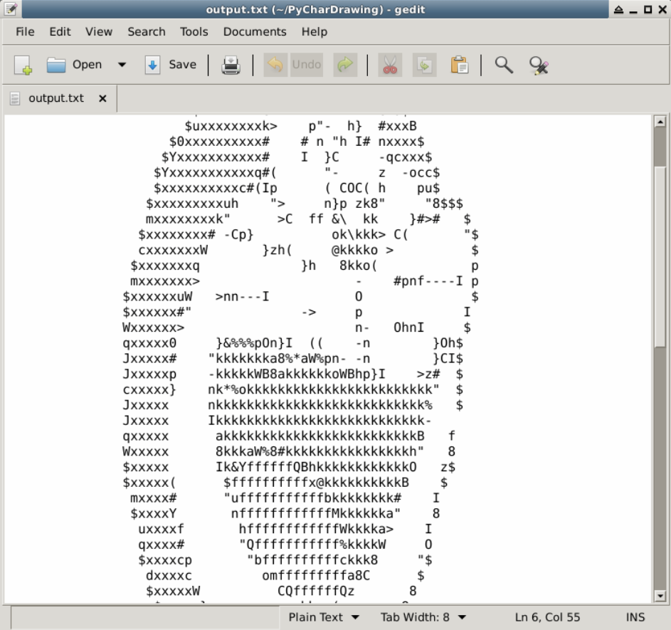

# Transform a Picture into Character Drawing - Python

## 1. Overview


### 1.1 Introduction

This lab will use Python - only 50 lines of code - to complete the transformation of a picture to character drawing. We should be quite familiar with Linux command operation, basics of Python, as well as how to pillow and argparse library.


### 1.2 Learning Objevtives

1. Linux command operation
2. Python fundamental concepts 
3. pillow library
4. argparse library

### 1.3 Operating Environmnet
+ python3.5  
+ Xfce terminal

### 1.4 Intended Audience
Anyone interested in Python. Since this one is not difficult, it is intended for beginners.


### 1.5 Code

You can download the following resources to LabEx environment.
```bash
$ git clone https://github.com/LabExCoding/PyCharDrawing
```

After downloading the project, in the repository, there are only some pictures. You should create a python source file here by yourself.


## 2. How Things Work

Character painting is a combination of a series of characters. We can think of characters as relatively large pixels. A character can represent a color (for now, we'll understand it this way). The more types of characters, the more colors that can be represented. The picture will be more layered.

So, if we want to transform a color picture, how would we achieve that with so many colors? Here, we'll introduce a new term called 

> Gray value: refers to the color depth of the black and white image midpoint; the range is generally from 0 to 255. White is 255, and black is 0, so the black and white picture is also called gray image

We can use the gray value formula to map a pixel's RGB value to a gray value:

```python
gray ＝ 0.2126 * r + 0.7152 * g + 0.0722 * b
```

With this done, it is much simpler. We can create a non-repeating list of characters, symbols with a small gray (dark) starting with the list, and symbols with a large (bright) gray value using the end of the list.

## 3. Preparation

PIL is a Python image processing library, an important tool used in this tutorial, to install the pillow (PIL) library:

```sh
$ sudo pip3 install pillow
```


## 4. Project File Structure

Firstly, create a file called ascii.py in this folder. Now, the structure of the project is


## 5. Procedure

Edit ascii.py file 
```sh
$ gedit ascii.py
```

First import the necessary libraries. argparse library is used to manage the input of command line parameters

```python
from PIL import Image
import argparse
```

The following is the character set used by our character paintings. There are 70 characters in total. The type and number of characters can be debugged by themselves based on the effect of the character drawing.

```python
ascii_char = list("$@B%8&WM#*oahkbdpqwmZO0QLCJUYXzcvunxrjft/\|()1{}[]?-_+~<>i!lI;:,\"^`'. ")
```

The following is the function of RGB value to character:

```python
def get_char(r,g,b,alpha = 256):
    if alpha == 0:
        return ' '
    length = len(ascii_char)
    gray = int(0.2126 * r + 0.7152 * g + 0.0722 * b)

    unit = (256.0 + 1)/length
    return ascii_char[int(gray/unit)]
```

Full sample code:

```python
from PIL import Image
import argparse

#Command line input parameter processing
parser = argparse.ArgumentParser()

parser.add_argument('file')     #input file
parser.add_argument('-o', '--output')   #output file
parser.add_argument('--width', type = int, default = 80) #output the width of drawing
parser.add_argument('--height', type = int, default = 80) #output the height of drawing

#obtain parameter
args = parser.parse_args()

IMG = args.file
WIDTH = args.width
HEIGHT = args.height
OUTPUT = args.output

ascii_char = list("$@B%8&WM#*oahkbdpqwmZO0QLCJUYXzcvunxrjft/\|()1{}[]?-_+~<>i!lI;:,\"^`'. ")

# Map 256 gradations to 70 characters
def get_char(r,g,b,alpha = 256):
    if alpha == 0:
        return ' '
    length = len(ascii_char)
    gray = int(0.2126 * r + 0.7152 * g + 0.0722 * b)

    unit = (256.0 + 1)/length
    return ascii_char[int(gray/unit)]

if __name__ == '__main__':

    im = Image.open(IMG)
    im = im.resize((WIDTH,HEIGHT), Image.NEAREST)

    txt = ""

    for i in range(HEIGHT):
        for j in range(WIDTH):
            txt += get_char(*im.getpixel((j,i)))
        txt += '\n'

    print(txt)
    
    #output drawing to file
    if OUTPUT:
        with open(OUTPUT,'w') as f:
            f.write(txt)
    else:
        with open("output.txt",'w') as f:
            f.write(txt)
```

Enter the following command to run the script to see the effect:

```sh
$ python3 ascii.py ascii_dora.png
```

It will create a file output.txt in the folder, and print the drawing in the terminal.




please note: you might not have the exact output like the one shown here. It is acceptable since there are many other varaibels in different environmnet which may affect the output.

## 6. Summary

We have consolidated the basic knowledge of Python through this simple experiment. We hope that everyone who encounters unfamiliar functions in the process of learning will try to search and understand it.

##7. Practice

You can try to use the other two pictures (1.jpg and 2.jpg) and see the output. You can set the width and height of the drawing like this.

```
python3 ascii.py 1.jpg --width 40 --height 40
python3 ascii.py 2.jpg --width 35 --height 35
```

