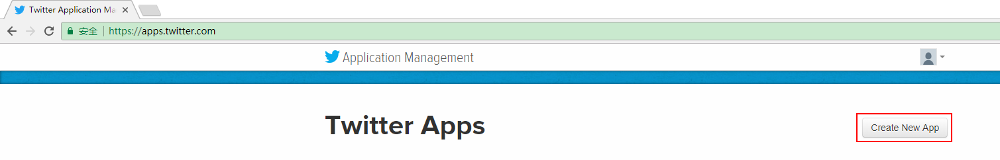
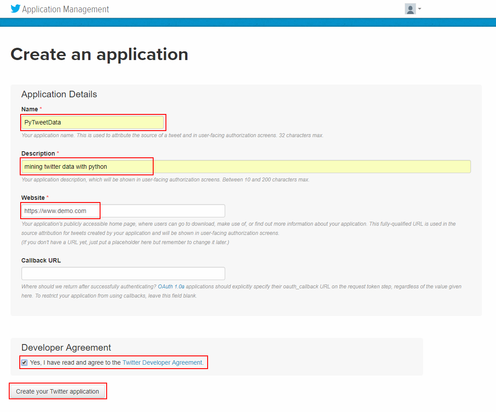
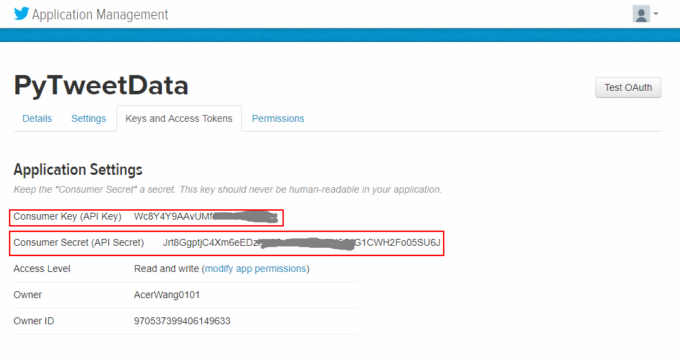
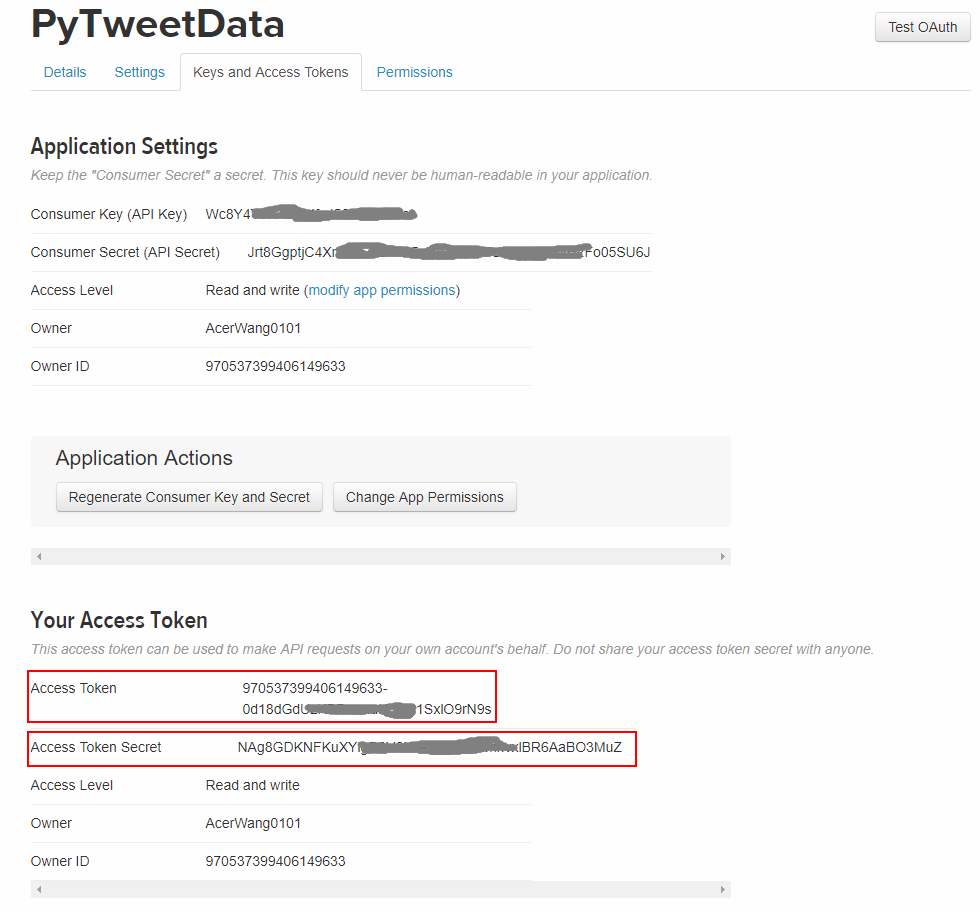
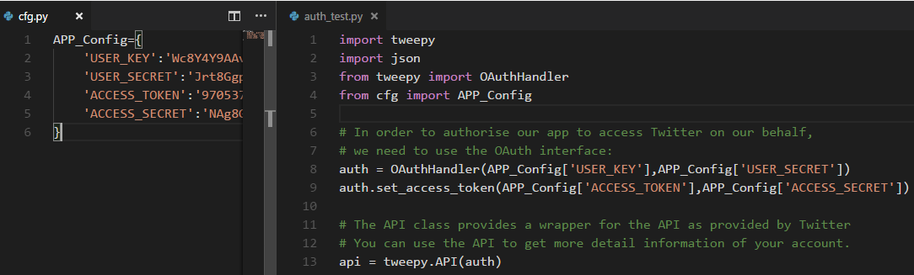
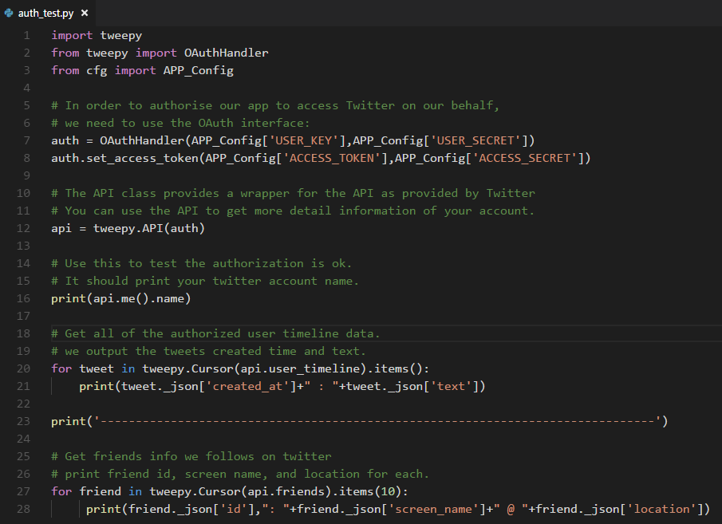
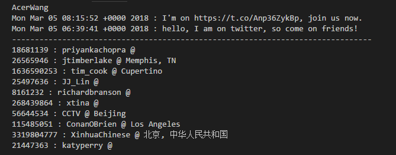
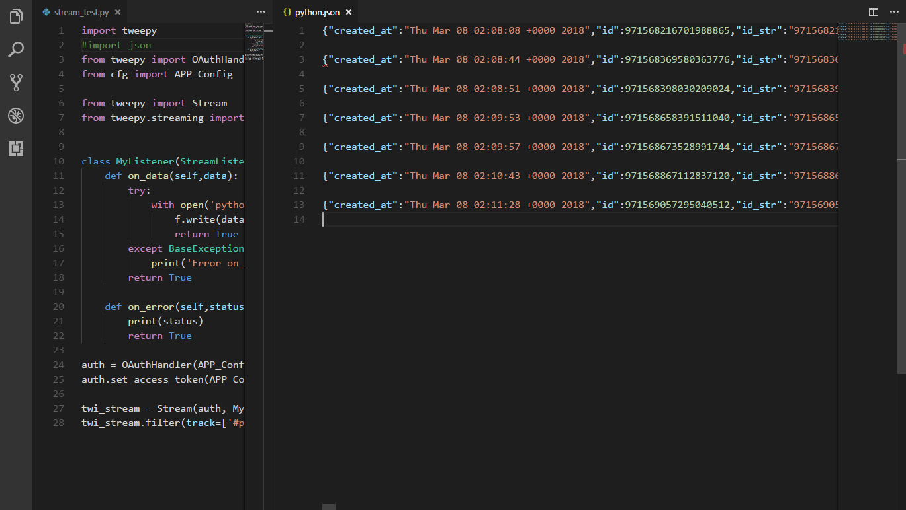

# Collecting data

## 1. Introduction

[Twitter](https://twitter.com/) is a popular social network where users can share short SMS-like messages called *tweets*. Users share thoughts, links and pictures on Twitter, journalists comment on live events, companies promote products and engage with customers. The list of different ways to use Twitter could be really long, and with hundreds of millions of tweets per day, there's a lot of data to analyse and to play with.

This is the first in a series of articles dedicated to mining data on Twitter using Python. In this first part, we'll see different options to collect data from Twitter. Once we have built a data set, in the next episodes we'll discuss some interesting data applications.

## 2. Implementation

### *Step One*: Register Your App

In order to have access to Twitter data programmatically, we need to create an app that interacts with the Twitter API. The first step is the registration of your app. In particular, you need to point your browser to [https://apps.twitter.com](https://apps.twitter.com/), log-in to Twitter (if you're not already logged in) and register a new application. 

Here, I use my account to do the operations showing you how to register an application on twitter step by step, you should use your own.



You can now choose a name and a description for your app (for example “Mining Demo” or similar). 



You will receive a *consumer key* and a *consumer secret*: these are application settings that should always be kept private. 



From the configuration page of your app, you can also require an access token and an access token secret. 



Similarly to the consumer keys, these strings must also be kept private: they provide the application access to Twitter on behalf of your account. The default permissions are read-only, which is all we need in our case, but if you decide to change your permission to provide writing features in your app, you must negotiate a new access token. 

**Important Note:** there are rate limits in the use of the Twitter API, as well as limitations in case you want to provide a downloadable data-set, see:

- https://developer.twitter.com/en/docs

- <https://developer.twitter.com/overview/terms/agreement-and-policy>
- <https://developer.twitter.com/rest/public/rate-limiting>


### *Step Two*: Accessing the Data

Twitter provides [REST APIs](https://dev.twitter.com/rest/public) you can use to interact with their service. There is also [a bunch of Python-based clients](https://dev.twitter.com/overview/api/twitter-libraries#python) out there that we can use without re-inventing the wheel. In particular, [Tweepy](https://github.com/tweepy/tweepy) in one of the most interesting and straightforward to use, now Tweepy support both python2.x and python3.x, we recommend you to use python3 syntax of programming. So let's install it:

```
sudo pip3 install Tweepy
```


In order to authorise our app to access Twitter on our behalf, we need to use the OAuth interface:

```
import tweepy
from tweepy import OAuthHandler
from cfg import APP_Config

# In order to authorise our app to access Twitter on our behalf,
# we need to use the OAuth interface.
auth = OAuthHandler(APP_Config['USER_KEY'],APP_Config['USER_SECRET'])
auth.set_access_token(APP_Config['ACCESS_TOKEN'],APP_Config['ACCESS_SECRET'])

# The API class provides a wrapper for the API as provided by Twitter.
# The api variable is now our entry point for most
# of the operations we can perform with Twitter. 
api = tweepy.API(auth)

# Use this to test the authorization is ok.
# It should print your twitter account name. 
print(api.me().name)
```



For example, we can read our own timeline (i.e. our Twitter homepage) with:

```
for status in tweepy.Cursor(api.home_timeline).items(10):
    # Process a single status
    print(status.text)
```

Tweepy provides the convenient Cursor interface to iterate through different types of objects. In the example above we're using *10* to limit the number of tweets we're reading, but we can of course access more. The `status` variable is an instance of the `Status()` class, a nice wrapper to access the data. The JSON response from the Twitter API is available in the attribute `_json`(with a leading underscore), which is not the raw JSON string, but a dictionary.

What if we want to have a list of all our followers? There you go:

```jj
for friend in tweepy.Cursor(api.friends).items():
    print(json.dumps(friend._json,indent=4))
```

And how about a list of all our tweets? Simple:

```
for tweet in tweepy.Cursor(api.user_timeline).items():
    print(json.dumps(tweet._json,indent=4))
```

Because of too much infomation in the list, here we simply get some of them, we suggest you try the upper two methods and watch what the result is.



**And the output seems like:**



In this way we can easily collect tweets (and more) and store them in the original JSON format, fairly easy to convert into different data models depending on our storage (many NoSQL technologies provide some bulk import feature).

**Tips To avoid being Rate Limited**

The tips below are there to help you code defensively and reduce the possibility of being rate limited. Some application features that you may want to provide are simply impossible in light of rate limiting, especially around the freshness of results. If real-time information is an aim of your application, look into the [Streaming APIs](https://developer.twitter.com/en/docs/tweets/filter-realtime/overview/POST_statuses_filter.html).

In case we want to “keep the connection open”, and gather all the upcoming tweets about a particular event, the streaming API is what we need. We need to extend the `StreamListener()`to customise the way we process the incoming data. A working example that gathers all the new tweets with the #python hashtag:

```
import tweepy
from tweepy import OAuthHandler
from cfg import APP_Config

from tweepy import Stream
from tweepy.streaming import StreamListener

class MyListener(StreamListener):
    def on_data(self,data):
        try:
            with open('python.json','a') as f:
                f.write(data)
                return True
        except BaseException as e:
            print('Error on_data:%s' % str(e))
        return True

    def on_error(self,status):
        print(status)
        return True

auth = OAuthHandler(APP_Config['USER_KEY'],APP_Config['USER_SECRET'])
auth.set_access_token(APP_Config['ACCESS_TOKEN'],APP_Config['ACCESS_SECRET'])

twi_stream = Stream(auth, MyListener())
twi_stream.filter(track=['#python'])
```

Depending on the search term, we can gather tons of tweets within a few minutes. This is especially true for live events with a world-wide coverage (World Cups, Super Bowls, Academy Awards, you name it), so keep an eye on the JSON file to understand how fast it grows and consider how many tweets you might need for your tests. The above script will save each tweet on a new line, so you can use the command `wc -l python.json` from a Unix shell to know how many tweets you've gathered.



## 3. Summary

We have introduced `tweepy` as a tool to access Twitter data in a fairly easy way with Python. There are different types of data we can collect, with the obvious focus on the “tweet” object.