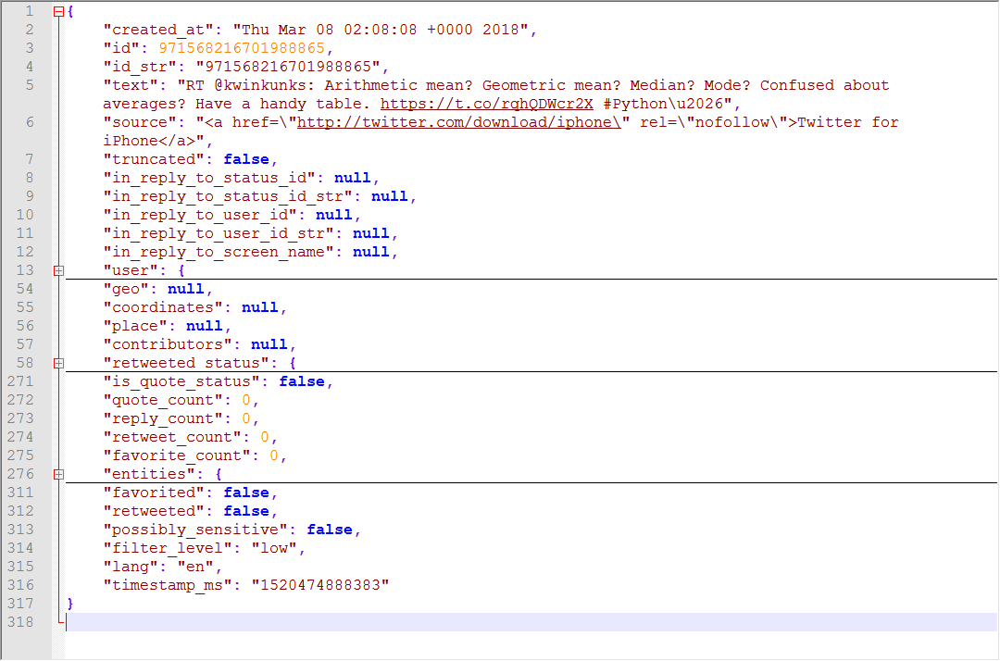
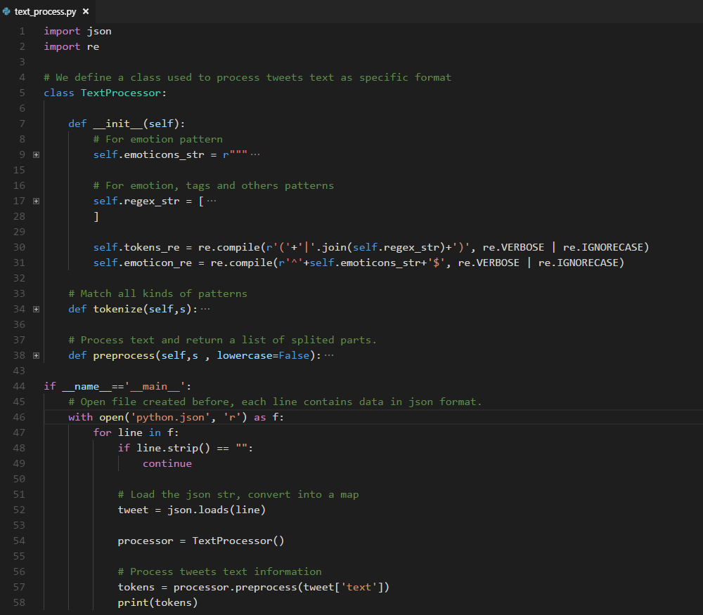
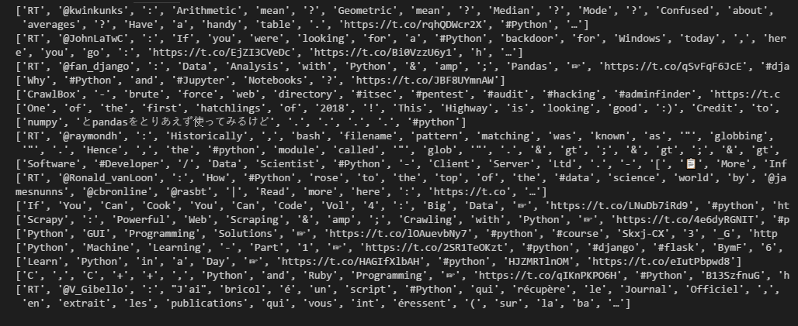

# Text Pre-processing

## 1. Introduction

We have seen how to collect data from Twitter. In this part, we'll discuss the structure of a tweet and we'll start digging into the processing steps we need for some text analysis.

## 2. Implementation

### *Step One:* The Anatomy of a Tweet

Assuming that you have collected a number of tweets and stored them in JSON as suggested in the previous chapter, let's have a look at the structure of a tweet:

```
# A test script, show you the structure of a tweet
import json
 
with open('python.json', 'r') as f:
    # Read only the first tweet/line
    line = f.readline()
    
	# Load it as Python dict    
    tweet = json.loads(line)
    
    # Pretty-print
    print(json.dumps(tweet, indent=4))
```

**The output looks like:**



The key attributes are the following:

- text: the text of the tweet itself
- created_at: the date of creation
- favorite_count, retweet_count: the number of favourites and retweets
- favorited, retweeted: boolean stating whether the authenticated user (you) have favourited or retweeted this tweet
- lang: acronym for the language (e.g. “en” for english)
- id: the tweet identifier
- place, coordinates, geo: geo-location information if available
- user: the author's full profile
- entities: list of entities like URLs, @-mentions, hashtags and symbols
- in_reply_to_user_id: user identifier if the tweet is a reply to a specific user
- in_reply_to_status_id: status identifier id the tweet is a reply to a specific status

As you can see there's a lot of information we can play with. All the *_id fields also have a *_id_str counterpart, where the same information is stored as a string rather than a big int (to avoid overflow problems). We can imagine how these data already allow for some interesting analysis: we can check who is most favourited/retweeted, who's discussing with who, what are the most popular hashtags and so on. Most of the goodness we're looking for, i.e. the content of a tweet, is anyway embedded in the text, and that's where we're starting our analysis.

We start our analysis by breaking the text down into words. Tokenisation is one of the most basic, yet most important, steps in text analysis. The purpose of tokenisation is to split a stream of text into smaller units called tokens, usually words or phrases. While this is a well understood problem with several out-of-the-box solutions from popular libraries, Twitter data pose some challenges because of the nature of the language.

### *Step Two:* How to Tokenise a Tweet Text

Here we use a popular natural language proceesing tool the NLTK, if your environment does not include it, use `pip3 install nltk` to download it.

Let's see an example, using the popular NLTK library to tokenise a fictitious tweet:

```
from nltk.tokenize import word_tokenize

// The first time you use nltk, you must download `punkt` package.
nltk.download('punkt')

tweet = 'RT @marcobonzanini: just an example! :D http://example.com #NLP'
print(word_tokenize(tweet))
```

**It would print as follows:**

```
['RT', '@', 'marcobonzanini', ':', 'just', 'an', 'example', '!', ':', 'D', 'http', ':', '//example.com', '#', 'NLP']
```

You will notice some peculiarities that are not captured by a general-purpose English tokeniser like the one from NLTK: @-mentions, emoticons, URLs and #hash-tags are not recognised as single tokens. The following code will propose a pre-processing chain that will consider these aspects of the language.

```
import re
 
emoticons_str = r"""
    (?:
        [:=;] # Eyes
        [oO\-]? # Nose (optional)
        [D\)\]\(\]/\\OpP] # Mouth
    )"""
 
regex_str = [
    emoticons_str,
    r'<[^>]+>', # HTML tags
    r'(?:@[\w_]+)', # @-mentions
    r"(?:\#+[\w_]+[\w\'_\-]*[\w_]+)", # hash-tags
    r'http[s]?://(?:[a-z]|[0-9]|[$-_@.&amp;+]|[!*\(\),]|(?:%[0-9a-f][0-9a-f]))+', # URLs
 
    r'(?:(?:\d+,?)+(?:\.?\d+)?)', # numbers
    r"(?:[a-z][a-z'\-_]+[a-z])", # words with - and '
    r'(?:[\w_]+)', # other words
    r'(?:\S)' # anything else
]
    
tokens_re = re.compile(r'('+'|'.join(regex_str)+')', re.VERBOSE | re.IGNORECASE)
emoticon_re = re.compile(r'^'+emoticons_str+'$', re.VERBOSE | re.IGNORECASE)
 
def tokenize(s):
    return tokens_re.findall(s)
 
def preprocess(s, lowercase=False):
    tokens = tokenize(s)
    if lowercase:
        tokens = [token if emoticon_re.search(token) else token.lower() for token in tokens]
    return tokens
 
tweet = 'RT @marcobonzanini: just an example! :D http://example.com #NLP'
print(preprocess(tweet))
```

**The output is:**

```
['RT', '@marcobonzanini', ':', 'just', 'an', 'example', '!', ':D', 'http://example.com', '#NLP']
```

As you can see, @-mentions, emoticons, URLs and #hash-tags are now preserved as individual tokens. If we want to process all our tweets, previously saved on file:

```
with open('./src/python.json', 'r') as f:
    for line in f:
        if line.strip() == "":
            continue
        tweet = json.loads(line)
        tokens = preprocess(tweet['text'])
        print(tokens)
```

Later in this course, we need to use the `preprocess` method, so we'd better wrap the related code as a class, we make some change of our code like this:



The output is like:



The tokeniser is probably far from perfect, but it gives you the general idea. The tokenisation is based on regular expressions (regexp), which is a common choice for this type of problem. Some particular types of tokens (e.g. phone numbers or chemical names) will not be captured, and will be probably broken into several tokens. To overcome this problem, as well as to improve the richness of your pre-processing pipeline, you can improve the regular expressions, or even employ more sophisticated techniques like Named Entity Recognition.

## 3. Summary

In this part, we have analysed the overall structure of a tweet, and we have discussed how to pre-process the text before we can get into some more interesting analysis. In particular, we have seen how tokenisation, despite being a well-understood problem, can get tricky with Twitter data. The proposed solution is far from perfect but it's a good starting point, and fairly easy to extend.