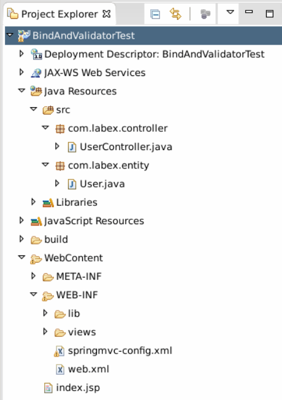
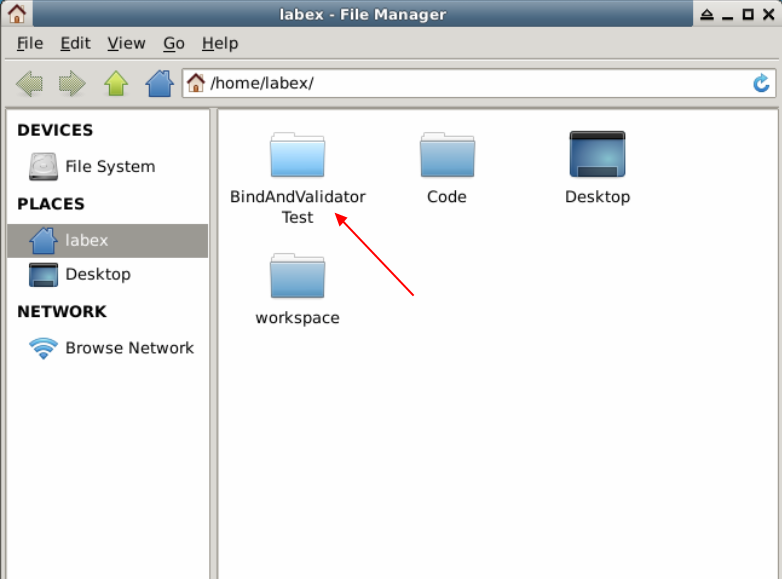
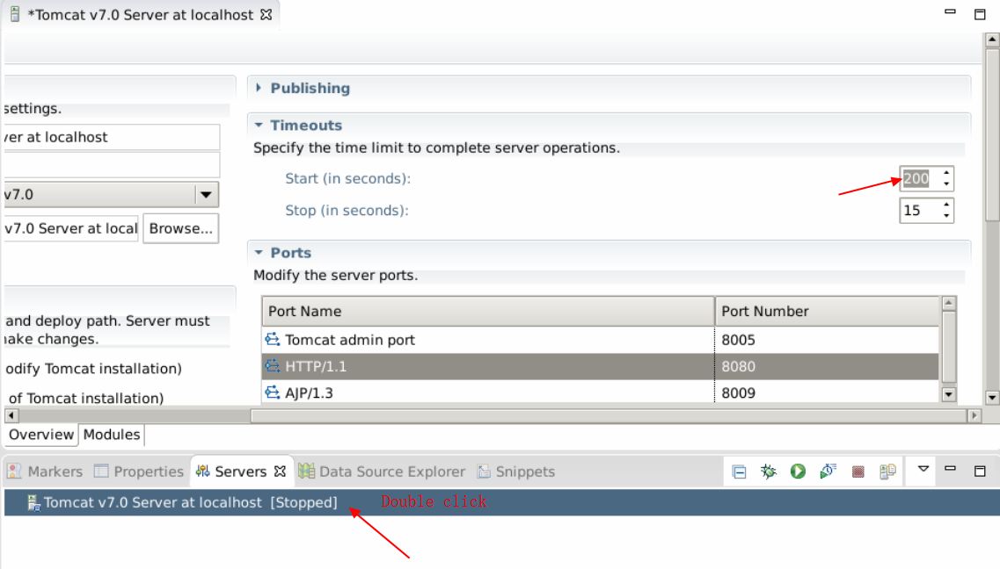
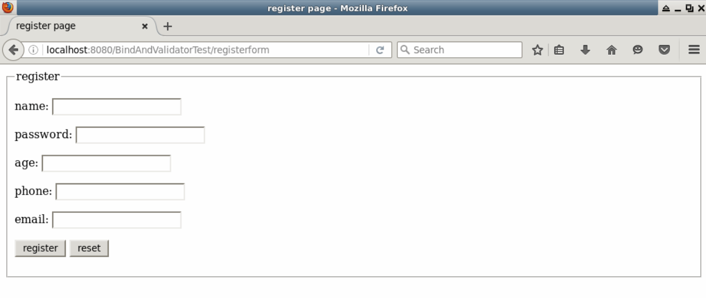
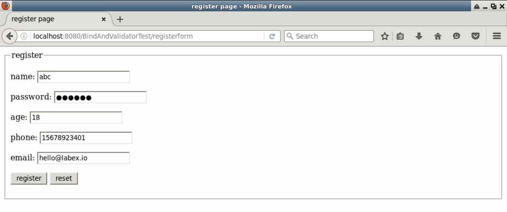
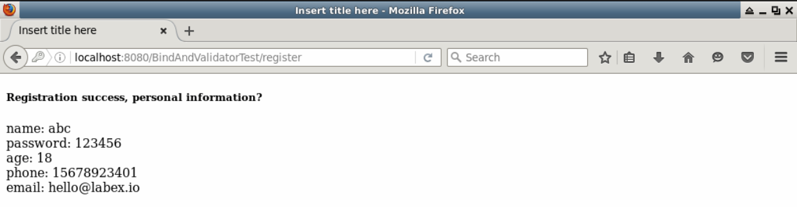
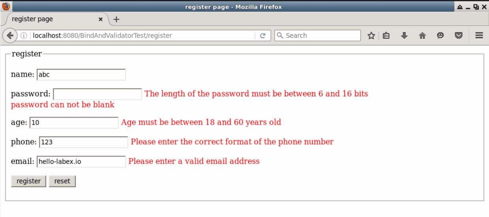

# Data Binding and Validation

## 1. Introduction

Data binding is a feature that bind user input to a domain model, while data validation is a necessary part for web application. Spring MVC provides two ways to validate user input, one is Spring built-in Validation framework, the other is JRS-303 framework.

As Spring validation framework is a little difficult for beginner and not the key point in this tutorial, we will simulate user registration data binding, introduce the Hibernate-Validator for validation. Hibernate-Validator accomplish annotation based validation supported by JSR-303 framework.

###Learning Objective

- Spring MVC
- Data binding
- Hibernate-Validator

 ## 2. Content

The project structure:



###2.1 Preparation

(1) Create a new dynamic web project `BindAndValidatorTest` as previous tutorial did, choose auto generate web.xml.

(2) Download the needed jar files, copy all the jar files to `WebContent/WEB-INF/lib` folder.

```
git clone https://github.com/LabExCoding/BindAndValidatorTest
```



(3) Expand server start timeout time.



(4) Explanation for Hibernate-Validator annotation:

|Annotation|Note|
|----|---|
|@Null|Validate whether an object is null|
|@NotNull|Validate whether an object is not null|
|@AssertTrue|Validate whether a boolean object is true|
|@AssertFalse|Validate whether a boolean object is false|
|@Max(value)|Validate whether a number or string <= value|
|@Min(value)|Validate whether a number or string >= value|
|@DecimalMax(value)|Validate whether a float number <= value|
|@DecimalMin(value)|Validate whether a float number >= value|
|@Digits(integer,fraction)|Validate whether a string fit for the format of int or fraction|
|@Size(min,max)|Validate size(obj) in [min,max]|
|@Past|Validate Date and Calender object before current time|
|@Future|Validate Date and Calender object after current time|
|@Pattern|Validate string fit for regular expression|
|@NotBlank|Validate Trim(str) is not null|
|@URL|Validate a url syntax is valid|
|@Email|Validate a email syntax is valid|
|@CreditCardNumber|Validate a credit card syntax is valid|
|@Length(min,max)|Validate len(str) in [min,max]|
|@NotEmpty|Validate an element is not null or empty|
|@Range(min,max,message)|Validate a attribute  in range(min,max)|

###2.2 Configuration File

(1) Alter web.xml file as the following content:

```xml
<?xml version="1.0" encoding="UTF-8"?>
<web-app xmlns:xsi="http://www.w3.org/2001/XMLSchema-instance" xmlns="http://java.sun.com/xml/ns/javaee" xsi:schemaLocation="http://java.sun.com/xml/ns/javaee http://java.sun.com/xml/ns/javaee/web-app_3_0.xsd" id="WebApp_ID" version="3.0">
  <display-name>BindAndValidatorTest</display-name>

	<!-- config Spring MVC DispatchcerServlet -->
    <servlet>
        <servlet-name>springmvc</servlet-name>
        <servlet-class>org.springframework.web.servlet.DispatcherServlet</servlet-class>
        <init-param>
            <!-- contextConfigLocation is param name，it contains Spring MVC config file path-->
            <param-name>contextConfigLocation</param-name>
            <param-value>/WEB-INF/springmvc-config.xml</param-value>
        </init-param>
        <!-- load Servlet immediately when application starting -->
        <load-on-startup>1</load-on-startup>
    </servlet>
    <!-- Servlet mapping -->
    <servlet-mapping>
        <servlet-name>springmvc</servlet-name>
        <!-- Listen to all requests -->
        <url-pattern>/</url-pattern>
    </servlet-mapping>
	<!-- avoid displaying messy code in web pages-->
	<filter>
        <filter-name>characterEncodingFilter</filter-name>
        <filter-class>org.springframework.web.filter.CharacterEncodingFilter</filter-class>
        <init-param>
            <param-name>encoding</param-name>
            <param-value>UTF-8</param-value>
        </init-param>
        <init-param>
            <param-name>forceEncoding</param-name>
            <param-value>true</param-value>
        </init-param>
    </filter>
    <filter-mapping>
        <filter-name>characterEncodingFilter</filter-name>
        <url-pattern>/*</url-pattern>
    </filter-mapping>

  <welcome-file-list>
    <welcome-file>register.jsp</welcome-file>
  </welcome-file-list>
</web-app>
```

(2) Alter springmvc-conf.xml file as the following content:

```xml
<?xml version="1.0" encoding="UTF-8"?>
<beans xmlns="http://www.springframework.org/schema/beans"
    xmlns:xsi="http://www.w3.org/2001/XMLSchema-instance" xmlns:p="http://www.springframework.org/schema/p"
    xmlns:mvc="http://www.springframework.org/schema/mvc" xmlns:context="http://www.springframework.org/schema/context"
    xmlns:aop="http://www.springframework.org/schema/aop"
    xsi:schemaLocation="http://www.springframework.org/schema/beans
        http://www.springframework.org/schema/beans/spring-beans-4.2.xsd
        http://www.springframework.org/schema/mvc
        http://www.springframework.org/schema/mvc/spring-mvc-4.2.xsd
        http://www.springframework.org/schema/context
        http://www.springframework.org/schema/context/spring-context-4.2.xsd
        http://www.springframework.org/schema/aop
        http://www.springframework.org/schema/aop/spring-aop-4.2.xsd">
    <context:component-scan base-package="com.labex.controller" />
    <mvc:annotation-driven />
    <bean id="viewResolver"
        class="org.springframework.web.servlet.view.InternalResourceViewResolver">
        <property name="prefix" value="/WEB-INF/views/" />
        <property name="suffix" value=".jsp" />
    </bean>
</beans>
```

`<mvc:annotation-driven />` will simplify spring mvc config, it will auto register DefaultAnnotationHandlerMapping and AnnotationMethodHandlerAdapter beans, and provides support for @NumberFormatannotation, @DateTimeFormat, @Valid, support read/write xml/json file.

### 2.3 Entity Class

Create package `com.labex.entity` in /Java Resources/src folder. Create a new class `User.java`:

```java
package com.labex.entity;

public class User {
    private String username;
    private String password;
    private Integer age;
    private String phone;
    private String email;

    public String getUsername() {
        return username;
    }

    public void setUsername(String username) {
        this.username = username;
    }

    public String getPassword() {
        return password;
    }

    public void setPassword(String password) {
        this.password = password;
    }

    public Integer getAge() {
        return age;
    }

    public void setAge(Integer age) {
        this.age = age;
    }

    public String getPhone() {
        return phone;
    }

    public void setPhone(String phone) {
        this.phone = phone;
    }

    public String getEmail() {
        return email;
    }

    public void setEmail(String email) {
        this.email = email;
    }

}
```

### 2.4 Controller Class

Create package `com.labex.controller` in /Java Resources/src folder. Create class `UserController`:

```java
package com.labex.controller;

import org.springframework.stereotype.Controller;
import org.springframework.ui.Model;
import org.springframework.web.bind.annotation.ModelAttribute;
import org.springframework.web.bind.annotation.RequestMapping;

import com.labex.entity.User;

@Controller
public class UserController {

    // the register page
    @RequestMapping(value = "/registerform")
    public String registerform(Model model) {
        model.addAttribute("user", new User());
        return "register";
    }

    // register handler
    @RequestMapping(value = "/register")
    public String register(@ModelAttribute("user") User user, Model model) {
        model.addAttribute("user", user);
        return "success";
    }
}
```

### 2.5 JSP Pages

Create an empty JSP page `index.jsp` in WebContent folder as home page.

(1) Create folder `views` in `WebContent/WEB-INF`, create `register.jsp` page in `views` folder.

```jsp
<%@ page language="java" contentType="text/html; charset=UTF-8"
    pageEncoding="UTF-8"%>
<!DOCTYPE html PUBLIC "-//W3C//DTD HTML 4.01 Transitional//EN" "http://www.w3.org/TR/html4/loose.dtd">
<%@ taglib prefix="form" uri="http://www.springframework.org/tags/form"%>
<html>
<head>
<meta http-equiv="Content-Type" content="text/html; charset=UTF-8">
<title>register page</title>
</head>
<body>
    <div id="global">
        <form:form modelAttribute="user" method="post" action="register">
            <fieldset>
                <legend>register</legend>
                <p>
                    <label>name:</label>
                    <form:input path="username" />
                </p>
                <p>
                    <label>password:</label>
                    <form:password path="password" />
                </p>
                <p>
                    <label>age:</label>
                    <form:input path="age" />
                </p>
                <p>
                    <label>phone:</label>
                    <form:input path="phone" />
                </p>
                <p>
                    <label>email:</label>
                    <form:input path="email" />
                </p>
                <p id="buttons">
                    <input id="submit" type="submit" value="register"> <input
                        id="reset" type="reset" value="reset">
                </p>
            </fieldset>
        </form:form>
    </div>
</body>
</html>
```

Here, we use Spring MVC form taglib, so we should add in JSP page header `<%@ taglib prefix="form" uri="http://www.springframework.org/tags/form"%>`. `modelAttribute="user"` in form will bind a JavaBean object.

(2) Create `success.jsp` page in `WebContent/WEB-INF/views` folder.

```jsp
<%@ page language="java" contentType="text/html; charset=UTF-8"
    pageEncoding="UTF-8"%>
<!DOCTYPE html PUBLIC "-//W3C//DTD HTML 4.01 Transitional//EN" "http://www.w3.org/TR/html4/loose.dtd">
<html>
<head>
<meta http-equiv="Content-Type" content="text/html; charset=UTF-8">
<title>Insert title here</title>
</head>
<body>
    <h5>Registration success, personal information：</h5>
    name：${user.username}
    <br />password：${user.password}
    <br />age：${user.age}
    <br />phone：${user.phone}
    <br />email：${user.email}
    <br />
</body>
</html>
```

### 2.6 Data Binding Test

Run this project on server. Open browser and access [http://localhost:8080/BindAndValidateorTest/registerform](http://localhost:8080/BindAndValidateorTest/registerform).



Input user info and click register button.





### 2.7 Data Validation Test

(1) Alter class `User.java`, add Hibernate-Validator annotation on class attribute.

```java
package com.labex.entity;

import javax.validation.constraints.Pattern;

import org.hibernate.validator.constraints.Email;
import org.hibernate.validator.constraints.Length;
import org.hibernate.validator.constraints.NotBlank;
import org.hibernate.validator.constraints.Range;

public class User {
    @NotBlank(message = "Username can not be empty")
    private String username;
    @NotBlank(message = "password can not be blank")
    @Length(min = 6, max = 16, message = "The length of the password must be between 6 and 16 bits")
    private String password;
    @Range(min = 18, max = 60, message = "Age must be between 18 and 60 years old")
    private Integer age;
    @Pattern(regexp = "^1[3|4|5|7|8][0-9]{9}$", message = "Please enter the correct format of the phone number")
    private String phone;
    @Email(message = "Please enter a valid email address")
    private String email;

    public String getUsername() {
        return username;
    }

    public void setUsername(String username) {
        this.username = username;
    }

    public String getPassword() {
        return password;
    }

    public void setPassword(String password) {
        this.password = password;
    }

    public Integer getAge() {
        return age;
    }

    public void setAge(Integer age) {
        this.age = age;
    }

    public String getPhone() {
        return phone;
    }

    public void setPhone(String phone) {
        this.phone = phone;
    }

    public String getEmail() {
        return email;
    }

    public void setEmail(String email) {
        this.email = email;
    }

}
```

(2) Alter class `UserController.java`.

```java
package com.labex.controller;
import javax.validation.Valid;

import org.springframework.stereotype.Controller;
import org.springframework.ui.Model;
import org.springframework.validation.Errors;
import org.springframework.web.bind.annotation.ModelAttribute;
import org.springframework.web.bind.annotation.RequestMapping;

import com.labex.entity.User;

@Controller
public class UserController {

    // the register page
    @RequestMapping(value = "/registerform")
    public String registerform(Model model) {
        model.addAttribute("user", new User());
        return "register";
    }

    // register handler
    @RequestMapping(value = "/register")
    public String register(@Valid  @ModelAttribute("user") User user, Errors errors,Model model) {
        if(errors.hasErrors()){
            return "register";
        }
        model.addAttribute("user", user);
        return "success";
    }
}
```

We add `@Valid @ModelAttribute` annotation on register() method param `User user` , it means validate after binding data to `@ModelAttribute("user")`. The `Errors errors` records error message, if having error message return to register page, otherwise, return to success page.

(3) Alter `register.jsp` page, add `<form:errors>` tag to show error message.

```xml
<%@ page language="java" contentType="text/html; charset=UTF-8"
    pageEncoding="UTF-8"%>
<!DOCTYPE html PUBLIC "-//W3C//DTD HTML 4.01 Transitional//EN" "http://www.w3.org/TR/html4/loose.dtd">
<%@ taglib prefix="form" uri="http://www.springframework.org/tags/form"%>
<html>
<head>
<meta http-equiv="Content-Type" content="text/html; charset=UTF-8">
<title>register page</title>
</head>
<body>
    <div id="global">
        <form:form modelAttribute="user" method="post" action="register">
            <fieldset>
                <legend>register</legend>
                <p>
                    <label>name:</label>
                    <form:input path="username" />
                    <form:errors path="username" cssStyle="color:red"/>
                </p>
                <p>
                    <label>password:</label>
                    <form:password path="password" />
                    <form:errors path="password" cssStyle="color:red"/>
                </p>
                <p>
                    <label>age:</label>
                    <form:input path="age" />
                    <form:errors path="age" cssStyle="color:red"/>
                </p>
                <p>
                    <label>phone:</label>
                    <form:input path="phone" />
                    <form:errors path="phone" cssStyle="color:red"/>
                </p>
                <p>
                    <label>email:</label>
                    <form:input path="email" />
                    <form:errors path="email" cssStyle="color:red"/>
                </p>
                <p id="buttons">
                    <input id="submit" type="submit" value="register"> <input
                        id="reset" type="reset" value="reset">
                </p>
            </fieldset>
        </form:form>
    </div>
</body>
</html>
```

(4) Restart server,  refresh  the register page in browser. Input some invalid info and submit to register.



If you input the correct info, you can see the success page.


## 3. Summary

In this section, we simulated user registration and used Spring MVC data binding and Hibernate-Validator framework.