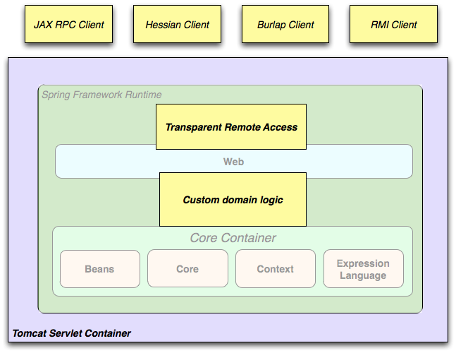
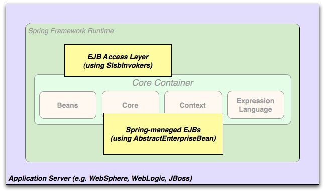

# Spring Introduction

##1. Introduction

In this tutorial, we will introduce what's Spring. Spring is a container. You can use IoC (Inversion of Control) and DI (dependency injection) to achieve high cohesion and low coupling applications. Besides, it can be integrated into other frameworks. The AOP (aspect oriented programming) it provides is convenient for database transaction management.

### Learning Objective

- Spring
- Spring architecture
- Advantages

## 2. Content

### 2.1 What's Spring ?

Spring is a light-weighted Java SE/Java EE application framework. It aims at simplifying enterprise-level application development. In traditional application development, a complete application consists of a set of collaborating objects. In addition to developing application business logic, the most important thing in developing an application is to focus on the cooperation of these objects to achieve the desired functions, and to achieve low coupling and high cohesion. Therefore, business logic development is unavoidable. If there is a framework that can help us to create objects and manage the dependencies between these objects, we can make use of configuration to create objects and manage dependencies between objects. We do not need to create and manage objects and their dependencies through factories and generators, it will reduce a lot of work and speed up development. The Spring Framework is mainly to complete this function.

In addition to helping us manage objects and their dependencies, the Spring framework also provides aspected oriented programming capabilities such as general-purpose logging, performance statistics, security controls, and exception handling. It helps us manage the most troublesome database transactions. At the same time, it provides a set of simple JDBC access implementations that integrate with third-party database access frameworks (such as Hibernate, JPA), integratate with various Java EE technologies (such as Java Mail, task scheduling, etc.), and provide a set of own web framework Spring MVC , but also it's very simple to integrate with third-party web frameworks. From here, we can think of Spring as a super glued platform. Besides providing its own functions, it also provides the ability to integrate with other technologies and frameworks, so that we can choose freely what technology to use for development. And no matter you develop JAVA SE (C/S Architecture) application programs or JAVA EE (B/S Architecture) applications, you can use this platform for development. Let's take a deep look at what Spring can do for us.

###2.2 What can Spring do ?

#### 2.2.1 Spring helps us create objects and maintain dependencies based on configuration files

In traditional program development, object creation and dependencies assembly are controlled by us within the program. This will increase the coupling between objects. If we want to modify dependencies between objects, we must modify the source code, recompile, and deploy. If using Spring, Spring will create and assemble dependencies between objects based on the configuration file. You only need to change the configuration file without recompiling.

####2.2.2 Spring AOP helps us to achieve logging, performance statistics, security control without coupling

When we need to do some logging, permission control, performance statistics and other work, in the traditional application, we may need to perform these operation in an object or method, and permission control, performance statistics are mostly repetitive work, so there are a lot of duplicated code, even if the general part is extracted, there are still repeated calls, such as performance statistics we may only need to carry out when necessary, after the diagnosis is completed, we should delete these codes, for logging, such as recording some method accessing log, data accessing logs and so on, these will be infiltrated into the various access methods, as well as privilege control, you must start the audit when the method is executed, these tasks need to be optimized. If Spring is used, the logging, permission controls, and performance statistics are separated from the business logic. Through Spring AOP, these capabilities are dynamically added without permeating the various methods or objects that are needed. In contrast, other solutions, through the use of "agent  pattern" or "wrapper  pattern", still need to create proxy objects programmatically, still need to couple these proxy objects, and Spring AOP can provide a better The way to complete the above functions. By configuring it, you don't need to add any extra code in your existing code, leaving the existing code to focus on the business logic.

#### 2.2.3 Spring helps us manage database transactions

In traditional applications, how do we manage database transactions? Need a series of "get connections, execute SQL, commit or roll back transactions, close connections", but also to ensure that the connection must be closed in the end, what awful things, but also very boring, if you use Spring, we only need to get the connection , Execute SQL, everything else is handed to Spring for management, it's simple and convenient.

Besides, the Spring can also do:

- It integrates seamlessly with third-party database access frameworks (such as Hibernate, JPA), and it also provides a set of JDBC access templates to facilitate database access.
- It integrates seamlessly with third-party Web frameworks (such as Struts, JSF), and it also provides a set of Spring MVC frameworks to facilitate the web layer construction.
- It Integrates with Java EE (such as Java Mail, task scheduling), and integrates with more technologies (such as caching framework).

### 2.3 Advantages

#### 2.3.1 Some concepts

- Application: a product that can complete the functions we need, such as shopping websites and OA systems.
- Framework: Semi-finished products that can complete certain functions, for example, we can use frameworks for shopping website development, frameworks do some functions, and we do some of our own functions. And the framework stipulates your overall architecture when developing applications, provides some basic functions, and also stipulates how classes and objects are created, how they work together, and so on, thereby simplifying our code and allowing us to focus on business logic development.
- Noninvasive : From the framework point of view, there is no need to inherit the classes provided by the framework, and this  can be seen as a non intrusive . If these framework classes are inherited, it is intruded into the , and if the framework is replaced later, the previously code can hardly be reused. If the code previously written in a non intrusive  still remains, you can continue to use it.
- Lightweight and heavyweight: Lightweight is relative to heavyweight. Lightweight is generally non intrusive, very few things, very little resources, simple deployment, and so on. In fact, it is easier to use, and the heavyweight is just the opposite.
- POJO: POJO (plain object Java object). It can contain business logic or persistence logic, but does not assume any special role and does not inherit or implement any other Java framework class or interface.
- Container: In the daily life, the container is something used to store things. From the point of view of programming, the container is to store objects. Because there are some operations such as put into, out and so on, the container also manages the life cycle of the object.
- IoC: Inversion of Control, also called dependency injection. That is, the container controls the relationship between the programs, rather than the traditional implementation, which is directly controlled by the program code.
- Bean: Generally refers to container management objects, and refers to Spring IoC container management objects in Spring.

#### 2.3.2 Advantages

- Lightweight container: In a centralized, automated way, application object creation and assembly will also be responsible for managing the lifecycle of the object, and can be combined into complex applications. The Spring container is noninvasive (not dependent on any Spring specific class), and is fully developed with POJOs, making the application easier to test and easier to manage. And the core JAR package is very small, Spring3.0.5 is less than 1 M, and does not need to rely on any application server, and can be deployed in any environment (Java SE or Java EE).
- AOP: From another perspective, a technology that can be dynamically added to the program without modifying the source during the compiling period, during the loading period, or during the running period. The popular point is to extract the reusable functions and then insert these general functions into the application at the right time, for example, security, logging, these are universal functions, and we can extract them, and then implants and executes them in the right place of the program. And complete the functions needed and reuse these functions.
- Database transaction management: In database applications, managing database transactions by yourself is a headache, and it is easy to make mistakes. Spring supports pluggable transaction management support without  needing JavaEE environment support. We can focus on business logic leaving transaction management for Spring.
- Support for JDBC and ORM framework: Spring makes it easier to use JDBC, it provides DAO (data access object) support, which is very convenient to integrate with third party ORM frameworks, such as Hibernate, and fully support Spring transactions and the unanimous exception system provided by Spring.
- Flexible Web support: Spring itself provides a very powerful MVC framework, and can be very easy to integrate with the third party MVC framework, such as Struts, etc.
- Simplify various technology integration: provide integration for Java Mail, task scheduling, JMX, JMS, JNDI, EJB, dynamic language, remote access, Web Service, and so on.

Spring can help us simplify application development, help us create and assemble objects, manage transactions, simple MVC frameworks, and we can regard Spring as a super gluing platform that integrates with a lot of technologies to form a whole that makes the system better, more outstanding, and faster. Our program development has the advantages above, and we have no reason not to consider using it.

### 2.4 How to learn Spring ?

You should know what Spring is, and then learn to use it. The core of the Spring is the IoC container, so we must thoroughly understand what is a IoC container, and how to configure and use the container, all the other technologies are based on the container, after understanding the IoC, the next is the AOP, make clear the concept, the basic configuration. The next is the database transaction management, in fact, Spring transaction management is implemented via AOP, so the basis is very important, the IoC container and AOP, the rest are based on the two core things.

### 2.5 Spring Architecture

#### 2.5.1 Core Container: Core, Beans, Context, EL

- Core module: this part of the framework is encapsulated, including resource access, type conversion and some commonly used tool classes.
- Beans: `BeanFactory` is the core of the container. Essentially, an implementation of the "factory pattern", and without implementing the "singleton pattern". The singleton is completely controlled by the container, and it advocates interface programming rather than implementation programming, the relationship between all application objects and objects is managed by the framework, dependencies between the objects are extracted out of program logic and all these dependencies are maintained by BeanFactory.
- Context: based on Core and Beans, integrate the function of Beans module and add resource binding, data validation, internationalization, Java EE support, container lifecycle, event propagation, and so on. The core interface is ApplicationContext
- EL: provide powerful expression language support, support access and modify attribute values, method calls, support access and modify arrays, containers, and indexer, name variables, support arithmetic and logic operations, support create Bean from the Spring container, and support list projection, selection, and general list aggregation.

#### 2.5.2 AOP, Aspects:

- AOP: the Spring AOP module provides a aspect-oriented programming implementation that conforms to the AOP Alliance specification, providing techniques such as logging, permission control, performance statistics and other general functions, and separation of business logic, and can dynamically add these functions to the required code. It reduces the coupling between business logic and general functions.
- Aspects: the integration of AspectJ, and AspectJ provides a more powerful function than Spring ASP.
- Data access/integration: the module includes JDBC, ORM, OXM, JMS and transaction management.
- Transaction: this module is used for transaction management, it does not require transaction control in the code, supports programming and declarative transaction management.
- JDBC: a sample template for JBDC is provided, using this template to eliminate the traditional verbose JDBC coding and the required transaction control, and to enjoy the benefits of Spring management transactions.
- ORM: it provides seamless integration with the popular object relational mapping framework, including Hibernate, JPA, and MyBatis. Moreover, Spring transaction management can be used without additional control transactions.
- OXM: A Object / XML mapping implementation is provided to map Java objects into XML data or to map XML data into Java objects, and Object / XML mapping implementations include JAXB, Castor, XMLBeans, and XStream.
- JMS: JMS (Java Messaging Service), a set of "message producers, message consumers" templates is used to make it easier to use JMS, and JMS is used to send messages between two applications, or distributed systems, for asynchronous communication.
- Web/Remoting: Web/Remoting contains Web, Web-Servlet, Web-Struts, Web-Porlet.
- Web: the basic web functionality is provided. For example, multiple file uploads, integrated IoC containers, remote process access (RMI, Hessian, Burlap), and Web Service support, and provide a RestTemplate class to provide convenient Restful services access.
- Web-Servlet: a Spring MVC Web framework implementation is provided. The Spring MVC framework provides request resource injection based on annotation, simpler data binding, data validation, and a very easy  way to use JSP tag, fully seamlessly collaborated with other Spring technologies.
- Test: Spring supports Junit and TestNG testing frameworks, and also provides a number of Spring based testing capabilities, such as the ability to simulate Http requests when testing the Web framework.

### 2.6 Application Scenarios

Spring can be applied to many scenarios. From the simplest standard Java SE program to enterprise application. The following are some of the more popular application scenarios:

- Typical Web application:

- Remote access application:

- EJB application:

## 3. Summary

This is a tutorial for Spring. In this part, we only introduced some basic concets and framework architecture and application scenarios. Next we will introduce Spring application implementation.

