# Spring IoC

## 1. Introduction

Before using the various functions provided by Spring, the user has to assemble the Bean in the Spring IoC container and establish the association between the Bean and the Bean. This experiment will take you to learn the IoC container of Spring.

### Learning Objective

- IoC container
- Bean
- Spring annotation

## 2. Content

The project structure.

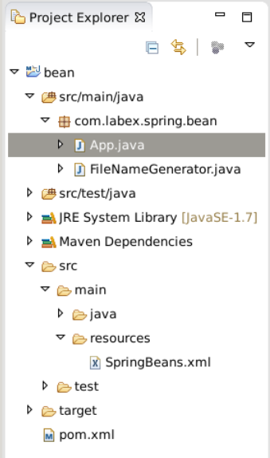

###2.1 IoC

####2.1.1 What's IoC ?

IoC--Inversion of Control. It's a design thought. In Java development, Ioc means to hand over control of objects you designed to container, instead of directly controlling inside your object.

In traditional Java SE programming, we create objects directly within the object through `new`, which is the initiative to create dependent objects, and IoC has a special container to create these objects, that is, to control the creation of objects by the IoC container. Who controls who? Of course, IoC containers control objects. What is controlled? It is to control the acquisition of external resources (not just objects, such as files, etc.).

Why is the reversal, which reverses: in the traditional application, object is directively controlled by ourselves in the application to get the dependencies, that is, the turn. And the reversal is the container to help create and inject the dependent object. Why is the reversal? Because containers help us find and inject dependent objects, objects are passively accepting dependent objects, so they are reversed. What aspects are reversed? The acquisition of dependent objects is reversed.

The procedure.

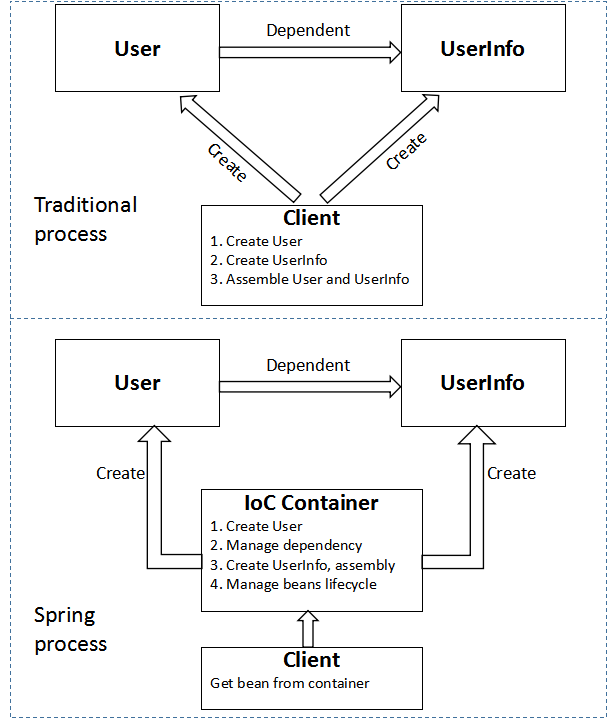

####2.1.2 What can IoC do ?

In traditional applications, we create dependent objects actively within the class, which leads to high coupling between classes and classes, which is difficult to test. With the IoC container, the control of creating and manageming dependencies is given to the container, and the container injects dependent object into the combined object, so the object is loosely coupled between two objects. It's convenient to test, and more importantly, makes the whole architecture of the program very flexible. The IoC container helps the object find the corresponding dependent object and injects it instead of the object.

#### 2.1.3 DI

DI--Dependency Injection. The dependencies between components are determined by the container in the runtime. In fact, a container dynamically injects an object into a component. The purpose of dependency injection is not to bring more functionality to the software system, but to reuse the components, and to build a flexible and extensible platform for the system. With the injection mechanism, we only need a simple configuration, without any code to specify the resources that the target needs, to complete the business logic of its own, without the need to care for where the specific resources come from, and by whom.

The key to understanding DI is: "who depends on who, why need to rely on, who injects who and what is injected".

- Who depends on who: of course, a container management object depends on the IoC container; "the object being injected" depends on the "dependent object".
- Why needs dependency: container management objects require IoC containers to provide external resources needed by objects.
- Who injects who: it is obvious that IoC container injects an object, that is, injecting "dependent object";
- What is injected: the external resources needed to be injected into an object (including objects, resources, and constant data).

### 2.2 IoC Container

The IoC container is a container with dependency injection, and the IoC container is responsible for instantiating, locating, configuring the objects in the application and establishing the dependencies among these objects. The application does not need to create related objects directly in the code, and the application is assembled by the IoC container. In Spring, `BeanFactory` is the actual representative of the IoC container.

Spring IoC container instantiate and assemble various objects in the application by reading the configuration metadata in the configuration file. It is generally used to configure metadata based on XML configuration files, and Spring is completely decoupled from the configuration file, and can be configured in any other possible way, such as annotations, Java based files, and properties based configuration file.

The representative of the Spring Ioc container is the `BeanFactory` interface in the `org.springframework.beans` package, and the `BeanFactory` interface provides the most basic function of the IoC container. The `ApplicationContext` interface in the `org.springframework.context` package extends `BeanFactory`, and provides a collection of Spring AOP, international processing, event propagation and context implementation at different levels, such as `WebApplicationContext` for web applications. In short, `BeanFactory` provides the most basic function of IoC container, while `ApplicationContext` adds more support for enterprise level functions. `ApplicationContext` inherits `BeanFactory` completely, so the semantics of `BeanFactory` also apply to `ApplicationContext`.

- xmlBeanFactory: an `BeanFactory` implementation, providing basic IoC container functions, which can get resources from classpath or file system.

```java
 File file = new File("fileSystemConfig.xml");
 Resource resource = new FileSystemResource(file);
 BeanFactory beanFactory = new XmlBeanFactory(resource);
```

or

```java
 Resource resource = new ClassPathResource("classpath.xml");                 
 BeanFactory beanFactory = new XmlBeanFactory(resource);
```

- ClassPathXmlApplicationContext: an ApplicationContext implementation, get configuration file from class path.

```java
 BeanFactory beanFactory = new ClassPathXmlApplicationContext("classpath.xml");
```

- FileSystemXmlApplicationContext: an ApplicationContext implementation, get configuration file from file system.

```java
BeanFactory beanFactory = new FileSystemXmlApplicationContext("fileSystemConfig.xml");
```

###2.3 Inject values to Bean properties

In Spring, there are three ways to inject value into the attributes of Bean. The general method, the abbreviation method, the P schema method. Let's look at the following Bean: `FileNameGenerator`, which contains two properties, `name` and `type`. We injected value into two properties.

(1) Create a Maven project as previous tutorial. The Archetype parameters are as follows:

```
Group Id: com.labex.spring
Artifact Id: bean
Version: 0.0.1-SNAPSHOP
Package: com.labex.spring.bean
```

(2) Alter pom.xml

```xml
<project xmlns="http://maven.apache.org/POM/4.0.0" xmlns:xsi="http://www.w3.org/2001/XMLSchema-instance"
  xsi:schemaLocation="http://maven.apache.org/POM/4.0.0 http://maven.apache.org/xsd/maven-4.0.0.xsd">
  <modelVersion>4.0.0</modelVersion>

  <groupId>com.labex.spring</groupId>
  <artifactId>bean</artifactId>
  <version>0.0.1-SNAPSHOT</version>
  <packaging>jar</packaging>

  <name>bean</name>
  <url>http://maven.apache.org</url>

  <properties>
    <project.build.sourceEncoding>UTF-8</project.build.sourceEncoding>
  </properties>

  <dependencies>
    <dependency>
      <groupId>junit</groupId>
      <artifactId>junit</artifactId>
      <version>3.8.1</version>
      <scope>test</scope>
    </dependency>
    <!-- Spring deploy -->
    <dependency>
        <groupId>org.springframework</groupId>
        <artifactId>spring-core</artifactId>
        <version>4.0.9.RELEASE</version>
    </dependency>
    <dependency>
        <groupId>org.springframework</groupId>
        <artifactId>spring-context</artifactId>
        <version>4.0.9.RELEASE</version>
    </dependency>
  </dependencies>
</project>
```

(3) Create a class in package `com.labex.spring.bean`.

```java
package com.labex.spring.bean;

public class FileNameGenerator {
     private String name;
     private String type;

     public String getName() {
         return name;
     }
     public void setName(String name) {
         this.name = name;
     }
      public String getType() {
         return type;
     }
    public void setType(String type) {
       this.type = type;
   }
    /*
    * print file name and type
    */
    public void printFileName() {
       System.out.println("FileName & FileType  is  :  "+name+" & "+type);
    }
}
```

(4) Create a folder `resources` in `src/main`, then create a file `SpringBeans.xml` in `src/main/resources`.

```java
<?xml version="1.0" encoding="UTF-8"?>
<beans xmlns="http://www.springframework.org/schema/beans"
    xmlns:xsi="http://www.w3.org/2001/XMLSchema-instance"
    xmlns:p="http://www.springframework.org/schema/p"
    xsi:schemaLocation="http://www.springframework.org/schema/beans
    http://www.springframework.org/schema/beans/spring-beans-3.0.xsd">
	<!-- the first way of config -->
    <bean id="FileNameGenerator" class="com.labex.spring.bean.FileNameGenerator">
        <property name="name">
            <value>labex</value>
        </property>
        <property name="type">
            <value>txt</value>
        </property>
    </bean>
    <!-- the second way of config - 'abbreviation method' -->
    <!-- 
        <bean id="FileNameGenerator" class="com.labex.spring.bean.FileNameGenerator">
               <property name="name" value="labex" />
               <property name="type" value="txt" />
           </bean>
     -->
     
     <!-- the third way of config - 'p schema method' -->
     <!--
     	<bean id="FileNameGenerator" class="com.labex.spring.bean.FileNameGenerator"
             p:name="labex" p:type="txt" />
      -->
</beans>
```

Note that the third way needs to add a declaration in the configuration file XML of bean.

```
xmlns:p="http://www.springframework.org/schema/p"
```

(5) Modify App.java file

```java
package com.labex.spring.bean;

import org.springframework.context.ApplicationContext;
import org.springframework.context.support.ClassPathXmlApplicationContext;

import com.labex.spring.bean.FileNameGenerator;

public class App 
{
     private static ApplicationContext context;

        public static void main( String[] args )
        {
            context = new ClassPathXmlApplicationContext("SpringBeans.xml");

            FileNameGenerator obj = (FileNameGenerator) context.getBean("FileNameGenerator");
            obj.printFileName();
        }
}
```

(6) Run this file as Java Application, see the consele.

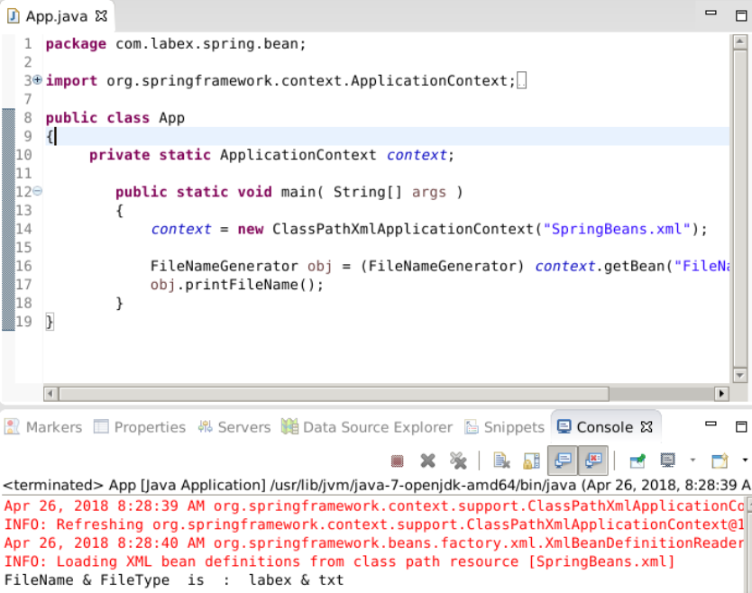

###2.4 Nested Bean

The nested Bean supports attribute (property) injection and constructor (constructor - ARG) injection, we continued to use the above project.

The project structure.
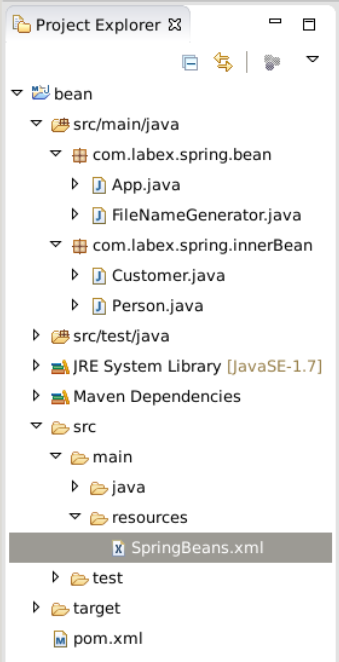

(1) Create a package `com.labex.spring.innerBean`. Create a new class `Person` in this package.

```java
package com.labex.spring.innerBean;

public class Person {
    private String name;
    private String address;
    private int age;

    public String getName() {
        return name;
    }

    public void setName(String name) {
        this.name = name;
    }

    public String getAddress() {
        return address;
    }

    public void setAddress(String address) {
        this.address = address;
    }

    public int getAge() {
        return age;
    }

    public void setAge(int age) {
        this.age = age;
    }

    @Override
    public String toString() {
        return "Person [address=" + address + ", age=" + age + ", name=" + name + "]";
    }  
}
```

(2) Create a new class `Customer` in package `com.labex.spring.innerBean`.

```java
package com.labex.spring.innerBean;

public class Customer {
         private Person person;
        // constructor with one param
        public Customer(Person person) {
            this.person = person;
        }
        // default constructor is a must 
        public Customer(){}

        public void setPerson(Person person) {
            this.person = person;
        }

        @Override
        public String toString() {
            return "Customer [person=" + person + "]";
        }
}
```

(3) Config `SpringBeans.xml`

Need to inject a Bean - `Person` into `Customer`. There are three ways to achieve it.

```xml
<!-- the first way: use `ref` to refer to another Bean -->
<bean id="CustomerBean" class="com.labex.spring.innerBean.Customer">
    <property name="person" ref="PersonBean" />
</bean>

<bean id="PersonBean" class="com.labex.spring.innerBean.Person">
    <property name="name" value="labex" />
    <property name="address" value="Paris" />
    <property name="age" value="25" />
</bean>

<!-- the second way: declare a inner Bean -->
<!--
    <bean id="CustomerBean" class="com.labex.spring.innerBean.Customer">
        <property name="person">
            <bean class="com.labex.labex.innerBean.Person">
                <property name="name" value="labex" />
                <property name="address" value="Paris" />
                <property name="age" value="25" />
            </bean>
        </property>
  </bean>
-->

<!-- the third way: inject by constructor -->
<!--
     <bean id="CustomerBean" class="com.labex.spring.innerBean.Customer">
     <constructor-arg>
         <bean class="com.labex.spring.innerBean.Person">
             <property name="name" value="labex" />
             <property name="address" value="Paris" />
             <property name="age" value="25" />
         </bean>
     </constructor-arg>
 </bean>
-->
```

(4) Modify App.java

```java
package com.labex.spring.bean;

import org.springframework.context.ApplicationContext;
import org.springframework.context.support.ClassPathXmlApplicationContext;

import com.labex.spring.innerBean.Customer;

public class App 
{
     private static ApplicationContext context;

        public static void main( String[] args )
        {
            context = new ClassPathXmlApplicationContext("SpringBeans.xml");

            Customer obj = (Customer) context.getBean("CustomerBean");

            System.out.println(obj.toString());
        }
}
```

(5) Run this file as Java Application, see the consele.

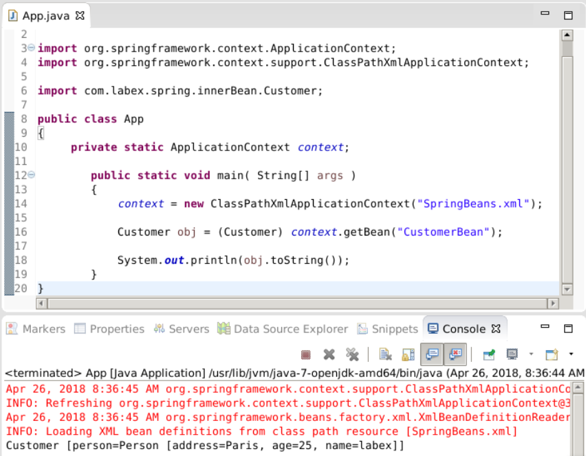

###2.5 Bean Scope

The project structure.


In Spring, the scope of Bean determines the type of Bean instances returned from the Spring container. In Spring, the following 5 types of scopes are supported:

1. singleton: the IoC container returns an unique Bean instance.
2. protptype: when requested, return a new Bean instance each time.
3. request: for each HTTP request, return an unique Bean instance.
4. session: for each HTTP session, return an unique Bean instance.
5. globalSession: HTTP Session global Bean instance.

> In most cases, you just need to use singleton and protptype. By default, the scope is singleton.

#### 2.5.1 singleton and prototype

Create a new package `com.labex.spring.customer.services`, create a new class `CustomerService` in this package.

```java
package com.labex.spring.customer.services;

public class CustomerService
{
    String message;

    public String getMessage() {
        return message;
    }

    public void setMessage(String message) {
        this.message = message;
    }
}
```

For singleton, the SpringBeans.xml is:

```xml
<bean id="CustomerService"  class="com.labex.spring.customer.services.CustomerService" />
```

For prototype, the SpringBeans.xml is:

```xml
<bean id="CustomerService" class="com.labex.spring.customer.services.CustomerService" scope="prototype"/>
```

Create a test class `Test` in package `com.labex.spring.customer.services`.

```java
package com.labex.spring.customer.services;

import org.springframework.context.ApplicationContext;
import org.springframework.context.support.ClassPathXmlApplicationContext;

public class Test 
{
     private static ApplicationContext context;

        public static void main( String[] args )
        {
            context = new ClassPathXmlApplicationContext(new String[] {"SpringBeans.xml"});

            CustomerService CSA = (CustomerService) context.getBean("CustomerService");
            CSA.setMessage("Message by CSA");
            System.out.println("Message : "+ CSA.getMessage());

            //retrieve it again
            CustomerService CSB = (CustomerService) context.getBean("CustomerService");
            System.out.println("Message : "+ CSB.getMessage());
        }
}
```

Run this class as Java Application.

(1) singleton

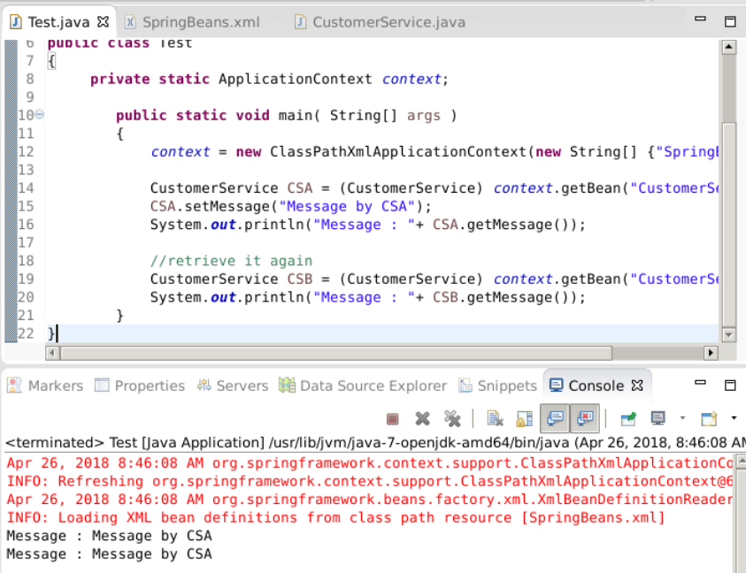

(2) prototype

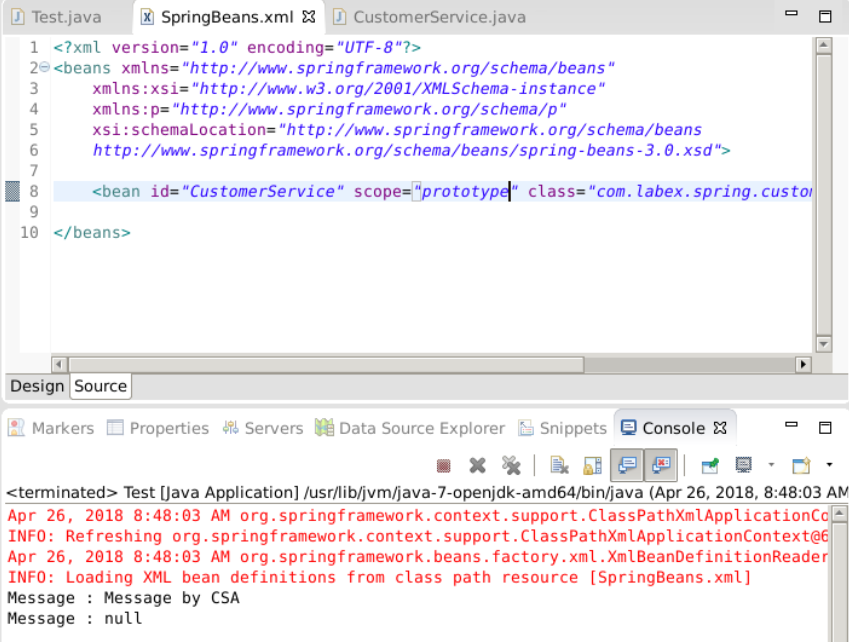

### 2.6 Collections Bean

The project structure.

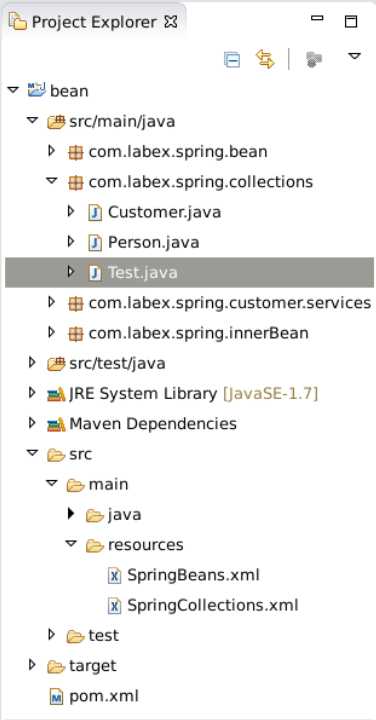

There are four types of collections:

- List
- Set
- Map
- Properties

Create a new package `com.labex.spring.collections`, copy class `Person` to package `com.labex.spring.collections`, then create a new class `Customer`.

```java
package com.labex.spring.collections;

import java.util.*;

import com.labex.spring.collections.Person;

public class Customer {
		
    	// the name `lists` should be the same with Bean property tag name
        private List<Object> lists ;
    
        private Set<Object> sets ;
        private Map<Object, Object> maps ;
        private Properties pros;
        
        // refer to Person  
    	private Person person;

        public List<Object> getLists() {
            return lists;
        }
        public void setLists(List<Object> lists) {
            this.lists = lists;
        }
        public Set<Object> getSets() {
            return sets;
        }
        public void setSets(Set<Object> sets) {
            this.sets = sets;
        }
        public Map<Object, Object> getMaps() {
            return maps;
        }
        public void setMaps(Map<Object, Object> maps) {
            this.maps = maps;
        }
        public Properties getPros() {
            return pros;
        }
        public void setPros(Properties pros) {
            this.pros = pros;
        }

        public Customer(Person person) {
            this.person = person;
        }

        public Customer(){}

        public void setPerson(Person person) {
            this.person = person;
        }

        @Override
        public String toString() {
            return "Customer [person=" + person + "]";
        }
}
```

> Note: JavaBean's special specification for attribute naming, the attribute name specified by the element in the spring configuration file and the Setter method of the Bean implementation class satisfy the attribute naming specification of Sun JavaBean: the property of XXX corresponds to the setXxx () method. In general, the names of attribute variables in Java start with lowercase letters, such as maxSpeed. But there is also a special case. Considering some specific English abbreviations (such as USA, XML), JavaBean also allows the attribute variable name of the uppercase initials, but it must be satisfied: the first two letters of the variable are either all capitals or all lowercase. For example, iC, iCcard, iDcode are illegal.

Create config file `SpringCollections.xml` in `src/main/resources`.

```xml
<?xml version="1.0" encoding="UTF-8"?>
<beans xmlns="http://www.springframework.org/schema/beans"
    xmlns:xsi="http://www.w3.org/2001/XMLSchema-instance"
    xsi:schemaLocation="http://www.springframework.org/schema/beans
    http://www.springframework.org/schema/beans/spring-beans-3.0.xsd">

    <!--bean id first letter is lowercase -->
    <bean id="customerBean" class="com.labex.spring.collections.Customer">

        <!-- java.util.List -->
        <property name="lists">
            <list>
                <value>1</value><!-- List properties: both <value> for string and <ref> for other Bean-->
                 <ref bean="personBean" />
                 <value>2</value>
                <bean class="com.labex.spring.collections.Person">
                    <property name="name" value="labexList" />
                    <property name="address" value="Paris" />
                    <property name="age" value="25" />
                </bean>
            </list>
        </property>

        <!-- java.util.Set -->
        <property name="sets">
            <set>
                <value>1</value><!--Set is similar to List-->
                <ref bean="personBean" />
                <bean class="com.labex.spring.collections.Person">
                    <property name="name" value="labexSet" />
                    <property name="address" value="Paris" />
                    <property name="age" value="25" />
                </bean>
            </set>
        </property>

        <!-- java.util.Map -->
        <property name="maps">
            <map>
                <entry key="Key 1" value="1" /><!--an entry is an element in Map-->
                <entry key="Key 2" value-ref="personBean" />
                <entry key="Key 3">
                    <bean class="com.labex.spring.collections.Person">
                        <property name="name" value="labexMap" />
                        <property name="address" value="Paris" />
                        <property name="age" value="25" />
                    </bean>
                </entry>
            </map>
        </property>    

        <!-- java.util.Properties -->
        <property name="pros"><!-- Properties is some like Map, Map item key/value can be any type, but Properties are only string type -->
            <props>
                <prop key="admin">admin@nospam.com</prop>
                <prop key="support">support@nospam.com</prop>
            </props>
        </property>
    </bean>

    <bean id="personBean" class="com.labex.spring.collections.Person">
        <property name="name" value="labexPersonBean" />
        <property name="address" value="Paris" />
        <property name="age" value="25" />
    </bean>
</beans>
```

Create a test class `Test` in `com.labex.spring.collections`.

```java
package com.labex.spring.collections;

import org.springframework.context.ApplicationContext;
import org.springframework.context.support.ClassPathXmlApplicationContext;

public class Test 
{
     private static ApplicationContext context;

        public static void main( String[] args )
        {
            context = new ClassPathXmlApplicationContext("SpringCollections.xml");

            /*
             * case 1 : List
             */
            Customer lists = (Customer) context.getBean("customerBean");
            System.out.println(lists.getLists().toString());

            /*
             * case 2 : Set
             */
//            Customer sets = (Customer) context.getBean("customerBean");
//            System.out.println(sets.getSets().toString());

            /*
             * case 3 : Map
             */
//            Customer maps = (Customer) context.getBean("customerBean");
//            System.out.println(maps.getMaps().toString());

            /*
             * case 4 : properties
             */
//            Customer pros = (Customer) context.getBean("customerBean");
//            System.out.println(pros.getPros().toString());


        }
}
```

Run this class as Java Application.

(1) List

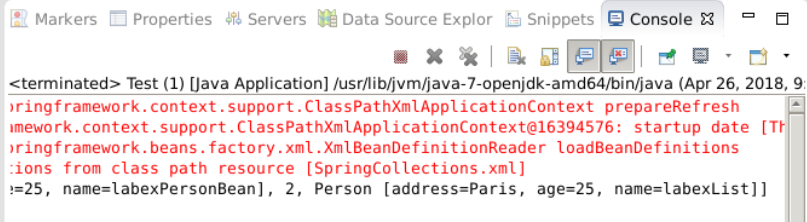

(2) Set

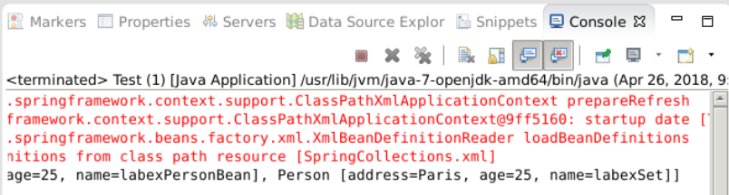

(3) Map

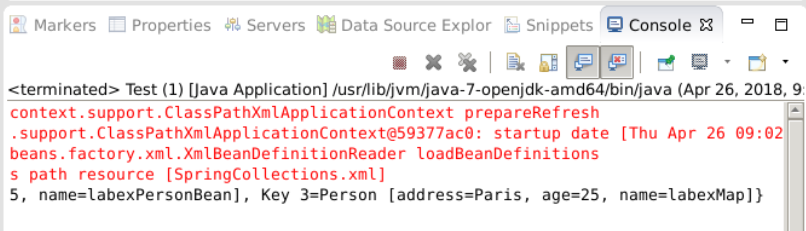

(4) Properties

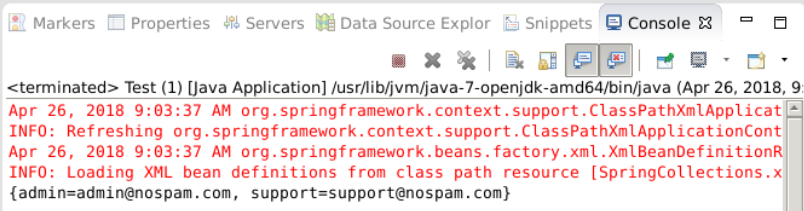

### 2.7 Spring Annotation

Annotations provide information for the Spring container to about Bean definitions, and describe the information defined by XML through class annotations. As we all know, the three elements of Spring container are Bean definition, Bean implementation class and Spring framework. If the XML configuration is used, the Bean definition is separated from the Bean implementation class itself, and the annotation configuration can be implemented by using the Bean definition on the Bean implementation class.

#### 2.7.1 @Component

The class marked by this annotation will be automatically recognized by the Spring container and automatically generate the Bean definition.

```java
packeage com.labex.spring;

@Component("labex")
public class Labex{

}
```

It has the same effect as follow:

```xml
<bean id="labex" class="com.labex.spring.Labex">
```

Besides, there are three annotations equivalent to @Component.

- @Controller: corresponds to the Bean of the presentation level, that is, Action.
- @Service: corresponds to the business layer Bean.
- @Repository: corresponds to the data access layer Bean.

#### 2.7.2 @Autowired

`@Autowired` can be used to assemble bean, which can be written on fields or methods. By default the dependent object must exist, and if the null value is allowed, you can set `required` as false.

Create ApplicationContext.xml in `src/main/resources`.

```
<?xml version="1.0" encoding="UTF-8"?>
<beans xmlns="http://www.springframework.org/schema/beans"
    xmlns:xsi="http://www.w3.org/2001/XMLSchema-instance"
    xmlns:p="http://www.springframework.org/schema/p"
    xsi:schemaLocation="http://www.springframework.org/schema/beans
    http://www.springframework.org/schema/beans/spring-beans-3.0.xsd">
	
	<bean class= "org.springframework.beans.factory.annotation.AutowiredAnnotationBeanPostProcessor" / >
	<bean id="person" class="com.labex.spring.innerBean.Person">
</beans>
```

#### 2.7.3 Configuration

By using annotation `@Configuration` to tell Spring this class is the core configuration file of Spring, and defines bean by using annotation `@Bean`.

```java
package com.labex.spring.java_config;

import org.springframework.context.annotation.Bean;
import org.springframework.context.annotation.Configuration;
import com.labex.spring.innerBean.Person;
@Configuration
public class AppConfig {

    @Bean(name="person")
    public Person getPerson(){
        return new Person();
    }
}
```

Test.java

```java
package com.labex.spring.java_config;

import org.springframework.context.ApplicationContext;
import org.springframework.context.annotation.AnnotationConfigApplicationContext;
import com.labex.spring.innerBean.Person;
public class Test {

    private static ApplicationContext context;

    public static void main(String[] args) {
        context = new AnnotationConfigApplicationContext(AppConfig.class);
        Person obj = (Person) context.getBean("person");
        System.out.println(obj.toString());

    }

}
```

Run the `Test` class and see the output.

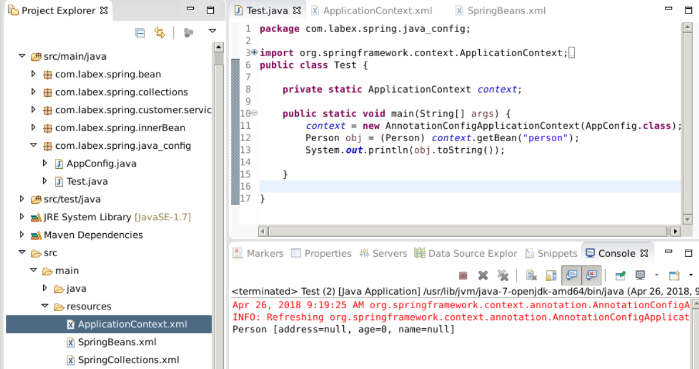

## 3. Summary

This section, we analyzed the concept of IoC, as well as the IoC, the Spring configuration file of Bean, the dependency between Beans, the scope of the Bean, the collection of Bean and so on. In the next section, we will enter the learning of automatic scanning components and automatic assembly.