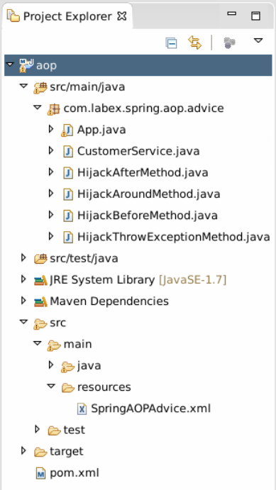
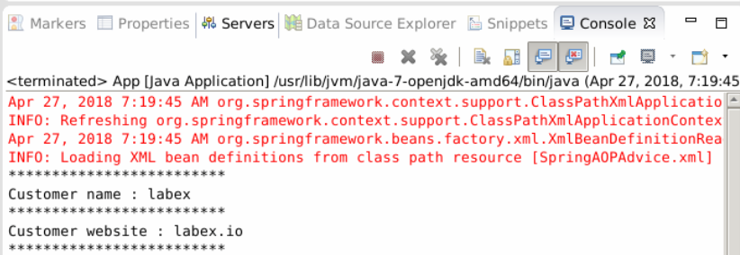
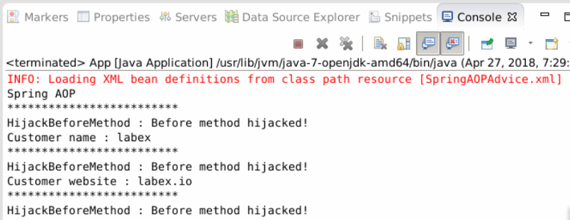
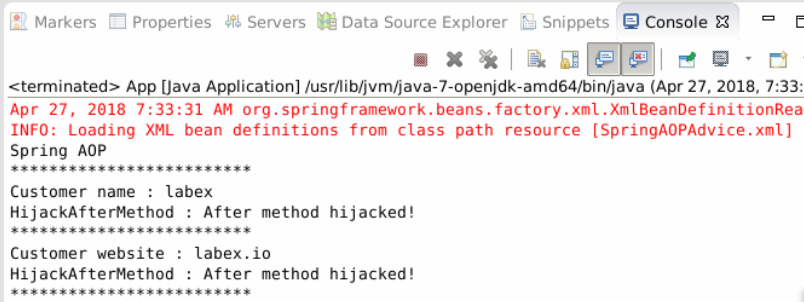
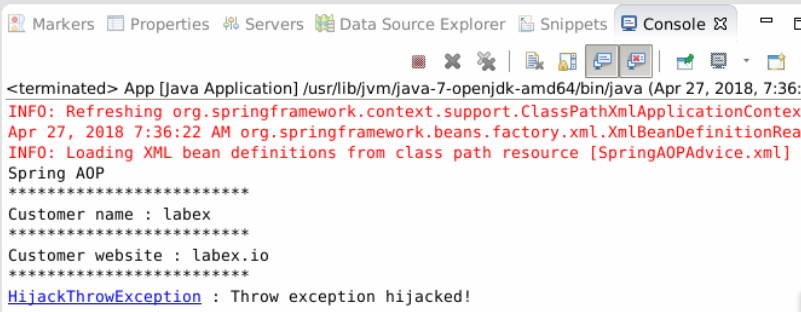
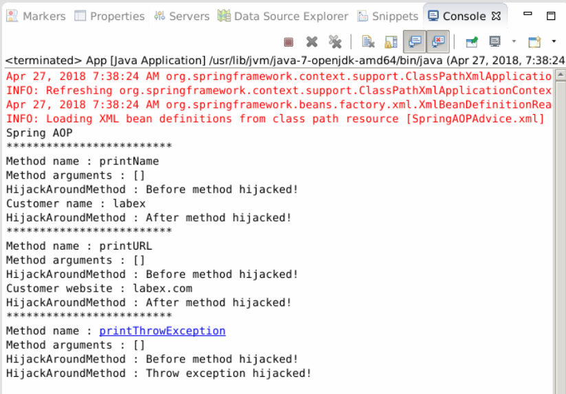

#Spring AOP - Advice

##1. Introdiction

in this section, you will learn about Spring AOP.

### Learning Objective

- AOP
- Advice

## 2. Content

The project structure.



### 2.1 AOP

Spring AOP, the aspect-oriented programming, is a supplement to the object oriented programming, which is specially used to deal with the cross concerns in various modules (different methods) distributed in the system. To put it simply, an interceptor (interceptor) intercepts some processing.

For example, when a method is executed, Spring AOP can hijack the running method and add some additional functions before or after method execution.

In Spring AOP, 4 types of notifications (Advice) are provided:

- Before advice - method pre execution notice
- After returning advice - method returns a result notification
- After throwing advice - method throws exception notification
- Around advice - surround the notice, combining the above three kinds.

Here, we write a demo for demonstration. As a comparison, we first create a project without using Spring AOP.

(1) Create a maven project.

```
group Id: com.labex.spring
artifact Id: aop
version: 0.0.1-SNAPSHOT
package: com.labex.spring.aop.advice
```

(2) Create class `CustomerService` in this package.

```java
package com.labex.spring.aop.advice;

public class CustomerService {

    private String name;
    private String url;

    public void setName(String name) {
        this.name = name;
    }

    public void setUrl(String url) {
        this.url = url;
    }

    public void printName() {
        System.out.println("Customer name : " + this.name);
    }

    public void printURL() {
        System.out.println("Customer website : " + this.url);
    }

    public void printThrowException() {
        throw new IllegalArgumentException();
    }

}
```

(3) Create folder `resources` in `src/main`, create file `SpringAOPAdvice.xml` in `src/main/resources`.

```xml
<?xml version = "1.0" encoding = "UTF-8"?>
<beans xmlns="http://www.springframework.org/schema/beans"
    xmlns:xsi="http://www.w3.org/2001/XMLSchema-instance"
    xsi:schemaLocation="http://www.springframework.org/schema/beans
    http://www.springframework.org/schema/beans/spring-beans.xsd">

    <bean id="customerService" class="com.labex.spring.aop.advice.CustomerService">
        <property name="name" value="labex" />
        <property name="url" value="labex.io" />
    </bean>

</beans>
```

Add to pom.xml:

```
<!-- Spring deploy -->
    <dependency>
        <groupId>org.springframework</groupId>
        <artifactId>spring-core</artifactId>
        <version>4.0.9.RELEASE</version>
    </dependency>
    <dependency>
        <groupId>org.springframework</groupId>
        <artifactId>spring-context</artifactId>
        <version>4.0.9.RELEASE</version>
    </dependency>
```

(4) Modify App.java

```java
package com.labex.spring.aop.advice;

import org.springframework.context.ApplicationContext;
import org.springframework.context.support.ClassPathXmlApplicationContext;

public class App {

    public static void main(String[] args) {
        ApplicationContext appContext = new ClassPathXmlApplicationContext(
                new String[] { "SpringAOPAdvice.xml" });

        CustomerService cust = (CustomerService) appContext.getBean("customerService");

        System.out.println("*************************");
        cust.printName();
        System.out.println("*************************");
        cust.printURL();
        System.out.println("*************************");
        try {
            cust.printThrowException();
        } catch (Exception e) {
        }
    }
}
```

(5) Run App.java as Java Project, and see the output.



### 2.2 AOP Application

#### 2.2.1 Before Advice

Before the method execution, the following code will be run.

Create class `HijackBeforeMethod` in package `com.labex.spring.aop.advice`.

```java
package com.labex.spring.aop.advice;

import java.lang.reflect.Method;
import org.springframework.aop.MethodBeforeAdvice;

public class HijackBeforeMethod implements MethodBeforeAdvice {

    public void before(Method arg0, Object[] args, Object target)
            throws Throwable {
        System.out.println("HijackBeforeMethod : Before method hijacked!");

    }

}
```

Add a new bean `hijackBeforeMethodBean` to the configuration file, then create a new agent (proxy), named customerServiceProxy. Target defines which bean you want to hijack; interceptorNames defines which class (advice) to use to hijack target. ApringAOPAdvice.xml as follows:

```xml
<?xml version = "1.0" encoding = "UTF-8"?>
<beans xmlns="http://www.springframework.org/schema/beans"
    xmlns:xsi="http://www.w3.org/2001/XMLSchema-instance"
    xsi:schemaLocation="http://www.springframework.org/schema/beans
    http://www.springframework.org/schema/beans/spring-beans.xsd">

    <bean id="customerService" class="com.labex.spring.aop.advice.CustomerService">
        <property name="name" value="labex" />
        <property name="url" value="labex.io" />
    </bean>
    
    <bean id="hijackBeforeMethodBean" class="com.labex.spring.aop.advice.HijackBeforeMethod" />

    <bean id="customerServiceProxy" class="org.springframework.aop.framework.ProxyFactoryBean">
        <property name="target" ref="customerService" />
        <property name="interceptorNames">
            <list>
                <value>hijackBeforeMethodBean</value>
            </list>
        </property>
    </bean>

</beans>
```

Before you use Spring proxy, you must add the CGLIB2 class library. The following is pom.xml dependency.

```xml
<dependency>
    <groupId>org.glassfish.hk2.external</groupId>
    <artifactId>cglib</artifactId>
    <version>2.2.0-b23</version>
</dependency>
```

App.java

```java
package com.labex.spring.aop.advice;

import org.springframework.context.ApplicationContext;
import org.springframework.context.support.ClassPathXmlApplicationContext;

public class App {

    public static void main(String[] args) {
        ApplicationContext appContext = new ClassPathXmlApplicationContext(
                new String[] { "SpringAOPAdvice.xml" });

        CustomerService cust = (CustomerService) appContext.getBean("customerServiceProxy");

        System.out.println("Spring AOP ");
        System.out.println("*************************");
        cust.printName();
        System.out.println("*************************");
        cust.printURL();
        System.out.println("*************************");

        try {
            cust.printThrowException();
        } catch (Exception e) {

        }

    }

}
```

Run this class as Java Application, the result is:



Before each customerService's method execution, the `HijackBeforeMethod`'s before method will be executed first.

#### 2.2.2 After Returning Advice

Create a class that implements the interface `AfterReturningAdvice`, and after method runs, the following code will not be executed until the result is returned.

Create class `HijackAfterMethod` in package `com.labex.spring.aop.advice`.

```java
package com.labex.spring.aop.advice;

import java.lang.reflect.Method;
import org.springframework.aop.AfterReturningAdvice;

public class HijackAfterMethod implements AfterReturningAdvice {

    public void afterReturning(Object returnValue, Method method, Object[] args,
            Object target) throws Throwable {
        System.out.println("HijackAfterMethod : After method hijacked!");

    }

}
```

Add a new bean `hijackAfterMethodBean` to the configuration file.

```xml
 <beans xmlns="http://www.springframework.org/schema/beans"
    xmlns:xsi="http://www.w3.org/2001/XMLSchema-instance"
    xsi:schemaLocation="http://www.springframework.org/schema/beans
    http://www.springframework.org/schema/beans/spring-beans.xsd">

    <bean id="customerService" class="com.labex.spring.aop.advice.CustomerService">
        <property name="name" value="labex" />
        <property name="url" value="labex.io" />
    </bean>

    <bean id="hijackBeforeMethodBean" class="com.labex.spring.aop.advice.HijackBeforeMethod" />
    <bean id="hijackAfterMethodBean" class="com.labex.spring.aop.advice.HijackAfterMethod" />

    <bean id="customerServiceProxy" class="org.springframework.aop.framework.ProxyFactoryBean">
        <property name="target" ref="customerService" />
        <property name="interceptorNames">
            <list>
                <value>hijackAfterMethodBean</value>
            </list>
        </property>
    </bean>

</beans>
```

Then run App.java and see the output.



After each `customerService`'s method execution, `the HijackAfterMethod`'s `afterReturning` method will be executed first.

#### 2.2.3 After Throwing Advice

Create a class that implements the `ThrowsAdvice` interface, hijacking `IllegalArgumentException` exceptions, and when the target method runs, after the `IllegalArgumentException` exception is thrown, the intercepor is to run.

Create class `HijackThrowExceptionMethod` in package `com.labex.spring.aop.advice`.

```java
package com.labex.spring.aop.advice;

import org.springframework.aop.ThrowsAdvice;

public class HijackThrowExceptionMethod implements ThrowsAdvice {

    public void afterThrowing(IllegalArgumentException e) throws Throwable {
        System.out.println("HijackThrowException : Throw exception hijacked!");
    }

}
```

Add a new bean `hijackThrowExceptionBean` to the configuration file.

```xml
<beans xmlns="http://www.springframework.org/schema/beans"
    xmlns:xsi="http://www.w3.org/2001/XMLSchema-instance"
    xsi:schemaLocation="http://www.springframework.org/schema/beans
    http://www.springframework.org/schema/beans/spring-beans.xsd">

    <bean id="customerService" class="com.labex.spring.aop.advice.CustomerService">
        <property name="name" value="labex" />
        <property name="url" value="labex.io" />
    </bean>

    <bean id="hijackBeforeMethodBean" class="com.labex.spring.aop.advice.HijackBeforeMethod" />
    <bean id="hijackAfterMethodBean" class="com.labex.spring.aop.advice.HijackAfterMethod" />
    <bean id="hijackThrowExceptionBean" class="com.labex.spring.aop.advice.HijackThrowExceptionMethod" />

    <bean id="customerServiceProxy" class="org.springframework.aop.framework.ProxyFactoryBean">
        <property name="target" ref="customerService" />
        <property name="interceptorNames">
            <list>
                <value>hijackThrowExceptionBean</value>
            </list>
        </property>
    </bean>

</beans>
```

Run App.java and see the output.



#### 2.2.4 Around Advice

Combining the above 3 forms of Advice, creating a class that implements the interface `MethodInterceptor`, you have to call the original method by `methodInvocation.proceed()`, that is, every method in `CustomerService` is called by `methodInvocation.proceed()`.

Create class `HijackAroundMethod` in package `com.labex.spring.aop.advice`.

```java
package com.labex.spring.aop.advice;

import java.util.Arrays;
import org.aopalliance.intercept.MethodInterceptor;
import org.aopalliance.intercept.MethodInvocation;

public class HijackAroundMethod implements MethodInterceptor {

    public Object invoke(MethodInvocation methodInvocation) throws Throwable {
        System.out.println("Method name : "
                + methodInvocation.getMethod().getName());
        System.out.println("Method arguments : "
                + Arrays.toString(methodInvocation.getArguments()));

        // equivalent to MethodBeforeAdvice
        System.out.println("HijackAroundMethod : Before method hijacked!");

        try {
            // call the original method (CustomerService method)
            Object result = methodInvocation.proceed();

            // equivalent to AfterReturningAdvice
            System.out.println("HijackAroundMethod : After method hijacked!");

            return result;

        } catch (IllegalArgumentException e) {
            // equivalent to ThrowsAdvice
            System.out.println("HijackAroundMethod : Throw exception hijacked!");
            throw e;
        }
    }

}
```

Add a new bean `hijackAroundMethodBean` to the configuration file.

```xml
<beans xmlns="http://www.springframework.org/schema/beans"
    xmlns:xsi="http://www.w3.org/2001/XMLSchema-instance"
    xsi:schemaLocation="http://www.springframework.org/schema/beans
    http://www.springframework.org/schema/beans/spring-beans.xsd">

    <bean id="customerService" class="com.labex.spring.aop.advice.CustomerService">
        <property name="name" value="labex" />
        <property name="url" value="labex.com" />
    </bean>

    <bean id="hijackBeforeMethodBean" class="com.labex.spring.aop.advice.HijackBeforeMethod" />
    <bean id="hijackAfterMethodBean" class="com.labex.spring.aop.advice.HijackAfterMethod" />
    <bean id="hijackThrowExceptionBean" class="com.labex.spring.aop.advice.HijackThrowExceptionMethod" />
    <bean id="hijackAroundMethodBean" class="com.labex.spring.aop.advice.HijackAroundMethod" />

    <bean id="customerServiceProxy" class="org.springframework.aop.framework.ProxyFactoryBean">
        <property name="target" ref="customerService" />
        <property name="interceptorNames"> 
            <list>
                <value>hijackAroundMethodBean</value>
            </list>
        </property>
    </bean>
</beans>
```

Run App.java and see the output.



The calling to each method in `CustomerService` executes the invoke method in `HijackAroundMethod`. Most Spring developers only use Around Advice because it can implement all types of Advice. In the actual project development, we should try our best to select the suitable Advice.

##3. Summary

In the above example, all of the methods in `CustomerService` are automatically intercepted, but in most cases, we do not need to intercept all the methods in a class, but intercepts the conforming methods. At this point, we need to use `Pointcut` and `Advice`, that is, pointcuts and notices, which will be introduced in later sections.