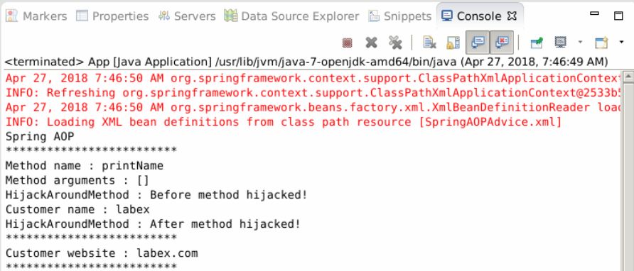

# Spring AOP - Proxy

## 1. Introduction

In previous sections, in the configuration file, we have to manually create Proxy bean (`ProxyFactoryBean`) for every bean that requires AOP.
This is not a good experience, for example, we want to allow all the bean of the DAO layer to support AOP so that the SQL log can be recorded, so a lot of ProxyFactoryBean must be created manually, which will result in the multiplication of the configuration file. Fortunately, there are two ways that Spring can automatically create proxy for you. In this section, we will learn how to create it automatically.

### Learning Objective

- Proxy

## 2. Content

We use previous project, the project structure.


### 2.1 BeanNameAutoProxyCreator

Create ProxyFactoryBean manually.

```xml
<beans xmlns="http://www.springframework.org/schema/beans"
    xmlns:xsi="http://www.w3.org/2001/XMLSchema-instance"
    xsi:schemaLocation="http://www.springframework.org/schema/beans
        http://www.springframework.org/schema/beans/spring-beans.xsd">

    <bean id="customerService" class=" com.labex.spring.aop.advice.CustomerService">
        <property name="name" value="labex" />
        <property name="url" value="labex.io" />
    </bean>

    <bean id="hijackAroundMethodBean" class=" com.labex.spring.aop.advice.HijackAroundMethod" />

    <bean id="customerServiceProxy" 
        class="org.springframework.aop.framework.ProxyFactoryBean">
        <property name="target" ref="customerService" />
        <property name="interceptorNames">
            <list>
                <value>customerAdvisor</value>
            </list>
        </property>
    </bean>

    <bean id="customerAdvisor"    class="org.springframework.aop.support.NameMatchMethodPointcutAdvisor">
        <property name="mappedName" value="printName" />
        <property name="advice" ref=" hijackAroundMethodBean " />
    </bean>
</beans>
```

When the configuration is finished, get the customerServiceProxy.

```java
CustomerService cust = (CustomerService) appContext.getBean("customerServiceProxy");
```

In automatic mode, we need to create a `BeanNameAutoProxyCreator` to form an independent unit of all bean (by name or regular expression) and advisor, configured as follows:

```xml
<beans xmlns="http://www.springframework.org/schema/beans"
    xmlns:xsi="http://www.w3.org/2001/XMLSchema-instance"
    xsi:schemaLocation="http://www.springframework.org/schema/beans
        http://www.springframework.org/schema/beans/spring-beans.xsd">

    <bean id="customerService" class=" com.labex.spring.aop.advice.CustomerService">
        <property name="name" value="labex" />
        <property name="url" value="labex.io" />
    </bean>

    <bean id="hijackAroundMethodBean" class=" com.labex.spring.aop.advice.HijackAroundMethod" />

    <bean
    class="org.springframework.aop.framework.autoproxy.BeanNameAutoProxyCreator">
        <property name="beanNames">
            <list>
                <value>*Service</value>
            </list>
        </property>
        <property name="interceptorNames">
            <list>
                <value>customerAdvisor</value>
            </list>
        </property>
    </bean>

<bean id="customerAdvisor" class="org.springframework.aop.support.NameMatchMethodPointcutAdvisor">
        <property name="mappedName" value="printName" />
        <property name="advice" ref="hijackAroundMethodBean" />
</bean>

</beans>
```

In the above configuration, as long as bean's ID conform to `*Service`, it will automatically create proxy, so you can get proxy with the following code.

```java
CustomerService cust = (CustomerService) appContext.getBean("customerService");
```

Run App.java and see output.



### 2.2 DefaultAdvisorAutoProxyCreator

This way of using DefaultAdvisorAutoProxyCreator to automatically create Proxy, it is powerful, any bean matching Advisor will automatically create Proxy to implement AOP, so be careful.

```java
<beans xmlns="http://www.springframework.org/schema/beans"
    xmlns:xsi="http://www.w3.org/2001/XMLSchema-instance"
    xsi:schemaLocation="http://www.springframework.org/schema/beans
        http://www.springframework.org/schema/beans/spring-beans.xsd">

    <bean id="customerService" class=" com.labex.spring.aop.advice.CustomerService">
        <property name="name" value="labex" />
        <property name="url" value="labex.io" />
    </bean>

    <bean id="hijackAroundMethodBean" class=" com.labex.spring.aop.advice.HijackAroundMethod" />

    <bean id="customerAdvisor"
        class="org.springframework.aop.support.NameMatchMethodPointcutAdvisor">
        <property name="mappedName" value="printName" />
        <property name="advice" ref="hijackAroundMethodBean" />
    </bean>

    <bean
        class="org.springframework.aop.framework.autoproxy.DefaultAdvisorAutoProxyCreator" />
</beans>
```

In the above example, any bean in XML will automatically create Proxy if it has a method name of `printName`, and use the following code to support AOP.

```java
CustomerService cust = (CustomerService) appContext.getBean("customerService");
```

Run App.java and see output.


## 3. Summary

In this section, we learned to create Proxy automatically, which solves the problem of creating a lot of ProxyFactoryBean manually, which may result in the configuration files complex and difficult to maintain. In the next section we are going to learn from AspectJ.