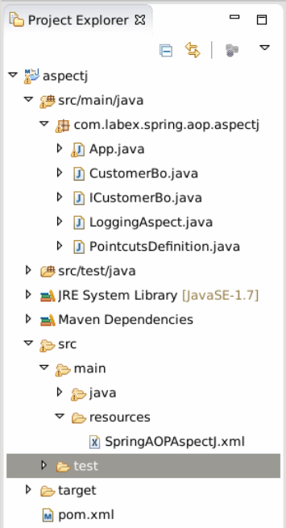
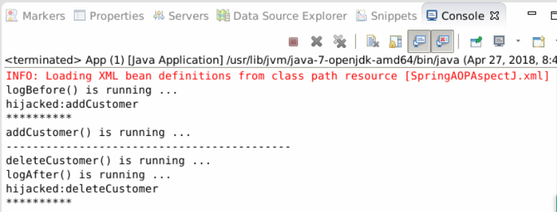
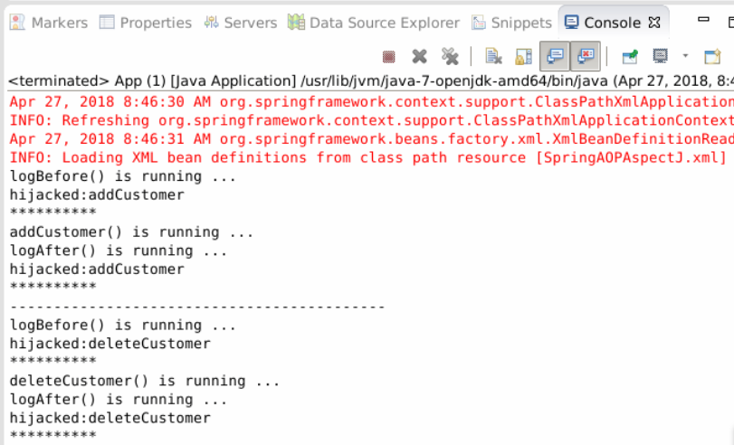

# Spring AOP - AspectJ

## 1. Introduction

This section, we will learn the implementation of Spring AOP using the AspectJ framework.

### Learning Objective

- AspectJ

## 2. Content

The project structure.



### 2.1 Review AOP

Review the three concepts in Spring AOP:

- Advice: the code that is injected into the program.
- Pointcut: the location of injection, Advice, pointcut are  methods.
- Advisor: the combination of Advice and Pointcut, so that Advice and Pointcut can be separately configured flexibly.

AspectJ is based on annotation, so it requires JDK5.0+.

AspectJ Annotation:

- @Before
- @After
- @AfterReturning
- @AfterThrowing
- @Around

### 2.2 AspectJ

We also use a simple project for demonstration.

Create a maven project.

```
group Id: com.labex.spring
artifact Id: aspectj
version: 0.0.1-SNAPSHOT
package: com.labex.spring.aop.aspectj
```

Add these to pom.xml:

```
<!-- Spring deploy -->
    <dependency>
        <groupId>org.springframework</groupId>
        <artifactId>spring-core</artifactId>
        <version>4.0.9.RELEASE</version>
    </dependency>
    <dependency>
        <groupId>org.springframework</groupId>
        <artifactId>spring-context</artifactId>
        <version>4.0.9.RELEASE</version>
    </dependency>
    <!-- aspectj deploy -->
    <dependency>  
      <groupId>org.aspectj</groupId>  
      <artifactId>aspectjtools</artifactId>  
      <version>1.8.9</version>  
    </dependency> 
```

(1) Create a bean `CustomerBo` implementing interface `ICustomerBo`.

ICustomerBo.java

```java
package com.labex.spring.aop.aspectj;

public interface ICustomerBo {
    void addCustomer();
    void deleteCustomer();
    String AddCustomerReturnValue();
    void addCustomerThrowException() throws Exception;
    void addCustomerAround(String name);

}
```

CustomerBo.java

```java
package com.labex.spring.aop.aspectj;

public class CustomerBo implements ICustomerBo {

    public void addCustomer() {
        System.out.println("addCustomer() is running ...");
    }

    public void deleteCustomer() {
        System.out.println("deleteCustomer() is running ...");
    }

    public String AddCustomerReturnValue() {
        System.out.println("AddCustomerReturnValue() is running ...");
        return "abc";
    }

    public void addCustomerThrowException() throws Exception {
        System.out.println("addCustomerThrowException() is running ...");
        throw new Exception("Generic Error");
    }

    public void addCustomerAround(String name) {
        System.out.println("addCustomerAround() is running ,args:"+name);

    }

}
```

(2) Create a class `LoggingAspect`.

```java
package com.labex.spring.aop.aspectj;

import org.aspectj.lang.JoinPoint;
import org.aspectj.lang.annotation.After;
import org.aspectj.lang.annotation.Aspect;
import org.aspectj.lang.annotation.Before;

@Aspect
public class LoggingAspect {

    @Before("execution(public * com.labex.spring.aop.aspectj.CustomerBo.addCustomer(..))")
    public void logBefore(JoinPoint joinPoint){
        System.out.println("logBefore() is running ...");
        System.out.println("hijacked:"+joinPoint.getSignature().getName());
        System.out.println("**********");
    }

    @After("execution(public * com.labex.spring.aop.aspectj.CustomerBo.deleteCustomer(..))")
    public void logAfter(JoinPoint joinPoint){
        System.out.println("logAfter() is running ...");
        System.out.println("hijacked:"+joinPoint.getSignature().getName());
        System.out.println("**********");
    }
}
```

- The @Aspect must be annotated before the LoggingAspect declaration so that it can be scanned by the framework.
- Advice and Pointcut are combined. `logBefore` and `logAfter` are Advice, the code to be injected. The expression on the Advice method is the Pointcut expression, that is, the pointcut definition. In the example, the expression of the @Before annotation is injected into the log when the CustomerBo.addCustomer method is executed.
- Add annotations such as @Before or @After to the LoggingAspect method.
- `execution (public * com.labex.spring.aop.aspectj.CustomerBo.addCustomer (..))` is the pointcut expression of Aspect, where * represents the return type, and followed by method name of interceptor, `com.labex.spring.aop.aspectj.CustomerBo.addCustomer` represents method to be intercepted,`(..)` represents the parameter matching, here is to match any number of parameters, can be 0 or more, if you are sure that the method does not need to use parameters, use `()`, and use `(*)` to match an arbitrary type of parameter, and used `(*, String)`, which represents a piece with two parameters, the second parameter must be a String type parameter.
- AspectJ expressions can be defined for the entire package, for example, `execution (* com.labex.spring.aop.aspectj.*.* (..))` indicates that the pointcut is an arbitrary method of any class in the `com.labex.spring.aop.aspectj` package.

(3) Create folder `resources` in `src/main`, create `SpringAOPAspectJ` in this folder.

```xml
<?xml version="1.0" encoding="UTF-8"?>
<beans xmlns="http://www.springframework.org/schema/beans"
    xmlns:xsi="http://www.w3.org/2001/XMLSchema-instance"
    xmlns:aop="http://www.springframework.org/schema/aop"
    xsi:schemaLocation="http://www.springframework.org/schema/beans
    http://www.springframework.org/schema/beans/spring-beans.xsd
    http://www.springframework.org/schema/aop
    http://www.springframework.org/schema/aop/spring-aop.xsd">

    <aop:aspectj-autoproxy/>

    <bean id="customerBo" class="com.labex.spring.aop.aspectj.CustomerBo"/>

    <bean id="logAspect" class="com.labex.spring.aop.aspectj.LoggingAspect" />

</beans>
```

`<aop:aspectj-autoproxy/> ` enables AspectJ support, so that Spring automatically searches for classes that are annotated by `@Aspect`, and the other configuration is the same as the spring common bean configuration.

(4) App.java

```java
package com.labex.spring.aop.aspectj;

import org.springframework.context.ApplicationContext;
import org.springframework.context.support.ClassPathXmlApplicationContext;


public class App {
    public static void main(String[] args) {

        ApplicationContext appContext = new ClassPathXmlApplicationContext(new String[] { "SpringAOPAspectJ.xml" });
        ICustomerBo customer=(ICustomerBo)appContext.getBean("customerBo");

        customer.addCustomer();

        System.out.println("-------------------------------------------");

        customer.deleteCustomer();

    }
}
```

(5) Run App.java and see the result.



### 2.3 Separate Advice from Pointcut

(1) Define a pointcut.

```java
package com.labex.spring.aop.aspectj;

import org.aspectj.lang.annotation.Aspect;
import org.aspectj.lang.annotation.Pointcut;

@Aspect
public class PointcutsDefinition {

    @Pointcut("execution(* com.labex.spring.aop.aspectj.CustomerBo.*(..))")
    public void customerLog() {
    }
}
```

- The `@Aspect` annotation is added before class, so that it can be scanned by the frame.
- `@Pointcut` is a pointcut declaration specifying the location of the code that needs to be injected, such as the specified pointcut in the previous example is all the methods in the CustomerBo class, and in the actual development, it is often the specified pointcut to a logical layer, such as `execution (* com.labex.spring.aop.aspectj.*.* (..))`, indicating that the AOP pointcut is the methods for all classes in the AspectJ  package.
- Method `customerLog` is a signature, which can be used instead of a pointcut expression in Advice, so you do not need to write actual code in the method body, such as the entry point required to operate the CustomerBo class here.

(2) LoggingAspect.java

```java
package com.labex.spring.aop.aspectj;

import org.aspectj.lang.JoinPoint;
import org.aspectj.lang.annotation.After;
import org.aspectj.lang.annotation.Aspect;
import org.aspectj.lang.annotation.Before;

@Aspect
public class LoggingAspect {

    @Before("com.labex.spring.aop.aspectj.PointcutsDefinition.customerLog()")
    public void logBefore(JoinPoint joinPoint){
        System.out.println("logBefore() is running ...");
        System.out.println("hijacked:"+joinPoint.getSignature().getName());
        System.out.println("**********");
    }

    @After("com.labex.spring.aop.aspectj.PointcutsDefinition.customerLog()")
    public void logAfter(JoinPoint joinPoint){
        System.out.println("logAfter() is running ...");
        System.out.println("hijacked:"+joinPoint.getSignature().getName());
        System.out.println("**********");
    }
}
```

- `@Before` and `@After` use the method signature in PointcutsDefinition to find the corresponding pointcut instead of the pointcut expression. So in this example, Advice class LoggingAspect, for all methods in CustomerBo, has added two kinds of two operations, `@Before` and `@After`.
- For PointcutsDefinition, the primary responsibility is to define Pointcut, which can define multiple pointcuts, and can be defined in a way that is easy to memorize.
- The advantage of a separate definition of Pointcut is that by using a meaningful method name rather than a hard to read Pointcut expression to make the code more intuitive; Pointcut can be shared and invoked directly by multiple Advice. If there are more than one Advice calling a Pointcut and the expression of Pointcut will change in the future, it will only need to modify one place, and maintenance is more convenient.

(3) Spring configuration file

SpringAOPAspectJ.xml

```xml
<beans xmlns="http://www.springframework.org/schema/beans"
    xmlns:xsi="http://www.w3.org/2001/XMLSchema-instance"
    xmlns:aop="http://www.springframework.org/schema/aop"
    xsi:schemaLocation="http://www.springframework.org/schema/beans
    http://www.springframework.org/schema/beans/spring-beans.xsd
    http://www.springframework.org/schema/aop
    http://www.springframework.org/schema/aop/spring-aop.xsd">

    <aop:aspectj-autoproxy/>

    <bean id="customerBo" class="com.labex.spring.aop.aspectj.CustomerBo"/>

    <bean id="logAspect" class="com.labex.spring.aop.aspectj.LoggingAspect" />

</beans>
```

(4) Run App.java and see output.



## 3. Summary

In this section, we studied the AspectJ framework. AspectJ is a aspect-oriented framework, which extends the Java language. AspectJ defines the AOP syntax, so it has a special compiler to generate Class files that comply with Java byte encoding specifications.