| show | version |
| ---- | ------- |
| step | 1.0     |

# Relational Database: MySQL and ORM

## 1. Introduction

Web development can't leave the support from database. In this experiment, we will learn relational database MySQL and ORM SQLAlchemy. [MySQL](https://www.mysql.com/) is the most widely used database, and [SQLAlchemy](https://www.sqlalchemy.org/) is the most popular ORM in Python.

#### Knowledge 

- Basic knowledge of MySQL  
- Basic knowledge of relational database 
- Basic knowledge of SQLAlchemy  

## 2. MySQL

MySQL is the most widely used database. Relational database use relational model as the metod to save data organizations, it can be divided in structure of 4 layers:


- Database, an application is corresponding to a database 
- Table, a database contains multiple tables
- Records, a table is consisted of multiple records 
- Field，a recode is made of multiple fields 

You can imagine the table structure as an Excel table, which is consisted of multiple fields, with each field being able to save data of certain types like strings and numbers. The types can be assigned while creaing tables. The tables arr connected by relationship(logic relationship), enabling you to query between multiple tables by the relationship while querying data.


The most important feature of relational database is ACID:

- A means atomicity 
- C means consistency
- I means isolation 
- D means durability 

ACID can ensure reliability. It means, it can make sure that a seriess of database operations can consist a complete logic process. The process would only be all executed or not executed at all. It wouldn't be half processed. Take transfering money in bank for example: Deducting money from the original client, and adding money to the target client. The summation of these two operations consist a complete and inseparable logic process.

To implement the ACID feature, MySQL supports multiple constraints. For example, while inserting a data, we need  to check if the foreign key exists. Though these operations can ensure the consistency of data, the they would, most of the time, lower the abiliy of concurrent operations. So, in the websites nowadays, if there's any needs of concurrent operations, ACID won't be used. Some would even use NoSQL. 

Besides, we need to supplement some basic knowledge of the keys in relational database, to helo you understand the content below. 

- Primary key: A combination of data columns or properties, give the saved data objects unique and complete marks. A data column can only have one primary key, and its value can't be null. 
- Foreign key: Actually in database, every data table is connected with relationship. The primary key of parent entity will be put in another data table, as a property to create the mutual relationship. This property is foreign key.  

For instance, the relationship between student and teacher is teaching relationship. In student data table, there's a property named tacher(foreign key), and this value is corresponding to the teahcer number(primary key) in the teacher data table. 

In the following content, we will be learning basic operations of MySQL. 

## Environment Preparation

We've installed MySQL in labex environment. You need to manually launch the MySQL service by the following commands: 

    $ sudo service mysql start

One more package to install 

    $ sudo pip3 install mysqlclient

The function of this package is to enable Python to connect to MySQL database. The following errors will happen if you don't install and use Python and SQLAlchemy to connect to MySQL database: 

    $ python3
    >>> import MySQLdb

`ImportError: No module named MySQLdb` or `Module MySQLdb not found`.

The reason why these error occurs is that `mysqlclient` hasn't been installed in the environment, or you haven't installed this package in the virtual environment while using virtualenv(we will learn it in the part of using python to connect to database). In addtion, if you didn't reactivate virtualenv environment, you may have this error even when you've install 

If this error occurs in the virtual environment created by virtualenv, then we need to execute `pip3 install mysqlclient` in virtualenv, execute `deactivate` to exit the virtualenv environment and enter virtualenv.

If you didn't create virtual environment by virtualenv, then just execute `sudo pip3 install mysqlclient`.

The function of virtualenv is avoiding the use conflict between python verson and package version. For example, if the system is only installed with python3.5, but a program has to execute on python2.7, virtualenv can deal with it. The python package installed in virtualenv will only be available when you enter virtualenv again. 

After successfully lauching the database, connect to the database by the following orders: 

    $ mysql -u root

MySQL database is consisted of client-side and server-side, the latter can be connected by former. In the command above, you can use `root` client to login the server. `Root`client is the supreme adminster account, not assigned with password information. That is because we didn't set the password of the `root` account in labex environment.
After login succeeds:

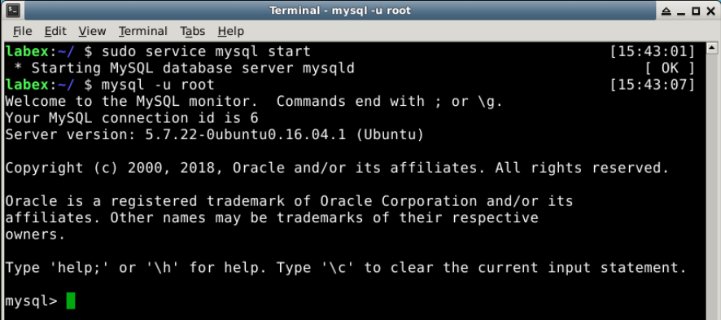

All the MySQL Commands(beginning with mysql>) will be inputted from MySQL client-side. 

## Basic Operations:

It's quite easy to create database, just input `create database <db_name>;`. `<db_name>` means the database name, and you can see all the databases by command `show databases;`(note that a `"s"` is added here), delete a database by `drop database <db_name>`, the example below shows the creating and deleting process of database:

    mysql> create database labex;
    Query OK, 1 row affected (0.00 sec)
    
    mysql> show databases;
    +--------------------+
    | Database           |
    +--------------------+
    | information_schema |
    | mysql              |
    | performance_schema |
    | labex          |
    | sys                |
    +--------------------+
    5 rows in set (0.00 sec)
    
    mysql> drop database labex;
    Query OK, 0 rows affected (0.00 sec)
    
    mysql> show databases;
    +--------------------+
    | Database           |
    +--------------------+
    | information_schema |
    | mysql              |
    | performance_schema |
    | sys                |
    +--------------------+
    4 rows in set (0.00 sec)

Note thae the output of `show databases;` shows multiple databases. That is because MySQL server has some default databases, the result might varys in different MySQL versions.

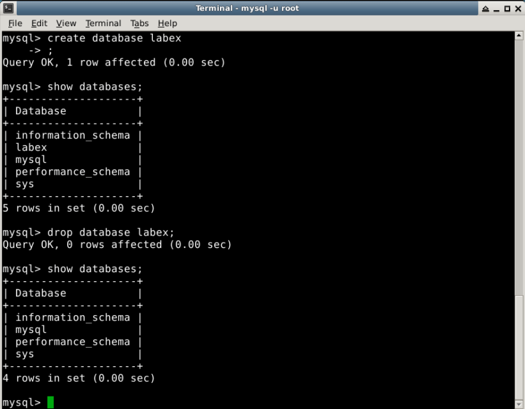

After successfully created database, creating tables will be the next. Before that, you need connect to `labex` database by `use labex;` command.


The basic commands to create table is: 

    CREATE TABLE TABLE NAME 
    (
    Column name a data type(data length) 
    Column name b data type(data length)
    Column name c data type(data length)
    );

Next, try to create a table named `user`, with 3 fields: 

- id, an integer, use `int`  
- name, a string, use `varchar`
- email, a string, use `varchar`

Input the following commands in MySQL client-side: 

    mysql> create database labex;
    mysql> use labex;
    Database changed
    mysql> create table user
        -> (
        -> id int(10),
        -> name varchar(20),
        -> email varchar(64)
        -> );
    Query OK, 0 rows affected (0.03 sec)
    mysql> show tables;
    +---------------------+
    | Tables_in_labex     |
    +---------------------+
    | user                |
    +---------------------+
    1 row in set (0.00 sec)

You can create `user` table by the commands above. Note that after inputting `create table user` and press `enter`, the client side will automatically recognize that it's an unfinished command, so the prompt `->` would appear. After successfully creating the table, you can see all the tables by `show tables;`, delete tables by `drop table <table_name>;`.

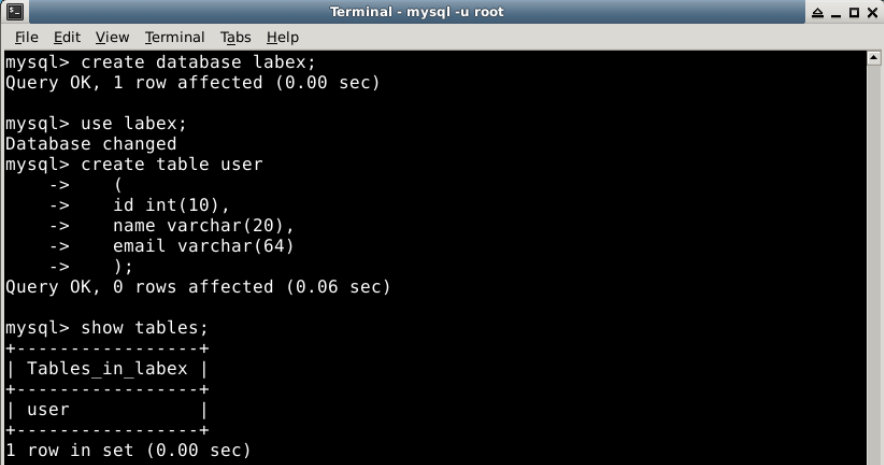

If you want to see the field information of a table, use `show create table <table_name>;` or `describe <table_name>；` command, as follows: 

    mysql> show create table user;
    
    | user  | CREATE TABLE `user` (
      `id` int(10) DEFAULT NULL,
      `name` varchar(20) DEFAULT NULL,
      `email` varchar(64) DEFAULT NULL
    ) ENGINE=InnoDB DEFAULT CHARSET=utf8 |
    1 row in set (0.00 sec)
    
    mysql> describe user;
    +-------+-------------+------+-----+---------+-------+
    | Field | Type        | Null | Key | Default | Extra |
    +-------+-------------+------+-----+---------+-------+
    | id    | int(10)     | YES  |     | NULL    |       |
    | name  | varchar(20) | YES  |     | NULL    |       |
    | email | varchar(64) | YES  |     | NULL    |       |
    +-------+-------------+------+-----+---------+-------+
    3 rows in set (0.00 sec)

Fileds in MySQL table support multiple types, like integer, float, string, timestamp and so on. The lack of space forbids further introducion of these.

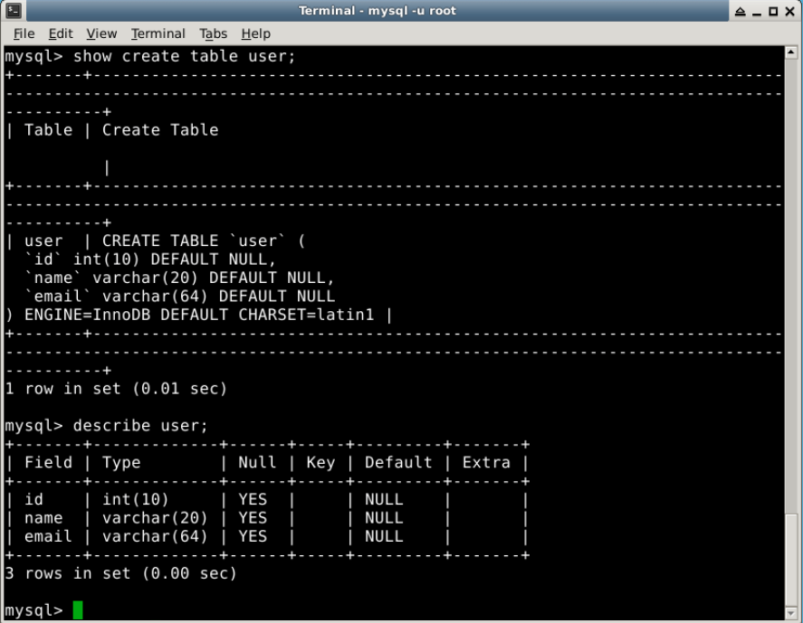

After successfully creating the sheet, you can inser data with `inser` command. The complete command fomat is: 

    INSERT INTO TABLE NAME(Column name a,column name b,column name c) VALUES(value 1,value 2,value 3);

When the inserted value and the field number defined by table are the same and in the same order, you can insert data into `user` table by the following order while ignoring the column name information:

    mysql> insert into user(id, name, email) values(1, 'admin', 'admin@labex.io');
    Query OK, 1 row affected (0.02 sec)
    
    mysql> insert into user values(2, 'user1', 'user1@gmail.com');
    Query OK, 1 row affected (0.00 sec)

Successfully inserted 2 data.
Use `select * from <table_name>;` to check the data of a table:

    mysql> select * from user;
    +------+-------+-----------------------+
    | id   | name  | email                 |
    +------+-------+-----------------------+
    |    1 | admin | admin@labex.io |
    |    2 | user1 | user1@gmail.com       |
    +------+-------+-----------------------+
    2 rows in set (0.00 sec)

Now we have learnt basic how to create database & table, insert records and query records. Is it quite simple? 

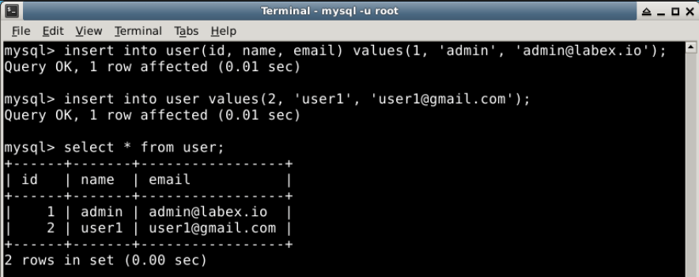

## Constraint

As a relational database, MySQL can restrain some operations with constraint. For example, while inserting data, you can check whether the data is restrained. If not, refuse the operation. We will demonstrate it by a simple example. 

In the part before, we've created `user` table and inserted 2 data:

    mysql> select * from user;
    +------+-------+-----------------------+
    | id   | name  | email                 |
    +------+-------+-----------------------+
    |    1 | admin | admin@labex.io |
    |    2 | user1 | user1@gmail.com       |
    +------+-------+-----------------------+

Now insert a data again: 

    mysql> insert into user values(3, 'user2', 'user1@gmail.com');
    Query OK, 1 row affected (0.01 sec)
    
    mysql> select * from user;
    +------+---------+-----------------------+
    | id   | name    | email                 |
    +------+---------+-----------------------+
    |    1 | admin   | admin@labex.io        |
    |    2 | user1   | user1@gmail.com       |
    |    3 | user2   | user1@gmail.com       |
    +------+---------+-----------------------+
    3 rows in set (0.00 sec)

The data is successfully inserted, but here's a problem: as for a launched database, we don't usually allow users with same emails exist in the user table, which means, the e`mail` field should have a unique constraint. What do wo do now? As for a existed table, we can change the field by `alter` command to set the unique constraint:

```mysql
mysql> alter table user modify email varchar(64) unique;
ERROR 1062 (23000): Duplicate entry 'user1@gmail.com' for key 'email'
mysql> delete from user where id = 3;
Query OK, 1 row affected (0.00 sec)

mysql> alter table user add constraint unique (email);
Query OK, 0 rows affected (0.03 sec)
Records: 0  Duplicates: 0  Warnings: 0

mysql> insert into user values(3, 'user2', 'user1@gmail.com');
ERROR 1062 (23000): Duplicate entry 'user1@gmail.com' for key 'email'
```

In the commands above, first, we try to edit `email` field to set the unique constraint, but the database reports error, because there's a repeated email record in` user` table. Next, we use `delete from user where id = 3;` to delete the repeated record. The meaning of this command is to delete records with the id of 3. Then, we successfully set the unique index of `email`, and then it will be forbidden while inserting repeated record. There's another way to add the unique constraint: `alter table user modify email varchar(64) unique;`. Actually it adds the unique index by editing the field. 

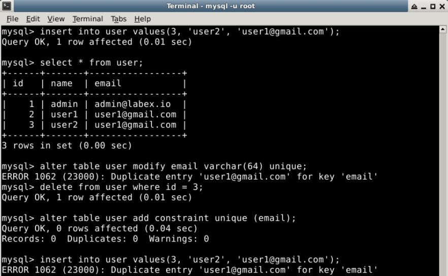

There's one more constraint, which is across the tables. While inserting data into the table, we require that one field value of the data should already exists in other tables, like foreign key constraint. If it doesn't meet the foreign key constraints while inserting data. If the foreign key constraint is damaged while deleting data, it would also forbid deleting data. When the foreign key constraint is created, primary key must exists in another table. The primary key can determine the number of a certain row. Next, we will try to create a `course` list with foreign key constraint. Before creating table, we need to set primary key in `user` table:

    mysql> alter table user add constraint pk_id primary key (id);                                    Query OK, 0 rows affected (0.14 sec)
    Records: 0  Duplicates: 0  Warnings: 0
    
    mysql> describe user;
    +-------+-------------+------+-----+---------+-------+
    | Field | Type        | Null | Key | Default | Extra |
    +-------+-------------+------+-----+---------+-------+
    | id    | int(10)     | NO   | PRI | NULL    |       |
    | name  | varchar(20) | YES  | UNI | NULL    |       |
    | email | varchar(64) | YES  | UNI | NULL    |       |
    +-------+-------------+------+-----+---------+-------+
    3 rows in set (0.00 sec)

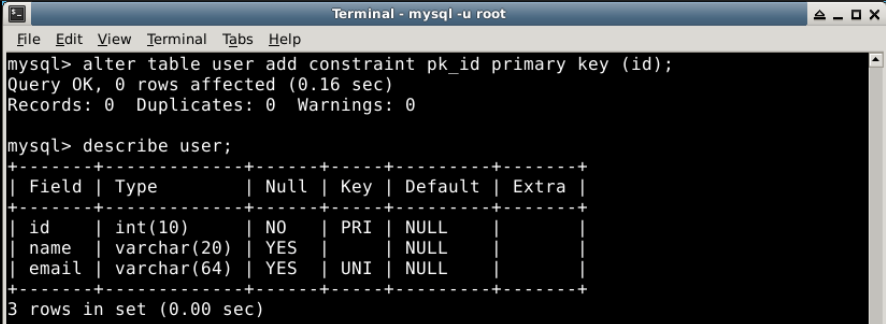

Successfully set `id` field as primary key in `user` by `alter` command. And we've certainly found that `id` row becomes primary key by `describe user;`(because the value of row key is PRI, which means primary). Next, create `course` table: 

    mysql> create table course 
        -> (
        -> id int(10) auto_increment,
        -> name varchar(64),
        -> teacher_id int(10),
        -> primary key (id),
        -> constraint fk_user foreign key (teacher_id) references user(id)
        -> );
    Query OK, 0 rows affected (0.04 sec)

The commands above has more content than command for creating table. First, we use `auto_increment` to set the field `id` in automatically increasing mode. Then, we won't have to assign this field while inserting data. After inserting data, this field would automatically increase. Next, by `primary key (id) `, we assign the primary key of the table as `id`, and assign the field `teacher_id` as foreign key, and associate the` id` field of user table. Now, try to insert data which doesn't exist in `user` table before into `course` table:

```py
mysql> insert into course(name, teacher_id) values('Python basics', 100);
ERROR 1452 (23000): Cannot add or update a child row: a foreign key constraint fails (`labex`.`course`, CONSTRAINT `fk_user` FOREIGN KEY (`teacher_id`) REFERENCES `user` (`id`))
```

You can see the insert is failed, because there's no data with an `id` of 100 in `user` table, so it doesn't meet the foreign key constraint. While deleting data, it would also fail deleting if it violates the foreign key constraint:

    mysql> select * from user;
    +----+-------+-----------------------+
    | id | name  | email                 |
    +----+-------+-----------------------+
    |  1 | admin | admin@labex.io |
    |  2 | lxttx | lxttx@gmail.com       |
    +----+-------+-----------------------+
    2 rows in set (0.00 sec)
    
    mysql> insert into course(name, teacher_id) values('Python basics', 2);
    Query OK, 1 row affected (0.00 sec)
    
    mysql> select * from course;
    +----+---------------+------------+
    | id | name          | teacher_id |
    +----+---------------+------------+
    |  2 |Python basic   |          2 |
    +----+---------------+------------+
    1 row in set (0.00 sec)
    
    mysql> delete from user where id = 2;
    ERROR 1451 (23000): Cannot delete or update a parent row: a foreign key constraint fails (`labex`.`course`, CONSTRAINT `fk_user` FOREIGN KEY (`teacher_id`) REFERENCES `user` (`id`))

In the example above, to demonstrate the failed situation, we insert a data in `course` table, then we try to delete the data with an `id` of 2 from `user` table but failed. That is because if we delete it, we would violate the existed foreign key constraint. 

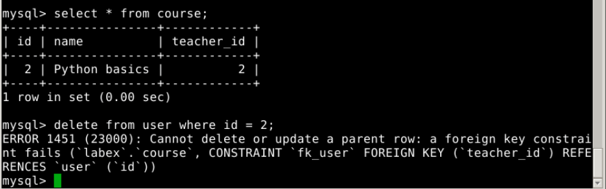


We need to query across tables many times, like when you want to know the course name, teacher name and email information: 

    mysql> select * from course join user on course.teacher_id = user.id;
    +----+---------------+------------+----+-------+-----------------+
    | id | name          | teacher_id | id | name  | email           |
    +----+---------------+------------+----+-------+-----------------+
    |  2 | Python basic  |          2 |  2 | lxttx | lxttx@gmail.com |
    +----+---------------+------------+----+-------+-----------------+
    1 row in set (0.00 sec)

In the example above, we use `join` command for union query. The keyword `on` assigns the union method of 2 tables.  

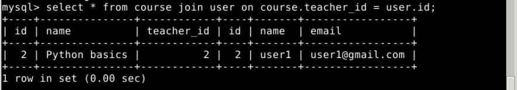

## Summary 

After learning the content above, we are capable of some basic oprerations of MySQL. MySQL is profound and involved with tons of knowledge. For further study of MySQL, you can learn other courses in labex and refer to more MySQL docs.

## 3. SQLAlchemy

In real projects, we don't visit database by writing SQL statement directly, instead, we use ORM tool. The fullname of ORM is Object  Relational Mapping. With ORM, we can map the python object into database, so we won't need to write any SQL statements anymore. And in python, SQLAlchemy is a powerfull ORM package, which is worth learning. Meanwhile, SQLAlchemy supports multiple relational data, if the project needs to conver to database of other types in the later period, it will be easier to use `SQLAlchemy`.

[](https://camo.githubusercontent.com/09536932a113e5bdd7ee3538b6de1e3acd81365c/68747470733a2f2f646f632e73686979616e6c6f752e636f6d2f646f63756d656e742d75696431383531306c616269643233383274696d657374616d70313530313134393437303936302e706e672f776d)


## Environment Preparations 

The experiment environment is mainly built based on `virtualenv`. Being of great importance, `virtualenv` can be understood as a seprated virtual environment. The packages installed under virtualenv won't effect the packages of the whole system, which can avoid the influence between packages of different versions. Besides, all you need about virtualenv is knowing how to create, activate and deactivate.

While using virtualenv, note that after you installed a package, you need to use `deactivate` command to exit virtualenv and re-activate virtualenv to use this package. 

After opening the terminal in the desktop, input the following commands by order to build the environment(`$` is the prompt of `shell`, the content after it is the command you need to input):

    $ cd ~/Code
    $ sudo pip install virtualenv
    $ virtualenv -p /usr/bin/python3.5 env
    $ source env/bin/activate
    $ pip3 install sqlalchemy lPython mysqlclient
    $ deactivate

The commands above have created a `virtualenv` environment in `Code` environment, next, installed the software packages needed in this experiment, like `sqlalchemy` and `lPython`. Next, it used `deactivate` to exit `env`. The subsequent interactive commands are all inputted by `lPython` terminal. Launch `lPython` terminal by the following commands: 

    $ source env/bin/activate
    $ lPython

Similar to the Python3 interactive environment we used before, lPython is an interactive computing system. But it's an interactive "Python shell" with more convenient functions. The main advantages of it are: 

1. Get many types of information of the objects in the code easily 
2. Use "!" to call Linux commands directly 
3. Support code auto-completion by TAB
4. Save all the inputted code into history record database 

So, if you are familiar with `lPython`, you would give up the previous `Python Shell` gradually.

In the subsequent codes, characters like `In [1]` are the prompt of lPython, you don't need to input these. 

The subsequent basic oprerations of SQLAlchemy are offered with detailed codes and expectant results, without involved with hard oprerations. In the operating process, understand the function of every module and function in SQLAlchemy carefully. 

Note: In lPython, pressing "enter" for two continuous times will lead to a new input. So if you haven't finished writing your class, do not press "enter" for two continuous times. 

## Connect to Database  

Using SQLAlchemy to connect to database is mainly executed by `Engine` object.
Input the following code in lPython terminal: 

    In [1]: from sqlalchemy import create_engine
    
    In [2]: engine = create_engine('mysql://root:@localhost/labex')
    
    In [3]: engine.execute('select * from user').fetchall()
    Out[3]: [(1, 'admin', 'admin@labex.io'), (2, 'user1', 'user1@gmail.com')]

First, we've imported `create_engine`. This method is used to create `Engine` example. The parameters passed to `create_engine` defined the visiting address of MySQL server, with the format of `mysql://<user>:<password>@<host>/<db_name>`. What we visit in the example is just the `labex` database created before.

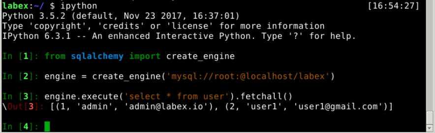

Next, we've executed a SQL statement by `engine.execute` method, queryed all the users in user table. Quite easy. 

## Object-relational Mapping

If you want to map Python class into database table, you will need `declarative base class` based on `SQLAlchemy`, which is, declaring base class to create class. When you create Python class based on the base class, it would automatically map to the corresponding database table. You can use `declarative_base` method to create declarative base class:

    In [5]: from sqlalchemy.ext.declarative import declarative_base
    
    In [6]: Base = declarative_base()

After creating base class, input the following code in lPython terminal to create `User` class. This class will map to the `user` table created before:

    In [10]: from sqlalchemy import Column, Integer, String
    
    In [11]: class User(Base):
        ...:     __tablename__ = 'user'
        ...:     id = Column(Integer, primary_key=True)
        ...:     name = Column(String)
        ...:     email = Column(String)
        ...:     def __repr__(self):
        ...:         return "<User(name=%s)>" % self.name
        ...: 
        
    In [12]:

When the code above executes, class `User` will be successfully defined. Note that `__repr__` has two underlines both in the front and end. The function with two underlines in the front and end represents a special function, named the magic method of python class. `__init__` is also a magic method. `__repr__` method would be called when directly calling objects in examples. `__tablename__` means the table name.

User has a `__table__` property to record the table information of the defined table. The property is shown below: 

    In [27]: User.__table__
    Out[27]: Table('user', MetaData(bind=None), Column('id', Integer(), table=<user>, primary_key=True, nullable=False), Column('name', String(), table=<user>), Column('email', String(), table=<user>), schema=None)

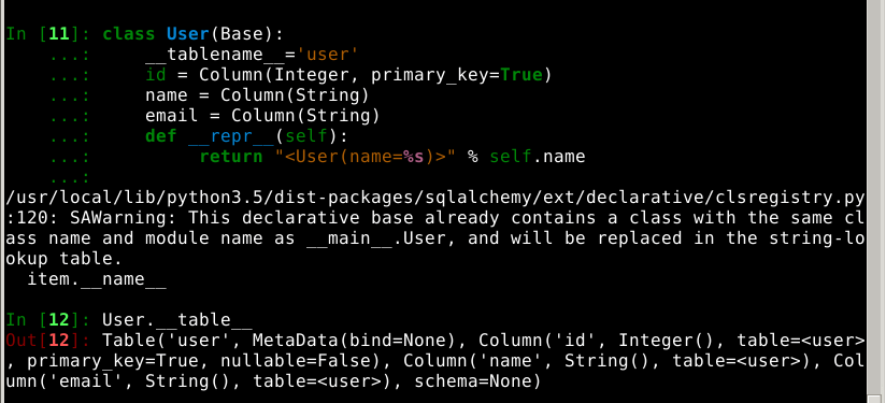

What if you want to query the database by `User` ? Import `Session` first. `Seesion` is the bridge between map class and database, containing the function of transaction management. Create `Session` by the following code: 

    In [13]: from sqlalchemy.orm import sessionmaker
    
    In [14]: Session = sessionmaker(bind=engine)
    
    In [15]: session = Session()

This code imports `sessionmaker` from `sqlalchemy.orm`, and creates a `sessionmaker` object `Session`. The `Session` object has a magic method (call), enabling the `Session` object to be called like a function, making it possible for ` Session()` to get a `session` object. 

When `Session` is successfully created, you can query the users now, mainly by `session.query` method: 

    In [16]: session.query(User).all()
    Out[16]: [<User(name=admin)>, <User(name=lxttx)>]
    
    In [17]: session.query(User).filter(User.name=='admin').first()
    Out[17]: <User(name=admin)>

Queried successfully. And you can directly  use field of `User` class to filter query. 

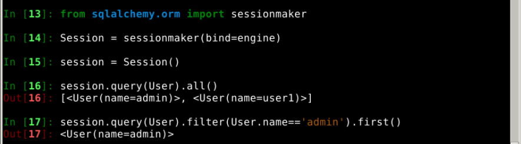

If you chose to show SQL statement by `echo` parameter while creating Engine before(`engine = create_engine('mysql://root:@localhost/labex', echo=True)`), then you will see the corresponding SQL output when you use session to query. 

    In [20]: session.query(User).filter(User.name=='admin').first()
    2017-08-30 18:02:37,878 INFO sqlalchemy.engine.base.Engine SHOW VARIABLES LIKE 'sql_mode'
    2017-08-30 18:02:37,878 INFO sqlalchemy.engine.base.Engine ()
    2017-08-30 18:02:37,883 INFO sqlalchemy.engine.base.Engine SELECT DATABASE()
    2017-08-30 18:02:37,883 INFO sqlalchemy.engine.base.Engine ()
    2017-08-30 18:02:37,885 INFO sqlalchemy.engine.base.Engine show collation where `Charset` = 'utf8' and `Collation` = 'utf8_bin'
    2017-08-30 18:02:37,885 INFO sqlalchemy.engine.base.Engine ()
    2017-08-30 18:02:37,889 INFO sqlalchemy.engine.base.Engine SELECT CAST('test plain returns' AS CHAR(60)) AS anon_1
    2017-08-30 18:02:37,889 INFO sqlalchemy.engine.base.Engine ()
    2017-08-30 18:02:37,893 INFO sqlalchemy.engine.base.Engine SELECT CAST('test unicode returns' AS CHAR(60)) AS anon_1
    2017-08-30 18:02:37,893 INFO sqlalchemy.engine.base.Engine ()
    2017-08-30 18:02:37,895 INFO sqlalchemy.engine.base.Engine SELECT CAST('test collated returns' AS CHAR CHARACTER SET utf8) COLLATE utf8_bin AS anon_1
    2017-08-30 18:02:37,895 INFO sqlalchemy.engine.base.Engine ()
    2017-08-30 18:02:37,897 INFO sqlalchemy.engine.base.Engine BEGIN (implicit)
    2017-08-30 18:02:37,898 INFO sqlalchemy.engine.base.Engine SELECT user.id AS user_id, user.name AS user_name, user.email AS user_email
    FROM user
    WHERE user.name = %s
     LIMIT %s
    2017-08-30 18:02:37,899 INFO sqlalchemy.engine.base.Engine ('admin', 1)
    Out[69]: <User(name=admin)>

In the query above, we used `filter` to filter the data. The operator in filter can be the operators in WHERE clause of SQL(like ==, !=, <, >, etc), or operators like AND, OR. Besides, the filter here can be changed to `filter_by` function. The latter is not flexible as the former, se we recommend `filter`. 

## Creating database table 

You can create database table based on the class defined by `SQLAlchemy`. Next, try to create a new experiment table `lab`, a course will be related to multiple experiments. So the relationship between `course` and `lab` is 1:M. Before defineing `Lab` class, you need to create `Course` class, to make it map to the `courese` table you defined before:

    In [18]: from sqlalchemy.orm import relationship
    
    In [19]: from sqlalchemy import ForeignKey
    
    In [20]: class Course(Base):
        ...:     __tablename__ = 'course'
        ...:     id = Column(Integer, primary_key=True)
        ...:     name = Column(String)
        ...:     teacher_id = Column(Integer, ForeignKey('user.id'))
        ...:     teacher = relationship('User')
        ...:     def __repr__(self):
        ...:         return '<Course(name=%s)>' % self.name
        ...:

We've imported something new in the code above. Thw `course` table created above has foreign key `teacher_id`, we can use `ForeignKey` to configure foreign key in SQLAlchemy. After configuring foreign key, it would be quite convenient to visit the corresponding records in `user` table from the example in `Course` directly. We can implement it by `relationship`. The code above defined `teaher` property by `relationship`, thus enabling you to get the corresponding user record by `course.teacher` directly. After finishing defineing `Course` class, let's define `Lab` class next: 

    In [21]: class Lab(Base):
        ...:    __tablename__ = 'lab'
        ...:    id = Column(Integer, primary_key=True)
        ...:    name = Column(String(64))
        ...:    course_id = Column(Integer, ForeignKey('course.id'))
        ...:    course = relationship('Course', backref='labs')
        ...:    def __repr__(self):
        ...:         return '<Lab(name=%s)>' % self.name
        ...:


The code above defined class `Lab`. Note when we are defineng the property of `course`, we used the parameter `backref` of `relationship`. With this parameter, we can visit the all the corresponding experiment record by `course.labs` in `Courese` example.  

Next, let's create the corresponding `lab` table in MySQL by the following commands. 

    In [22]: Base.metadata.create_all(engine)


Then we can see the table has been successfully created in the MySQL server:

    mysql> show tables;
    +---------------------+
    | Tables_in_labex     |
    +---------------------+
    | course              |
    | lab                 |
    | user                |
    +---------------------+
    3 rows in set (0.00 sec)
    
    mysql> describe lab;
    +-----------+-------------+------+-----+---------+----------------+
    | Field     | Type        | Null | Key | Default | Extra          |
    +-----------+-------------+------+-----+---------+----------------+
    | id        | int(11)     | NO   | PRI | NULL    | auto_increment |
    | name      | varchar(64) | YES  |     | NULL    |                |
    | course_id | int(11)     | YES  | MUL | NULL    |                |
    +-----------+-------------+------+-----+---------+----------------+
    3 rows in set (0.00 sec)

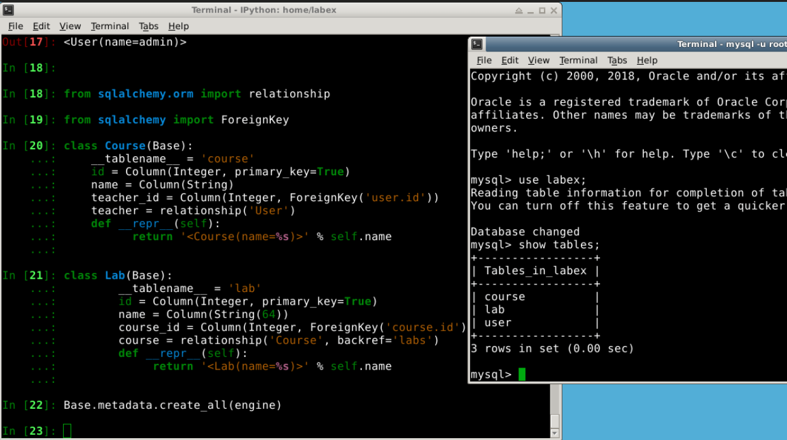

## Simple Oprerations of CRUD 

Based on the class `User`, `Course` and `Lab`, we will learn further about creating, querying, updating and deleting. With ORM mapping, creating database records becomes easier. For example, if you want to create an experiment, relate it to the course, and then just create an example of `Lab`: 

    In [37]: course = session.query(Course).first()
    
    In [38]: lab1 = Lab(name='ORM basics', course_id=course.id)
    
    In [39]: lab2 = Lab(name='relational database', course=course)
    
    In [41]: session.add(lab1)
    
    In [42]: session.add(lab2)
    
    In [43]: session.commit()
    
    In [44]: course.labs
    Out[44]: [<Lab(name=relational database)>, <Lab(name=ORM basics)>]


In the code above, we queried the course objects to manage, created 2 experiments, and submit them to the database by `session.commit（）`. Before submitting the data changes into the database, we need to add the data to `session` by `session.add` method. Besides, we can see that, while creating experiments, there're two ways to relate them to the courses: 1. Assign the value to `course_id` directly. 2.Assign value to the relationship property `course`. When the data is successfully inserted into the database, we can get them by `course.labs`. 

We can query that 2 data has been inserted into `lab` table in MySQL server.

    mysql> select * from lab;
    +----+--------------------+-----------+
    | id | name               | course_id |
    +----+--------------------+-----------+
    |  2 | relational databas |    2      |
    |  3 | ORM basics         |    2      |
    +----+--------------------+-----------+
    2 rows in set (0.00 sec)

It's easy to update. All you need is updating the property of the objectm, and then submit it to the database by `session.commit（）`. The code below shows how to update the course name: 

    In [58]: course.name
    Out[58]: 'Python basics'
    
    In [59]: lab1.course
    Out[59]: <Course(name=Python basics)>
    
    In [60]: course.name = 'Python data analysis'
    
    In [61]: session.add(course)
    
    In [62]: session.commit()
    
    In [63]: lab1.course
    Out[63]: <Course(name=Python data analysis)>
    
    In [64]: session.query(Course).all()
    Out[64]: [<Course(name=Python data analysis)>]


While deleting data, just delete the objects by `session.delete`:

    In [65]: session.delete(lab1)
    
    In [66]: session.commit()
    
    In [67]: course.labs
    Out[67]: [<Lab(name=relationship database)>]

After deleting, the number of experiments got from the course example also decreases. 

We can see that, with SQLAlchemy, the CRUD oprerations of database all become the corresponding Python object oprerations, which is very convenient and easy.

## Building the Relationship of 1:1 and M:M 

In relational database, there're 3 types of relationships: 

- 1:1，the data in two tables are in a 1:1 relationship. Suppose the user has only one attached information, then the user table and attached information table are in a 1:1 relationship.
- 1:M，like the relationship between course and experiment, a course is corresponding to multiple experiments. 
- M:M，many to many. Like the course and table, a course has many tables, and a table is corresponding to many courses.  

We've leant about the method to create the 1:M relationship, mainly done with foreign key. Actually, the 1:1 relationship can also be created by foreign key. Use the code below to create the attached information table of users `UserInfo`:

    In [86]: class UserInfo(Base):
        ...:     __tablename__ = 'userinfo'
        ...:     user_id = Column(Integer, ForeignKey('user.id'), primary_key=True)
        ...:     addr = Column(String(512))
        ...:
        
    In [87]: Base.metadata.create_all(engine)


In the code above, we've successfully created `UserInfo` table, whose relationship between `User` table is 1:1, as its main key and foreign key are all `user_id` and relied on the main key of `User` table.

As for the M:M relationship, it can be created by two 1:M relationships. If two tables are in a relationship of 1:M with the same table(suppose its name is T), then we can use T as the intermediary table, to create the M:M relationshi+p of two tables. Take the relationship between course table and tag table for example, we can create it with the code below: 

    In [90]: from sqlalchemy import Table, Text
    
    In [91]: course_tag = Table('course_tag', Base.metadata,
        ...:     Column('course_id', ForeignKey('course.id'), primary_key=True),
        ...:     Column('tag_id', ForeignKey('tag.id'), primary_key=True)
        ...: )
        
    In [92]: class Tag(Base):
         ...:     __tablename__ = 'tag'
         ...:     id = Column(Integer, primary_key=True)
         ...:     name = Column(String(64))
         ...:     courses = relationship('Course',
         ...:                            secondary=course_tag,
         ...:                            backref='tags')
         ...:     def __repr__(self):
         ...:         return '<Tag(name=%s)>' % self.name
        
    In [93]: Base.metadata.create_all(engine)  


1. `Base.metadata` is a `sqlalchemy.schema.MetaData` object, representing the 
  set of all Table objects. `create_all()` will strike all the tables created by statement `CREATE TABLE`. 
2. `course_tag` is a double main key. The purpose of using double key is to avoid the existence of two repeated main key records. It's mostly used in the M:M intermediary table.
3. `secondary` means the intermediary table.`backref` is the table pointing at itself. 
4. The internal implementation of `session` is calling the ports of `engine`, so `session` is like a package of `engine`. For example, `session.commit` would invole `engine.connect()` first to connect to database, and then call the port related to executing sql.

In the code above, we've created a intermediary table `course_tag` with class `Table`. As this table doesn't need to map to any python object, we directly created the table. We can see `Course`, `Tag` table and `course_tag` table are all in 1:M relationship. And we've created M:M relationship with intermediary table `course_tag`. What's more, property `courses` is defined in `Tag` table. By the parameter `secondary` of function `relationship`, this property tells SQLAlchemy that, it should relate to the object of `Course` table by table `course_tag`. We will show you how to make CRUD opreration of M:M relationship below: 

    In [126]: session.close()
    In [130]: course = session.query(Course).first()
    
    In [131]: course.tags
    Out[131]: []
    
    In [132]: tag1 = Tag(name='tag_1')
    
    In [133]: tag2 = Tag(name='tag_2')
    
    In [136]: course.tags.append(tag1)
    
    In [137]: course.tags.append(tag2)
    
    In [138]: session.add(course)
    
    In [139]: session.commit()
    
    In [140]: course.tags
    Out[140]: [<Tag(name=tag_1)>, <Tag(name=tag_2)>]
    
    In [141]: engine.execute('select * from tag').fetchall()
    Out[141]: [(1, 'tag_1'), (2, 'tag_2')]
    
    In [142]: engine.execute('select * from course_tag').fetchall()
    Out[142]: [(2, 1), (2, 2)]


In the code above, we've added tags into courses by `course.tags.append(tag1)`. It's easy as operating python list. In the end, by `engine.execute`, we executed SQL query to verify that the tags are inserted into the database indeed, and the corresponding relationship record is also generated in table `course_tag`. Now, let's try to add course in object `Tag`:


    In [153]: teacher = session.query(User).filter(User.name=='admin').first()
    
    In [154]: course1 = Course(name='Linux basics', teacher=teacher)
    
    In [155]: session.add(course1)
    
    In [156]: session.commit()
    
    In [157]: tag1.courses
    Out[157]: [<Course(name=Python data analysis)>]
    
    In [159]: tag1.courses.append(course1)
    
    In [160]: session.add(tag1)
    
    In [161]: session.commit()
    
    In [163]: tag1.courses
    Out[163]: [<Course(name=Python data analysis)>, <Course(name=Linux basics)>]
    
    In [164]: engine.execute('select * from course_tag').fetchall()
    Out[164]: [(2, 1), (3, 1), (2, 2)]


First, created another course `course1`, and then added `course1` to tag `tag1` successfully.  

I believe that after the examples above, you have basicly mastered the method to created all kinds of relationships in SQLAlchemy. 

## Summary:

This experiment mainly talked about the basic knowledge of `MySQL` and `SQLAlchemy`. `MySQL` mainly contains the knowledge below: 

- How to create database and table  
- Basic CRUD operations 
- How to create basic constraints 

SQLAlchemy mainly contains the following knowledge: 

- How to connect to database  
- How to define mapping class(table) 
- How to make CRUD operations by python objects  
- How to define common relationships  

Loads of code are involved in this course, but you need to write all of it to truly master the content of the course. 
